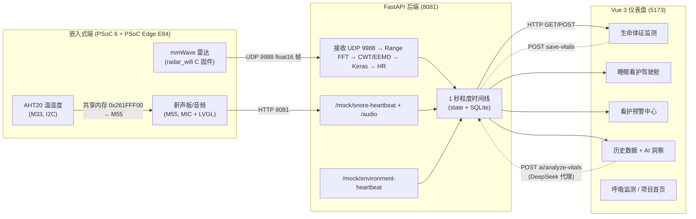

# HRRR 雷达睡眠看护系统 — Codex 开发手册

> 本文件专为 AI 编程助手 (codex) 服务。它把整个仓库 (硬件 + 后端 + 前端) 串成一份"可改可测"的工程地图。
> 如果你是终端用户/评阅老师,请先看 [README.md](README.md);本文**不重复**里面的 quick-start 步骤。

---

## 1. 项目总览

`hrrr-radar-monitor-system` 是一套 **mmWave 雷达睡眠看护 + 鼾声检测 + 温湿度看板** 端到端方案,目标硬件为 **Infineon PSoC Edge 2026 嵌入式竞赛** 提供的两块板子:一块带 BGT60TRXX 60 GHz 雷达的 PSoC 6 (UDP 推流),一块 PSoC Edge E84 Edgi-Talk (双核 M33+M55,跑 RT-Thread + LVGL,本地 AHT20 温湿度)。两板通过同一台 PC 上的 **FastAPI 后端** 把秒级时间线对齐后,由 **Vue 3 + ECharts 仪表盘** 统一呈现。**支持全软件 mock 演示**:后端内置合成器,前端协议完全一致。

### 1.1 三段式数据流 (一句话 + mermaid)



补充:**M55 xiaozhi 子系统** 复用小智 AI 的语音栈,把"小智"按键改造成"开始/停止鼾声采集会话",其 `xiaozhi_voice_board` 也会 POST `/emergency` 上报告警事件 (severity=critical, 指纹去重)。

---

## 2. 技术栈与运行环境

| 项 | 值 | 备注 |
|---|---|---|
| Python | 3.10.x (推荐 3.10.16) | 后端 FastAPI / TF / Keras |
| Node.js | 18.x 或 20.x | 前端 Vite 7 + Vue 3.5 |
| conda env | **`radar`** | `conda create -n radar python=3.10` 后 `pip install -r backend/requirements.txt` |
| 后端 HTTP | **TCP 8081** | `mock_hardware_api.py` / `realtime_radar_processing.py` |
| 雷达 UDP | **0.0.0.0:9988** | 仅生产硬件路径使用;mock 路径走 HTTP `/mock/radar-frame` |
| Vite dev | **TCP 5173** | 默认端口;`VITE_API_BASE_URL` 覆盖 |
| Vite preview | TCP 4173 | 仅 `npm run build` 后使用 |
| 关键 Python 依赖 | fastapi 0.115, uvicorn 0.34, pydantic 2.11, tensorflow 2.15, numpy 1.24, scipy 1.13, PyWavelets 1.6, pyemd 1.0 | 隐式: pymysql, bcrypt (HW 路径) |
| 关键前端依赖 | vue 3.5, vue-router 4, pinia 3 + pinia-plugin-persistedstate 4, element-plus 2.10, axios 1.11, echarts 6 | `marked` / `plotly.js` 装了但未使用 |
| 关键固件 | RT-Thread + LVGL (E84), FreeRTOS + lwIP + mbedTLS (PSoC 6) | 见 [§7](#7-固件架构) |

> 完整安装步骤在 [README.md](README.md) 顶层"快速开始"章节;**本文不重复**。

---

## 3. 顶层目录树

> 标注规则:`[自有]` = 本项目代码,直接可改;`[Vendor]` = 第三方上游/子模块,不要直接改。

```
hrrr-radar-monitor-system/
├── README.md / PROJECT_README.md / PLAN.md            [自有] 面向用户的文档
├── MOCK_SIMULATION_HANDOFF.md / 看护预警中心…/ 睡眠看护…/ 项目页面… [自有] 开发交接
├── .gitignore / LICENSE                                [自有]
├── docs/                                                [自有] 赛题 + 芯片 datasheet
├── backend/                                             [自有] Python FastAPI
├── frontend/                                            [自有] Vue 3 + Vite
├── shared/                                              [自有] 跨核共享内存头/源 (.c/.h)
├── radar_wifi/                                          [自有] PSoC 6 + BGT60 雷达固件 (ModusToolbox)
├── Edgi_Talk_M55_XiaoZhi/                               [自有] PSoC Edge E84 M55 固件 (RT-Thread)
├── Edgi_Talk_M33_AHT20/                                 [自有] PSoC Edge E84 M33 AHT20 固件 (RT-Thread)
├── M33_AHT20/                                           [Vendor] RT-Thread 官方 M33 blink 示例
├── models/                                              [自有] 占位 / 离线训练产物
├── tests/                                               [自有] FastAPI 集成测试 (unittest)
├── image/                                               [自有] 演示图片
└── Edgi_Talk_M55_XiaoZhi/{rt-thread,lvgl_9.2.0,libraries,libs,packages,edge-impulse}/  [Vendor] 大量子模块
```

---

## 4. 文件索引

> 按目录分组;**每个文件一行用途**。所有路径使用相对仓库根的 markdown 链接形式以便 VS Code 跳转。

### 4.1 仓库根
- [README.md](README.md) — 4 终端快速启动 (真实硬件 + mock)、conda/环境、端口、DeepSeek `.env`、FAQ。**用户/Codex 都先看这里**。
- [PROJECT_README.md](PROJECT_README.md) — 完整产品手册,含 6 个页面说明、时间线对齐算法、Demo 流程。
- [PLAN.md](PLAN.md) — 两版"变更计划": 无硬件 mock 计划 + 连续双板/时间线/AI 扩展计划 (含 Test Plan / Assumptions)。
- [MOCK_SIMULATION_HANDOFF.md](MOCK_SIMULATION_HANDOFF.md) — 最近一次 mock 模拟浪潮的详细交接: 文件 diff、3 张数据流图、DeepSeek 配置、手动验收。
- [看护预警中心页面及功能.md](看护预警中心页面及功能.md) — `/manage/alert_center` 设计计划 (A/B/C 方案对比 → 选 A)。
- [睡眠看护驾驶舱页面及功能.md](睡眠看护驾驶舱页面及功能.md) — `/manage/sleep_dashboard` 设计计划。
- [项目页面与功能说明.md](项目页面与功能说明.md) — 评阅/演示用的页面"说辞"清单。
- [LICENSE](LICENSE) — MIT, 2026。
- [.gitignore](.gitignore) — 分类忽略 OS/Python/Node/嵌入式/项目私有产物。

### 4.2 [backend/](backend/)
- [backend/mock_hardware_api.py](backend/mock_hardware_api.py) — **默认/推荐入口**;无硬件 FastAPI 全栈模拟;SQLite `mock_monitor.db`。
- [backend/realtime_radar_processing.py](backend/realtime_radar_processing.py) — **真实硬件入口**;绑 UDP 9988 + HTTP 8081;加载 Keras 模型 → HR;MySQL `user_data`。
- [backend/realtime_radar_processing_9988.py](backend/realtime_radar_processing_9988.py) — 早期精简版;只跑雷达管线,无 snore/env/MySQL,保留对比。
- [backend/mock_server.py](backend/mock_server.py) — **遗留**;绑 8000,3 场景轮询;**不要用于新功能**。
- [backend/mock_device_sender.py](backend/mock_device_sender.py) — CLI 模拟器,可扮演雷达板/鼾声板/两者并行;驱动无硬件 API。
- [backend/db.py](backend/db.py) — MySQL (pymysql) 用户/心率持久化 + bcrypt 密码哈希。
- [backend/radar_dl_models.py](backend/radar_dl_models.py) — `create_deep_state_space_model()` Keras 工厂 (Conv1D→GRU→BiLSTM→残差→Dense)。
- [backend/traditional_methods.py](backend/traditional_methods.py) — 6 类心率基线算法 + LSTM/CNN 对照,仅作评估。
- [backend/signal_decomposition.py](backend/signal_decomposition.py) — `apply_cwt()` / `apply_eemd()` 包装。
- [backend/radar_func.py](backend/radar_func.py) — Range FFT / Doppler FFT / MTI / CFAR / `extract_phase` 纯 DSP 函数。
- [backend/radar_settings.py](backend/radar_settings.py) — BGT60TR13C 25 项参数表 + JSON overlay;`radar_params` 模块级单例。
- [backend/Preprocess.py](backend/Preprocess.py) — 一次性脚本:`radar_raw_data.npy` → `train_model/data.npy`。
- [backend/raed.py](backend/raed.py) — 5 行冒烟脚本:`np.load("train_model/data.npy")` 打 shape。
- [backend/audio_udp_receive.py](backend/audio_udp_receive.py) — 端口 8889 原始 TCP/HTTP 音频 dump,旁路。
- [backend/presence_detection.py](backend/presence_detection.py) — `PresenceAntiPeekingAlgo` + `RadarPresenceDetector`。
- [backend/udp_client_radar_modified.py](backend/udp_client_radar_modified.py) — 厂商风格 UDP 客户端 (Cypress),诊断用。
- [backend/connect_test.py](backend/connect_test.py) — `0.0.0.0:9988` 监听并打印包头,13 行。
- [backend/test.py](backend/test.py) — 随机端口 UDP 监听,38 行。
- [backend/requirements.txt](backend/requirements.txt) — 锁定 numpy 1.24.3 / pyemd 1.0.0 / PyWavelets 1.6.0 / scipy 1.13.1 / TF 2.15.0 / fastapi 0.115.12 / uvicorn 0.34.2 / pydantic 2.11.4。
- [backend/.env.example](backend/.env.example) — DeepSeek 配置模板 (BASE_URL/MODEL/API_KEY)。
- [backend/.env](backend/.env) — **未跟踪**,真 key 在此 (`.gitignore` 已屏蔽)。
- [backend/index.html](backend/index.html) — 后端运行时 uvicorn 调试页 shell (与前端 `index.html` 无关,放这里当模板)。
- [backend/mock_audio_uploads/](backend/mock_audio_uploads/) — `/audio` 接收到的 WAV,时间戳命名。
- [backend/radar_front_sql_embed/](backend/radar_front_sql_embed/) — 早期 SQL 嵌入前端旧工程残骸,**勿用**。
- [backend/trained_models/](backend/trained_models/) — `DeepStateSpace_CWT_best.keras` / `DeepStateSpace_EEMD_best.keras` 模型文件;`trained_models/` 在 `.gitignore`。
- [backend/mock_hardware_api.stdout.log / stderr.log](backend/) — 最近一次运行的 uvicorn 日志。

### 4.3 [frontend/](frontend/)
- [frontend/package.json](frontend/package.json) — 依赖清单 + `dev`/`build`/`preview` 三脚本。
- [frontend/vite.config.js](frontend/vite.config.js) — Vue + VueDevTools 插件;`@` → `./src`;无 proxy。
- [frontend/jsconfig.json](frontend/jsconfig.json) — VSCode 路径提示。
- [frontend/index.html](frontend/index.html) — SPA 入口;内联脚本预读 `localStorage[hrrr-radar-theme]`,挂 `<html data-theme>` 防白闪。
- [frontend/public/favicon.ico](frontend/public/favicon.ico) — 浏览器图标。
- [frontend/public/pic/](frontend/public/pic/) — 静态图片 (含 `hardware/hardware-radar-board.jpg`、`hardware/snore-detect-board.jpg`)。
- [frontend/public/result.json](frontend/public/result.json) — 47 字节小文件,演示状态。
- [frontend/src/main.js](frontend/src/main.js) — Vue 应用 bootstrap (Pinia + 持久化 + 主题预应用 + Element Plus zhCn + 全局图标)。
- [frontend/src/App.vue](frontend/src/App.vue) — 根组件,只渲染 `<RouterView />`。
- [frontend/src/router/index.js](frontend/src/router/index.js) — 路由表 (HTML5 history,无 `beforeEach`)。
- [frontend/src/utils/request.js](frontend/src/utils/request.js) — 预配置 axios (baseURL/timeout/响应解包/ElMessage 错误处理)。
- [frontend/src/stores/userStore.js](frontend/src/stores/userStore.js) — 登录身份,`persist: true` (key `user`)。
- [frontend/src/stores/themeStore.js](frontend/src/stores/themeStore.js) — `light`/`dark` 模式,key `hrrr-radar-theme`。
- [frontend/src/stores/alertPolicyStore.js](frontend/src/stores/alertPolicyStore.js) — 10 个阈值 + acknowledgedKeys,`persist: true`。
- [frontend/src/stores/historyAnalysisStore.js](frontend/src/stores/historyAnalysisStore.js) — 历史/AI 分析状态机;`inFlightAnalysisPromise` + `activeRequestToken` 防抖/取消。
- [frontend/src/assets/global.css](frontend/src/assets/global.css) — 356 行 CSS 变量令牌表 (light/dark) + Element Plus 覆盖 + 滚动条。
- [frontend/src/assets/logo.svg](frontend/src/assets/logo.svg), [logo.png](frontend/src/assets/logo.png) — 品牌。
- [frontend/src/assets/leftmenu/](frontend/src/assets/leftmenu/) — 5 个 SVG 侧栏图标 (知识库/widgetview/workbench/datamana/management)。
- [frontend/src/views/login.vue](frontend/src/views/login.vue) — 登录/注册 tab,提交后写入 `userStore` 并 `replace('/manage/project_intro')`。
- [frontend/src/views/manage.vue](frontend/src/views/manage.vue) — 280 px 侧栏 + 顶栏 + `<RouterView />`。
- [frontend/src/views/project_intro.vue](frontend/src/views/project_intro.vue) — 静态首页 (Hero + 4 价值卡 + 4 流程 + 2 硬件图 + 4 入口按钮)。
- [frontend/src/views/heart_pic.vue](frontend/src/views/heart_pic.vue) — 实时生命体征页 (4 ECharts + 2 监测器 + 鼾声条 + 3 洞察卡)。
- [frontend/src/views/HeartRateMonitor.vue](frontend/src/views/HeartRateMonitor.vue) — 60–120 BPM 进度环展示组件。
- [frontend/src/views/breath_pic.vue](frontend/src/views/breath_pic.vue) — 单 ECharts 相位波 + `BreathRateMonitor`,200 ms 轮询。
- [frontend/src/views/BreathRateMonitor.vue](frontend/src/views/BreathRateMonitor.vue) — 0–40 RPM 展示组件。
- [frontend/src/views/sleep_dashboard.vue](frontend/src/views/sleep_dashboard.vue) — 睡眠驾驶舱 (得分环 + 事件流 + 鼾声热力图 + 3 稳定卡)。
- [frontend/src/views/alert_center.vue](frontend/src/views/alert_center.vue) — 预警中心 (7 维风险 + Edgi E84 设备状态 + SOS 紧急处置 + 阈值编辑 + 5 序列趋势)。
- [frontend/src/views/environment_analysis.vue](frontend/src/views/environment_analysis.vue) — 睡眠环境分析 (温度/湿度/舒适度时序 + 事件流 + 阈值边界告警);`/manage/environment_analysis` 路由。
- [frontend/src/views/data.vue](frontend/src/views/data.vue) — 历史数据 + AI 洞察 (分页表 + AI 面板)。
- [frontend/src/components/](frontend/src/components/) — 当前空目录,Vue 3 组件预留位。

### 4.4 [shared/](shared/) (跨核共享内存)
- [shared/env_shared_memory.h](shared/env_shared_memory.h) — 头文件:struct `env_shared_data_t`、magic `0x45564E31` "EVN1"、地址 `0x261FFF00`。
- [shared/env_shared_memory.c](shared/env_shared_memory.c) — C 源 (被两边 SCons 链接)。
- [shared/env_shared_memory.o](shared/env_shared_memory.o) — 编译产物。

### 4.5 [radar_wifi/](radar_wifi/) (PSoC 6 + BGT60 雷达板)
- [radar_wifi/source/main.c](radar_wifi/source/main.c) — ModusToolbox FreeRTOS 入口,创建 radar_task / udp_server。
- [radar_wifi/source/radar_task.c](radar_wifi/source/radar_task.c) — BGT60 SPI 驱动,组帧 (1 byte cmd + 1 byte 保留 + 4 byte 帧号 LE + 512×float16)。
- [radar_wifi/source/udp_server.c](radar_wifi/source/udp_server.c) — lwIP UDP 客户端,目标 PC `0.0.0.0:9988`。
- [radar_wifi/source/heap_usage.c](radar_wifi/source/heap_usage.c) — FreeRTOS heap 监控。
- [radar_wifi/source/radar_config_task.c](radar_wifi/source/radar_config_task.h) — 雷达参数应用任务。
- [radar_wifi/source/radar_settings.h / .json](radar_wifi/source/) — 板上配置 (与 `backend/radar_settings.py` 内容互相对应)。
- [radar_wifi/source/rtos_artifacts.h](radar_wifi/source/rtos_artifacts.h) — RTOS 资源审计。
- [radar_wifi/source/udp_server.h](radar_wifi/source/udp_server.h), [radar_wifi/configs/wifi_config.h](radar_wifi/configs/wifi_config.h) — WiFi 凭证占位 (SSID/PSK 编译时常量,**真实值不进 git**)。
- [radar_wifi/configs/FreeRTOSConfig.h](radar_wifi/configs/FreeRTOSConfig.h) — FreeRTOS 调度/优先级/堆配置。
- [radar_wifi/udp_server.py](radar_wifi/udp_server.py) — 4.5 KB Python 伪服务端,板端固件外的参考/回环测试。
- [radar_wifi/Makefile](radar_wifi/Makefile) — ModusToolbox 项目入口。
- [radar_wifi/libs / deps / bsps / build / images](radar_wifi/) — ModusToolbox 自动管理的依赖与产物。

### 4.6 [Edgi_Talk_M55_XiaoZhi/](Edgi_Talk_M55_XiaoZhi/) (E84 M55 核)
- [Edgi_Talk_M55_XiaoZhi/SConstruct](Edgi_Talk_M55_XiaoZhi/SConstruct), [SConscript](Edgi_Talk_M55_XiaoZhi/SConscript), [Kconfig](Edgi_Talk_M55_XiaoZhi/Kconfig), [rtconfig.h / .py](Edgi_Talk_M55_XiaoZhi/), [rtconfig_preinc.h](Edgi_Talk_M55_XiaoZhi/rtconfig_preinc.h) — RT-Thread 构建系统。
- [Edgi_Talk_M55_XiaoZhi/build_libs.py](Edgi_Talk_M55_XiaoZhi/build_libs.py) — Python BSP 库下载助手(Infineo 模组资源 / 工具链脚本)。
- [Edgi_Talk_M55_XiaoZhi/audio_udp_receive.py](Edgi_Talk_M55_XiaoZhi/audio_udp_receive.py) — 旁路脚本,接收 8889 端口原始 UDP/TCP 音频 dump(与 [backend/audio_udp_receive.py](backend/audio_udp_receive.py) **字节级相同**,两份都要保留)。
- [Edgi_Talk_M55_XiaoZhi/applications/main.c](Edgi_Talk_M55_XiaoZhi/applications/main.c) — M55 app 入口;**当前顺序** `xiaozhi_ui_init` → `xiaozhi_ui_wait_ready(5000ms)` → **`env_monitor_init`**(必须在 WiFi 之前,见 7.5) → `wifi_manager_init` → `alarm_clock_init` → `imu_fall_monitor_init`(**仅在 `BSP_USING_LSM6DS3=y` 时编译**,否则 `LOG_I` 跳过),然后返回。
- [Edgi_Talk_M55_XiaoZhi/applications/env_monitor_m55.c](Edgi_Talk_M55_XiaoZhi/applications/env_monitor_m55.c) — 共享内存读 AHT20 (2 s 轮询),WiFi 连上后每 5 s `POST /mock/environment-heartbeat` (**原始 Berkeley socket,不是 WebClient**);`env_status` MSH 命令。
- [Edgi_Talk_M55_XiaoZhi/applications/backend_target_config.c](Edgi_Talk_M55_XiaoZhi/applications/backend_target_config.c) — `/flash/backend_config.json` 原子写 (tmp → unlink → rename → 校验读回);MSH `backend_cfg_*` 命令后端;env_monitor **每个 tick 重新读** (无缓存)。
- [Edgi_Talk_M55_XiaoZhi/applications/backend_target_config.h](Edgi_Talk_M55_XiaoZhi/applications/backend_target_config.h) — 上述 API 头。
- [Edgi_Talk_M55_XiaoZhi/applications/env_shared_memory.c](Edgi_Talk_M55_XiaoZhi/applications/env_shared_memory.c) / [.h](Edgi_Talk_M55_XiaoZhi/applications/env_shared_memory.h) — 1 行 `#include "../../shared/env_shared_memory.*"` 软链。
- [Edgi_Talk_M55_XiaoZhi/applications/imu_fall_monitor.c](Edgi_Talk_M55_XiaoZhi/applications/imu_fall_monitor.c) / [.h](Edgi_Talk_M55_XiaoZhi/applications/imu_fall_monitor.h) — **新模块**:LSM6DS3 自由落体检测,经 I2C0 (地址 0x6A/0x6B,见 [imu_fall_monitor.c:10-12](Edgi_Talk_M55_XiaoZhi/applications/imu_fall_monitor.c#L10));20 ms 轮询;硬件 `WAKE_UP_SRC.FF_IA` 需连续 2 次、软件低重力需连续 4 次、撞击阈值约 3.0 g;60 s 冷却;命中时调 `xz_trigger_emergency_event("xiaozhi_imu_board", "设备自由落体", "...")`。
- [Edgi_Talk_M55_XiaoZhi/applications/alarm_clock.c](Edgi_Talk_M55_XiaoZhi/applications/alarm_clock.c) / [.h](Edgi_Talk_M55_XiaoZhi/applications/alarm_clock.h) — **新模块**:RTC 闹钟,持久化到 `/flash/alarm.cfg`(原子写,见 [alarm_clock.c:21-22](Edgi_Talk_M55_XiaoZhi/applications/alarm_clock.c#L21));默认 `{enabled=false, hour=7, minute=0}`;`alarm_clock_thread` 1 s 轮询 RTC,匹配 hour:minute 且 `s_last_fired_day` 未触发过 → 调 `xiaozhi_ui_show_alarm_ring()` + `xz_trigger_alarm_clock()` + `xz_trigger_emergency_event("alarm_clock", "起床", ...)`;MSH 命令 `alarm_clock` / `alarm_test`(见 [alarm_clock.c:209-237](Edgi_Talk_M55_XiaoZhi/applications/alarm_clock.c#L209))。
- [Edgi_Talk_M55_XiaoZhi/applications/env_monitor_m55.c](Edgi_Talk_M55_XiaoZhi/applications/env_monitor_m55.c) — 共享内存读 AHT20 (2 s 轮询),WiFi 连上后每 5 s `POST /mock/environment-heartbeat` (**原始 Berkeley socket,不是 WebClient**);`env_status` MSH 命令。
- [Edgi_Talk_M55_XiaoZhi/applications/backend_target_config.c](Edgi_Talk_M55_XiaoZhi/applications/backend_target_config.c) — `/flash/backend_config.json` 原子写 (tmp → unlink → rename → 校验读回);MSH `backend_cfg_*` 命令后端;env_monitor **每个 tick 重新读** (无缓存)。
- [Edgi_Talk_M55_XiaoZhi/applications/backend_target_config.h](Edgi_Talk_M55_XiaoZhi/applications/backend_target_config.h) — 上述 API 头。
- [Edgi_Talk_M55_XiaoZhi/applications/env_shared_memory.c](Edgi_Talk_M55_XiaoZhi/applications/env_shared_memory.c) / [.h](Edgi_Talk_M55_XiaoZhi/applications/env_shared_memory.h) — 1 行 `#include "../../shared/env_shared_memory.*"` 软链。
- [Edgi_Talk_M55_XiaoZhi/applications/xiaozhi/SConscript](Edgi_Talk_M55_XiaoZhi/applications/xiaozhi/SConscript) — 子系统 SCons。
- [Edgi_Talk_M55_XiaoZhi/applications/xiaozhi/xiaozhi.cpp](Edgi_Talk_M55_XiaoZhi/applications/xiaozhi/xiaozhi.cpp) — 小智状态机 + WebSocket + 顶层守护/对话模式；守护态用 `always_on` STT 匹配求助词并屏蔽 LLM/TTS，对话态恢复多轮聊天。
- [Edgi_Talk_M55_XiaoZhi/applications/xiaozhi/xiaozhi.h](Edgi_Talk_M55_XiaoZhi/applications/xiaozhi/xiaozhi.h) — `DeviceState`、`XzOperatingMode` 枚举 + 对外 API。
- [Edgi_Talk_M55_XiaoZhi/applications/xiaozhi/xiaozhi_audio.cpp](Edgi_Talk_M55_XiaoZhi/applications/xiaozhi/xiaozhi_audio.cpp) — Opus 16 kHz 编码 / 24 kHz 解码,`mic0`/`sound0` 帧循环。
- [Edgi_Talk_M55_XiaoZhi/applications/xiaozhi/opus_heap.c](Edgi_Talk_M55_XiaoZhi/applications/xiaozhi/opus_heap.c) — Opus 缓冲 memheap 包装。
- [Edgi_Talk_M55_XiaoZhi/applications/xiaozhi/iot/](Edgi_Talk_M55_XiaoZhi/applications/xiaozhi/iot/) — ThingManager + **3 个 thing** (Speaker/Screen/Led) + iot_c_api。
- [Edgi_Talk_M55_XiaoZhi/applications/xiaozhi/iot/led.cpp](Edgi_Talk_M55_XiaoZhi/applications/xiaozhi/iot/led.cpp) — 三色 GPIO LED (R=P16.7, G=P16.6, B=P16.5);**不是 WS2812**。
- [Edgi_Talk_M55_XiaoZhi/applications/xiaozhi/iot/screen.cpp](Edgi_Talk_M55_XiaoZhi/applications/xiaozhi/iot/screen.cpp) — LVGL 屏幕 + 调亮接口。
- [Edgi_Talk_M55_XiaoZhi/applications/xiaozhi/iot/speaker.cpp](Edgi_Talk_M55_XiaoZhi/applications/xiaozhi/iot/speaker.cpp) — I2S codec (ES8388) 扬声器音量。
- [Edgi_Talk_M55_XiaoZhi/applications/xiaozhi/mcp/](Edgi_Talk_M55_XiaoZhi/applications/xiaozhi/mcp/) — JSON-RPC 2.0 over WebSocket,5 个工具 (`self.audio_speaker.set_volume`/`get_volume`, `self.screen.set_emoji`/`set_brightness`, `self.led.set`)。
- [Edgi_Talk_M55_XiaoZhi/applications/xiaozhi/wake_word/SConscript](Edgi_Talk_M55_XiaoZhi/applications/xiaozhi/wake_word/SConscript) — 加 Edge Impulse / CMSIS-NN / CMSIS-DSP / `TF_LITE_STATIC_MEMORY` 编译宏。
- [Edgi_Talk_M55_XiaoZhi/applications/xiaozhi/wake_word/xiaozhi_wakeword.cpp / .h](Edgi_Talk_M55_XiaoZhi/applications/xiaozhi/wake_word/) — Edge Impulse 唤醒词 "xiaorui";阈值 0.80,冷却 1 s;**只触发聊天,不触发鼾声**。
- [Edgi_Talk_M55_XiaoZhi/applications/xiaozhi/wake_word/snore_detect.cpp](Edgi_Talk_M55_XiaoZhi/applications/xiaozhi/wake_word/snore_detect.cpp) — **本项目改造**: TFLite Micro 鼾声检测 (log-Mel `[1,60,20]` int8) + 三线程 (detect/audio_send/heartbeat) + MSH 命令;`snore_model_tflite` 内联,tensor arena 256 KB 在 hyperram;最近一次大改: 输入从 `[1,40,257]` 线性 FFT 改成 `[1,60,20]` log-Mel,输出 2 类 (snore/no-snore)。
- [Edgi_Talk_M55_XiaoZhi/applications/xiaozhi/adc/adc.c](Edgi_Talk_M55_XiaoZhi/applications/xiaozhi/adc/adc.c) — **电池电压监测** (P8.4 → `adc1` ch0,轮询无 DMA);`INIT_APP_EXPORT` 默认注释掉。
- [Edgi_Talk_M55_XiaoZhi/applications/xiaozhi/pwm/pwm.c](Edgi_Talk_M55_XiaoZhi/applications/xiaozhi/pwm/pwm.c) — LCD 背光 (`pwm18` ch0, 5 kHz);`set_brightness(0-100)`,默认 80%。
- [Edgi_Talk_M55_XiaoZhi/applications/xiaozhi/webnet/webnet_wifi.c](Edgi_Talk_M55_XiaoZhi/applications/xiaozhi/webnet/webnet_wifi.c) — WebNet HTTP,**只挂 2 个 CGI** (`wifi_connect` 表单提交 + STA 切换,`wifi_scan` 返回 JSON);AP `RT-Thread-AP` 密码 `123456789` 门户 `http://192.168.169.1`;**存储后端从 SD 卡迁到 `/flash` LittleFS**,`wifi_storage_ready()` 探针 + tmp 文件读回校验;新增 MSH `wifi_cfg_status` / `wifi_cfg_clear`。
- [Edgi_Talk_M55_XiaoZhi/applications/xiaozhi/webnet/wifi_manager.h](Edgi_Talk_M55_XiaoZhi/applications/xiaozhi/webnet/wifi_manager.h) — WiFi 初始化 + 状态查询 API。
- [Edgi_Talk_M55_XiaoZhi/applications/xiaozhi/webnet/romfs.c](Edgi_Talk_M55_XiaoZhi/applications/xiaozhi/webnet/romfs.c) + [romfs/webnet/](Edgi_Talk_M55_XiaoZhi/applications/xiaozhi/webnet/romfs/) — 配网页静态资源 (`index.html`, `1.png`, `2.png`)。
- [Edgi_Talk_M55_XiaoZhi/applications/xiaozhi/ui/xiaozhi_ui.c](Edgi_Talk_M55_XiaoZhi/applications/xiaozhi/ui/xiaozhi_ui.c) / [.h](Edgi_Talk_M55_XiaoZhi/applications/xiaozhi/ui/xiaozhi_ui.h) / [xiaozhi_font.c](Edgi_Talk_M55_XiaoZhi/applications/xiaozhi/ui/xiaozhi_font.c) — LVGL 屏 (`s_main_screen` + `s_snore_screen` + UI 命令 mq);字体是 raw TTF blob。
- [Edgi_Talk_M55_XiaoZhi/applications/xiaozhi/ui/3d_demo/litegfx/](Edgi_Talk_M55_XiaoZhi/applications/xiaozhi/ui/3d_demo/litegfx/) — LiteGFX 3D demo,**本项目未启用**。
- 其余 (`build/`、`Debug/`、`tools/`、`rt-thread/`、`libraries/`、`libs/`、`packages/`、`edge-impulse/`) — RT-Thread/LVGL/CherryUSB/wifi-host-driver 上游子模块。

### 4.7 [Edgi_Talk_M33_AHT20/](Edgi_Talk_M33_AHT20/) (E84 M33 核)
- [Edgi_Talk_M33_AHT20/SConstruct](Edgi_Talk_M33_AHT20/SConstruct), [SConscript](Edgi_Talk_M33_AHT20/SConscript), [Kconfig](Edgi_Talk_M33_AHT20/Kconfig), [rtconfig.h / .py / _preinc.h](Edgi_Talk_M33_AHT20/) — RT-Thread 构建系统 (与 M55 相同族)。
- [Edgi_Talk_M33_AHT20/applications/main.c](Edgi_Talk_M33_AHT20/applications/main.c) — M33 入口,只把 LED_PIN_B (P16.5) 翻转,**不**创建 env_sensor_m33 任务(那个用 `INIT_APP_EXPORT` 自启)。
- [Edgi_Talk_M33_AHT20/applications/env_sensor_m33.c](Edgi_Talk_M33_AHT20/applications/env_sensor_m33.c) — **soft-I2C (bit-bang) 读 AHT20** (总线名 `"i2c1"`, SCL=pin75=P15.3, SDA=pin74=P15.2, 2 s 采样一次;走 `PKG_USING_AHT10` 的 RT-Thread device API);写共享内存。**不是硬件 I2C 外设**。
- [Edgi_Talk_M33_AHT20/applications/env_shared_memory.c / .h](Edgi_Talk_M33_AHT20/applications/) — 1 行软链到 [shared/](shared/)。
- [Edgi_Talk_M33_AHT20/config/boot_with_extended_boot.json / _scons.json](Edgi_Talk_M33_AHT20/config/) — Infineon `edgeprotecttools` secure-boot 打包配置(两阶段: relocate + merge);`SConstruct` 的 post-build 调用。
- [Edgi_Talk_M33_AHT20/board/board.c / .h](Edgi_Talk_M33_AHT20/board/) — `IFX_SRAM_SIZE=256` KB、`cy_bsp_all_init()`;**没有** I2C 引脚宏(全部走 Kconfig)。
- [Edgi_Talk_M33_AHT20/board/linker_scripts/link.ld](Edgi_Talk_M33_AHT20/board/linker_scripts/link.ld) — `m33_m55_shared` 区位于 `0x261C0000` 长度 256 KB(共享内存 0x261FFF00 在区尾);`.reserved_socmem NOLOAD` 占满。

### 4.8 [M33_AHT20/](M33_AHT20/)
- [M33_AHT20/applications/main.c](M33_AHT20/applications/main.c) — 官方 RT-Thread M33 blink 示例,LED_PIN_B = `GET_PIN(16, 5)`,500 ms 翻转。**未在本项目使用**。
- [M33_AHT20/SConscript](M33_AHT20/SConscript) — 示例 SCons。

### 4.9 [tests/](tests/)
- [tests/test_mock_environment_api.py](tests/test_mock_environment_api.py) — mock_hardware_api 的环境心跳集成测试 (2 个 case)。
- [tests/test_realtime_snore_api.py](tests/test_realtime_snore_api.py) — realtime_radar_processing 的音频/鼾声/环境集成测试 (9 个 case)。

### 4.10 [docs/](docs/), [image/](image/), [models/](models/)
- [docs/infineon-psoc-edge-e8x-consumer-datasheet-datasheet-en.pdf](docs/) — 芯片 datasheet。
- [docs/psoc_edge_basic_V0.2.pdf](docs/), [docs/psoc_edge_corev0_2.pdf](docs/) — 参考手册。
- [docs/嵌赛-英飞凌赛道说明-2026.pdf](docs/) — 比赛赛题。
- [image/](image/) — 演示截图。
- [models/](models/) — 训练产物占位。

---

## 5. 后端架构 (backend/)

### 5.1 入口选择

| 入口 | 端口 | DB | 硬件 | **何时用** |
|---|---|---|---|---|
| **[mock_hardware_api.py](backend/mock_hardware_api.py)** | TCP 8081 | SQLite `mock_monitor.db` | ❌ | **默认**:无硬件演示、CI、前端联调。 |
| [realtime_radar_processing.py](backend/realtime_radar_processing.py) | UDP 9988 + TCP 8081 | MySQL `user_data` | ✅ PSoC 6 雷达 | 真实硬件 + DL 推理。 |
| [realtime_radar_processing_9988.py](backend/realtime_radar_processing_9988.py) | UDP 9988 + TCP 8081 | 无 | ✅ | 老生产精简版,**对比保留**,无 snore/env。 |
| [mock_server.py](backend/mock_server.py) | TCP 8000 | 无 | ❌ | **遗留**,3 场景轮询;**不要用于新功能**。 |

`mock_hardware_api.py` 与 `realtime_radar_processing.py` **共享同一套 HTTP 契约**,所以前端不用感知差异。

### 5.2 HTTP API 全表 (端口 8081)

> **路线代码定位**:
> - mock 端: [backend/mock_hardware_api.py](backend/mock_hardware_api.py) 行号随文件增长
> - HW 端: [backend/realtime_radar_processing.py](backend/realtime_radar_processing.py) `RealtimeRadarProcessor._register_routes` 内,具体行号见下表

#### 5.2.1 GET

| Path | Query | Response summary | 实现 / 行号 |
|---|---|---|---|
| `/` | — | 服务 banner + 状态 | mock + HW (realtime:1306) |
| `/heartrate` | — | `{heart_rate, timestamp, status}` | mock + HW (realtime:1310) |
| `/target` / `/targetdata` | — | `{heart_rate, breath_rate, target_distance, target_bin, phase_values[-80:], snore_*, env_*, sleep_stage, timestamp, status}` | mock + HW (realtime:1322) |
| `/detailed` | — | 完整 state 快照 (mock `state_snapshot` 行 474) / `get_latest_results` (HW;realtime:1505) | mock + HW |
| `/status` | — | 设备健康大 JSON;**新增** `environment_board_online/voice_board_online/environment_age_seconds/voice_age_seconds/last_environment_heartbeat_at/last_voice_received_at/temperature_c/humidity_pct/comfort_status` | mock + HW (realtime:1345) |
| `/timeline` | `seconds=10..1800` (默认 180) | `{code, status, seconds, data: [rows], summary}`;**新增** 每行 `environment_online/temperature_c/humidity_pct/comfort_status`,`summary.avg_temperature_c` | mock + HW (realtime:1526) |
| `/sleep/overview` | `mode=live\|history`, `seconds=60..7200` (默认 1800), `date=YYYY/MM/DD` 或 `YYYY-MM-DD`, `userID` | `{code, status, mode, seconds, date, userID, generated_at, score:{score,label,summary,penalties}, stats, devices, heatmap, worst_disturbance, events[:120], stability_cards}`;`devices` 增 `environment_board_online`;**新增 4 稳定卡之一: 环境舒适度** | mock + HW (realtime:1546) |
| `/heartdata/selectPage` | `pageNum>=1`, `pageSize=1..100`, `date`, `userID` | `{code, msg, data: {list:[{dataID,userID,year,month,day,bpm_rader,bpm_finger,target_distance,timestamp}], total}}` | mock (SQLite) + HW (MySQL, realtime:1614) |
| `/debug/radar` | — | `state.radar_debug` 字典 | HW only (realtime:1350) |

#### 5.2.2 POST

| Path | Body (Pydantic) | Response | 实现 / 行号 |
|---|---|---|---|
| `/mock/radar-frame` | `RadarFrameData` ([mock_hardware_api.py:145](backend/mock_hardware_api.py#L145)) | `{code, status, message, frame_number}` | mock |
| `/mock/snore-heartbeat` | `SnoreHeartbeat` ([mock_hardware_api.py:156](backend/mock_hardware_api.py#L156)) | `{code, status, message, snore_score, snore_dbfs, snore_level, snore_detected}` | mock + HW (realtime:1355) |
| `/mock/environment-heartbeat` | `EnvironmentHeartbeat` ([mock_hardware_api.py:163](backend/mock_hardware_api.py#L163);HW 内嵌 [realtime_radar_processing.py:1206](backend/realtime_radar_processing.py#L1206),默认 `source="real_edgi_talk_m33_aht20"`) | `{code, status, message, temperature_c, humidity_pct, sensor_ok, comfort_status}` | mock + HW (realtime:1388) |
| `/mock/snore-session/start` | — | `{code, status, message, snore_board_online, started_at}` | HW (realtime:1414) |
| `/mock/snore-session/stop` | — | `{code, status, message, snore_board_online}` | HW (realtime:1436) |
| `/emergency` | `EmergencyRequest` ([mock_hardware_api.py:170](backend/mock_hardware_api.py#L170);HW: [realtime_radar_processing.py:1213](backend/realtime_radar_processing.py#L1213)) `{source="xiaozhi_voice_board", phrase, transcript, device_id, timestamp}` | `{status, event_type:"emergency_voice", severity:"critical", timestamp, event_id}` | mock (`record_emergency_event` 模块级函数) + HW (`RealtimeRadarProcessor._record_emergency_event` 行 611) |
| `/emergency/resolve` | `EmergencyResolveRequest` ([mock_hardware_api.py:178](backend/mock_hardware_api.py#L178);HW: [realtime_radar_processing.py:1221](backend/realtime_radar_processing.py#L1221)) `{event_id, source, resolved_by, resolution_note}` | `{status, event_id, resolved_at, message?}` (`"success" \| "not_found"`) | mock + HW (realtime:1233, 函数 `_resolve_emergency_event` 行 654) |
| `/register` | `UserRegister` ([mock_hardware_api.py:120](backend/mock_hardware_api.py#L120)) | `{code, status, message, user_id, userName}` (mock: sha256; HW: bcrypt) | mock + HW (realtime:1238) |
| `/login` | `UserLogin` ([mock_hardware_api.py:126](backend/mock_hardware_api.py#L126)) | `{code, status, message, user_id, userName, email}` | mock + HW (realtime:1255) |
| `/save-vitals-with-user` | `VitalsData` ([mock_hardware_api.py:131](backend/mock_hardware_api.py#L131)) | `{code, status, message, dataID}` | mock (SQLite) + HW (MySQL, realtime:1273) |
| `/ai/analyze-vitals` | `AiAnalysisRequest` ([mock_hardware_api.py:185](backend/mock_hardware_api.py#L185)) | `{code, status, provider, model?, fallback:bool, report, local_report?, warning?}` | mock only |
| `/audio` | 原始 body (RIFF/WAV **或** int16 stereo PCM) | `{code, status, message, file, seconds, dbfs, last_audio_dbfs}`;**只存档,不更新 snore 状态** (`snore_score/snore_detected` 恒为 0/False);`snore_board_online` 也**不**再被音频到达触发 | mock + HW (realtime:1454) |
| `/mock/scenario` | `ScenarioRequest` ([mock_hardware_api.py:139](backend/mock_hardware_api.py#L139)) | `{code, status, scenario, seconds}` | mock only |

> URL 例子: `/heartdata/selectPage?pageNum=1&pageSize=10&date=2025/12/07&userID=1`;`/sleep/overview?mode=live&seconds=1800&date=2025/12/07&userID=1`。

### 5.3 DB Schema

两个**完全独立**的后端存储,**不可混用**。

#### 5.3.1 MySQL — [backend/db.py](backend/db.py),数据库 `user_data`
> 连接: `host=localhost port=3306 user=root password=123456 database=user_data charset=utf8mb4`。**代码不会自动建库/表**,需手工 `CREATE DATABASE user_data;` 后启动。

- `user_info` (`userID` PK auto-inc, `userName`, `passWord` **bcrypt**, `email`)
- `heart_data` (`dataID` PK auto-inc, `userID` FK→user_info, `heart_rate` REAL, `breath_rate` REAL, `target_distance` REAL, `timestamp` DATETIME default NOW)
- `query_heart_data_by_date` 投影出 `YEAR/MONTH/DAY` + `bpm_rader/bpm_finger` 给前端。

#### 5.3.2 SQLite — [backend/mock_hardware_api.py](backend/mock_hardware_api.py) → `mock_monitor.db`
启动时 `CREATE TABLE IF NOT EXISTS` (见 `init_db` 行 329):
- `user_info(userID PK, userName UNIQUE, passWord SHA256, email)` — **注意 sha256 而非 bcrypt**。
- `heart_data(dataID PK, userID, heart_rate, breath_rate, target_distance, timestamp ISO)`
- `sleep_events(eventID PK, userID, event_type, severity, title, message, timestamp, source, score_delta REAL default 0, details JSON, fingerprint UNIQUE, **status TEXT default 'active', resolved_at TEXT, resolution_note TEXT, resolved_by TEXT**)` — 指纹去重格式 `"{event_type}:{minute_key(timestamp)}"` ([mock_hardware_api.py:654](backend/mock_hardware_api.py#L654));新增 4 列由 `ensure_sleep_event_status_columns()` ([mock_hardware_api.py:313](backend/mock_hardware_api.py#L313)) 启动期做幂等 `ALTER TABLE` 兼容旧库 (在 `init_db` 行 375 调用);`insert_sleep_event` 返回 `Optional[int]` (eventID),`record_emergency_event` / `resolve_emergency_event` 维护 emergency 事件全生命周期 (active → resolved)。

### 5.4 关键共享状态

> **铁律**: 任何 GET 路由的状态读,必须经过模块级锁 (`STATE_LOCK` / `RLock`)。

- **[mock_hardware_api.py](backend/mock_hardware_api.py)** 模块级 `state` 字典 + `STATE_LOCK`:
  - 雷达: `scenario, scenario_until, heart_rate, breath_rate, target_distance, target_bin, phase_values, running, start_time, frame_count, radar_online, radar_board_online, last_radar_received_at, last_radar_frame_number`
  - 鼾声: `snore_board_online, last_snore_heartbeat_at, snore_score, snore_dbfs, snore_detected, snore_event_count, last_snore_at, audio_upload_count, last_audio_received_at, last_audio_file, last_audio_seconds, last_audio_dbfs`
  - 环境: `environment_board_online, environment_sensor_ok, last_environment_heartbeat_at, temperature_c, humidity_pct, comfort_status` (维护在 [mock_hardware_api.py:440-449](backend/mock_hardware_api.py#L440-L449) 的 `update_mock_state_loop`)
  - 语音: `voice_board_online, last_voice_received_at, last_device_message` (紧急事件来时由 `record_emergency_event` 模块级函数刷新)
  - 杂项: `last_sleep_condition, timeline(list)`
- **[realtime_radar_processing.py](backend/realtime_radar_processing.py)** `RealtimeRadarProcessor` 实例 + `self.state_lock = threading.RLock()` (`RLock` 支持同线程重入)。新增字段: `presence_detected, presence_stable, cwt_results, eemd_results, model_prediction, snore_session_active/stopped/started_at/text/last_seen_at, radar_debug, emergency_events`(仅内存,封顶 120);env + voice 字段见 `_environment_snapshot` (行 429) / `_environment_board_online` (行 421) / `_voice_board_online` (行 425)。
- **[mock_server.py](backend/mock_server.py)** `state` 字典,**无锁**,**遗留**。

### 5.5 Mock 设备协议 ([mock_device_sender.py](backend/mock_device_sender.py))

`sender` 假装成"板子"通过 HTTP 推数据;**真实板子最终也调同一组端点**。所以无论用 mock 还是真硬件,前端协议一致。

| 板子 | CLI 标志 | 端点 | 频率 |
|---|---|---|---|
| 雷达 | `--radar-board` (默认) | POST `http://host:8081/mock/radar-frame` (Content-Type: application/json) | `--radar-interval` s |
| 雷达 (UDP) | `--radar-udp` | UDP `<udp_host>:<udp_port>` 包格式 `[0x01, 0x00, frame_no:u32-le, 512×float16]` | `--radar-interval` s |
| 鼾声 | `--snore-board` | POST `http://host:8081/mock/snore-heartbeat` (JSON) | `--snore-interval` s (默认 1) |
| 鼾声音频 | `--audio` (伴随) | POST `http://host:8081/audio` (Content-Type: `audio/wav`);**只存档不更新 snore 状态** | `--audio-interval` s (默认 10) |
| 环境 | (无 CLI 标志,直接调端点) | POST `http://host:8081/mock/environment-heartbeat`;真实板 `source="real_edgi_talk_m33_aht20"`,mock 板 `source="mock_environment_board"` | — |
| **语音(E84 小智板)** | (无 CLI 标志,真实板走 WebClient) | POST `http://host:8081/emergency` `EmergencyRequest{source="xiaozhi_voice_board", phrase, transcript, device_id}`;`POST /emergency/resolve` 走 `xz_resolve_emergency_from_board()` | 紧急触发 + 用户点"解除" |
| 演示 | `--demo` | 雷达 + 鼾声并发 30 s | — |

请求体样例:
```json
// /mock/radar-frame
{ "frame_number": 1, "heart_rate": 73.4, "breath_rate": 18.0,
  "target_distance": 0.82, "target_bin": 30,
  "phase_values": [0.0, 0.1, ...], "status": "ok", "source": "mock_radar_board" }
// /mock/snore-heartbeat
{ "snore_score": 0.82, "snore_detected": true, "dbfs": -14.0, "source": "mock_snore_board" }
// /mock/environment-heartbeat
{ "temperature_c": 24.5, "humidity_pct": 52.0, "sensor_ok": true, "source": "mock_environment_board" }
// /emergency
{ "source": "xiaozhi_voice_board", "phrase": "救命", "transcript": "救命啊", "device_id": "<client_id>", "timestamp": "2026-06-11T12:00:00" }
// /emergency/resolve
{ "event_id": 42, "source": "frontend_alert_center", "resolved_by": "李护工", "resolution_note": "老人已安顿" }
```

**关键计算函数行号** (供新端点参考):
- [backend/mock_hardware_api.py:209](backend/mock_hardware_api.py#L209) `comfort_status_for(t, h, sensor_ok, online)` — 纯函数,分类 `comfortable / cold / hot / dry / humid / *_critical / offline / sensor_error / no_data`
- [backend/mock_hardware_api.py:255](backend/mock_hardware_api.py#L255) `environment_snapshot(snapshot)` — 派生 online + 浮点温湿度 + comfort 状态
- [backend/realtime_radar_processing.py:133](backend/realtime_radar_processing.py#L133) `comfort_status_for` (HW 端**字节级复制**自 mock)
- [backend/realtime_radar_processing.py:429](backend/realtime_radar_processing.py#L429) `_environment_snapshot` (HW 端)

### 5.6 深度学习 (DL) 模型

- 工厂: [`create_deep_state_space_model(input_shape, output_units=1, state_dim=32, rnn_units=64, emission_layers=2, dropout_rate=0.2)`](backend/radar_dl_models.py)
  - 拓扑: `Input → Conv1D(64, k=3) → BN → MaxPool → Conv1D(32) → BN → GRU(state_dim) → BiLSTM(rnn_units) → Dropout → Add(residual) → LayerNorm → Dense(64)×emission_layers → Dense(1)`
  - 编译: `Adam(lr=1e-3) + loss='mse' + metrics=['mae']`
- 推理: `RealtimeRadarProcessor.__init__` 加载 `trained_models/DeepStateSpace_<DECOMP_TYPE>_best.keras` (其中 `DECOMP_TYPE ∈ {cwt, eemd}`)。
- 推理数据流: `UDP 包 → range_fft → mti_filter → extract_phase → apply_cwt/eemd → prepare_model_input(转置+加 batch 维) → keras.models.predict → self.heart_rate = float(pred[0][0])`。呼吸率另走 `estimate_breath_rate_fft()` (0.1–0.5 Hz,6.1–30 BPM 合理范围)。
- CLI 切换: `--decomp-type cwt|eemd`, `--cwt-wavelet`, `--cwt-scales`, `--eemd-noise/--eemd-ensemble/--eemd-imf`, `--no-model`, `--cwt-model`, `--eemd-model`。
- 研究对照 ([traditional_methods.py](backend/traditional_methods.py)): 6 类基线 + LSTM/CNN,fs=30 Hz,HR 频段 0.8–2.5 Hz。**仅评估,不在 runtime 路径**。

### 5.7 DeepSeek 代理 ([mock_hardware_api.py](backend/mock_hardware_api.py))

| 步骤 | 说明 |
|---|---|
| 配置加载 | 自实现 `load_env_file()` 读 `backend/.env`,字段 `DEEPSEEK_API_KEY` (必填,缺失 → `RuntimeError("未配置 DEEPSEEK_API_KEY")`)、`DEEPSEEK_BASE_URL` (默认 `https://api.deepseek.com`)、`DEEPSEEK_MODEL` (默认 `deepseek-v4-flash`)。 |
| HTTP | `POST {base_url}/v1/chat/completions`,Bearer 头,`max_tokens=800, temperature=0.35, stream=false`,timeout `DEEPSEEK_TIMEOUT_SECONDS=40`。 |
| 异步 | 在 `/ai/analyze-vitals` 路由里 `await asyncio.to_thread(call_deepseek, prompt)`,不阻塞事件循环。 |
| Prompt | `build_ai_prompt(rows[:100], date, user_id)` 中文,要求 4 段: 整体结论/异常点/呼吸睡眠观察/1–2 条建议。JSON 字段 `bpm_rader` (心率) / `bpm_finger` (呼吸) — 与前端 `data.vue` 同名。 |
| 兜底 | 任意 `HTTPError` / `URLError` / `Exception` 触发 `local_vitals_report()`,中文规则报告,响应里多带 `fallback: true, warning, local_report`。 |
| 注释 | HW 路径**不**做 AI 代理,只在 mock 路径启用。 |

---

## 6. 前端架构 (frontend/)

### 6.1 技术栈

| 维度 | 选型 | 关键文件 |
|---|---|---|
| 框架 | Vue 3.5 (`<script setup>`) | [src/main.js](frontend/src/main.js) |
| 构建 | Vite 7 | [vite.config.js](frontend/vite.config.js) |
| 状态 | Pinia 3 + `pinia-plugin-persistedstate` 4 | [src/stores/](frontend/src/stores/) |
| 路由 | Vue Router 4 (HTML5 history) | [src/router/index.js](frontend/src/router/index.js) |
| UI 库 | Element Plus 2.10 + Icons 2.3,zhCn locale | [src/main.js](frontend/src/main.js) |
| HTTP | axios 1.11 | [src/utils/request.js](frontend/src/utils/request.js) |
| 图表 | ECharts 6 (`* as echarts`,不抽 hook) | 各 view 内联 |
| 别名 | `@` → `./src` | [vite.config.js](frontend/vite.config.js), [jsconfig.json](frontend/jsconfig.json) |

### 6.2 路由表 ([src/router/index.js](frontend/src/router/index.js))

| Path | Name | Component | meta.title |
|---|---|---|---|
| `/` | — | redirect → `/login` | — |
| `/login` | — | [login.vue](frontend/src/views/login.vue) | — |
| `/manage` | — | [manage.vue](frontend/src/views/manage.vue) (redirect → `/manage/project_intro`) | — |
| `/manage/project_intro` | `project_intro` | [project_intro.vue](frontend/src/views/project_intro.vue) | "项目首页" |
| `/manage/data` | `data` | [data.vue](frontend/src/views/data.vue) | "历史数据" |
| `/manage/alert_center` | `alert_center` | [alert_center.vue](frontend/src/views/alert_center.vue) | "看护预警中心" |
| `/manage/environment_analysis` | `environment_analysis` | [environment_analysis.vue](frontend/src/views/environment_analysis.vue) | "睡眠环境分析" |
| `/manage/heart_pic` | `heart_pic` | [heart_pic.vue](frontend/src/views/heart_pic.vue) | "生命体征监测" |
| `/manage/sleep_dashboard` | `sleep_dashboard` | [sleep_dashboard.vue](frontend/src/views/sleep_dashboard.vue) | "睡眠看护驾驶舱" |
| `/manage/breath_pic` | `breath_pic` | [breath_pic.vue](frontend/src/views/breath_pic.vue) | "呼吸监测" |

> **没有** `beforeEach` 守卫,也没有 `meta.requiresAuth`。`data.vue` 用 `v-if="!userID"` 自渲染登录提示卡。

### 6.3 View 职责

| View | 职责 | 关键交互 | 备注 |
|---|---|---|---|
| [login.vue](frontend/src/views/login.vue) | 登录/注册 tab 切换 | `POST /login`、`POST /register` | 成功后 `userStore.setUserInfo` + `router.replace('/manage/project_intro')` |
| [manage.vue](frontend/src/views/manage.vue) | 280 px 侧栏 + 顶栏 + `<RouterView />` | 主题切换、菜单跳转 | 无 API |
| [project_intro.vue](frontend/src/views/project_intro.vue) | 静态首页 (Hero/4 卡/4 流程/2 图/4 入口);`flowSteps[0]` 标题"雷达 + Edgi E84 采集" | 跳转路由 | 无 API |
| [heart_pic.vue](frontend/src/views/heart_pic.vue) | 实时生命体征: 4 ECharts (心率/呼吸/鼾声/温湿度) + 2 监测器 + 鼾声条 + 3 洞察卡;**Edgi E84 设备卡**显示 voice/snore/env 综合状态 | 2 s 轮询 `/status` + `/timeline?seconds=180`;登录态下自动 `POST /save-vitals-with-user`;设备卡用 `.device-panel` grid `minmax(280px, 0.95fr) minmax(360px, 1.35fr)` | 主题变化重建 ECharts |
| [breath_pic.vue](frontend/src/views/breath_pic.vue) | 单 ECharts 相位波 + `BreathRateMonitor` | **200 ms** 轮询 `/detailed` | 最快轮询 |
| [HeartRateMonitor.vue](frontend/src/views/HeartRateMonitor.vue) | 60–120 BPM 展示组件 (props `rate, isPresent`) | — | 纯展示 |
| [BreathRateMonitor.vue](frontend/src/views/BreathRateMonitor.vue) | 0–40 RPM 展示组件 | — | 纯展示 |
| [sleep_dashboard.vue](frontend/src/views/sleep_dashboard.vue) | 睡眠驾驶舱: 得分环 + 事件流 (含 "已处理" 徽章 [行 88 `v-if="event.status === 'resolved'"` + 行 91-93 `.event-resolution` div 渲染 `resolved_by: resolution_note`]) + 鼾声热力图 + 4 稳定卡 (新增"环境舒适度");**Edgi E84 设备 pill** [行 31-33] 合并 voice/snore/env | `GET /sleep/overview` (live 2.5 s, history 按需) | 4 种事件类型: snore/environment/device_offline/emergency_voice;事件过滤器新增 "只看环境";`comfortLabelMap` [行 169] 20+ 键映射 |
| [alert_center.vue](frontend/src/views/alert_center.vue) | **SOS 紧急处置卡 (顶部 [行 35-78 `v-if="latestEmergencyEvent"`],红色边框 + SOS 徽章 + 处理人/说明输入框 + "确认已处理" 按钮)** + 7 维风险 + Edgi E84 设备状态 + 阈值编辑 (温湿度阈值 `el-input-number` [行 190-198]) + 5 序列趋势 (新增温度/湿度曲线) | 5 s `Promise.allSettled` 调 `/sleep/overview` + `/timeline?seconds=1800` + `/status`;紧急时 `request.post('/emergency/resolve', ...)` [行 517] | 阈值绑 `useAlertPolicyStore`;`latestEmergencyEvent` computed [行 347] 过滤 `type==='emergency_voice' && severity==='critical' && status==='active'`;`riskItems` [行 361] 7 维 |
| [environment_analysis.vue](frontend/src/views/environment_analysis.vue) | 睡眠环境分析: 得分环 (`.score-gauge` [行 18]) + 4 度量卡 (温度 °C, 湿度 %RH, dB) + 温湿度变化趋势 ECharts (`.climate-chart` [行 88], `last 30 min`) + 环境声音趋势 (`<h2>环境声音趋势</h2>` [行 96]) + 评分因素 `.score-factors` [行 29] | `loadEnvironment()` [行 500] 5 s 轮询 [行 542];调 `/status` + `/timeline?seconds=1800` | 新页,`/manage/environment_analysis` 路由 |
| [data.vue](frontend/src/views/data.vue) | 历史数据 + AI 洞察 (分页表 + AI 面板) | 委托 `useHistoryAnalysisStore` | 5/10/15/20 分页,`heartTag(55, 100)` / `breathTag(10, 24)` |

### 6.4 Pinia Stores

| 文件 | State (关键) | Actions | 后端调用 | 持久化 |
|---|---|---|---|---|
| [userStore.js](frontend/src/stores/userStore.js) | `userInfo` | `setUserInfo` / `clearUserInfo` / `isLoggedIn` | (login.vue 调 `/login`) | `persist: true` (key `user`) |
| [themeStore.js](frontend/src/stores/themeStore.js) | `mode: 'light'\|'dark'` | `setMode` / `toggle` / `applyToDom` | — | `persist: { key: 'hrrr-radar-theme', paths: ['mode'] }` + 手动 localStorage |
| [alertPolicyStore.js](frontend/src/stores/alertPolicyStore.js) | `defaultPolicy()` ([行 3-17](frontend/src/stores/alertPolicyStore.js#L3)) → `heartLow=55, heartHigh=100, breathLow=10, breathHigh=24, snoreThreshold=55, temperatureLow=18, temperatureHigh=28, humidityLow=40, humidityHigh=70, offlineSeconds=8, acknowledgedKeys[]` | `acknowledge(key)` [行 20-24] / `clearAcknowledged()` [行 26-28] / `resetPolicy()` [行 30-34] (保留 acknowledgedKeys) | — | `persist: true` ([行 36]);后端 `/status` `comfort_status` 分类按相同阈值硬编码 |
| [historyAnalysisStore.js](frontend/src/stores/historyAnalysisStore.js) | `date, tableData[], pageNum, pageSize, total, loading, error, AiData, aiLoading, aiProvider, aiProviderLabel, aiFallback, aiError, lastAnalyzedAt, lastAnalysisStatus` | `loadHistory` / `runAiAnalysis` / `resetHistory` | `/heartdata/selectPage`、`/ai/analyze-vitals` | 无 (内存) |

`historyAnalysisStore` 模块级 `inFlightAnalysisPromise` + `activeRequestToken` **保证 AI 请求唯一 + 新请求取消旧响应**。

### 6.5 API 客户端 ([src/utils/request.js](frontend/src/utils/request.js))

- `API_BASE_URL = import.meta.env.VITE_API_BASE_URL || 'http://192.168.0.102:8081'`
- `request` = `axios.create({ baseURL, timeout: 30000 })`
- 请求拦截器: 强写 `Content-Type: application/json;charset=utf-8`
- 响应拦截器: 返回 `response.data`;若字符串则 `JSON.parse`
- 错误处理: 404 → `ElMessage.error('未找到请求接口')`;500 → `ElMessage.error('系统异常, 请查看后端控制台')`;其它 `console.error`
- **无 token/bearer 注入**;身份只走 `userStore.userInfo.userID`

---

## 7. 固件架构

### 7.1 双核角色分配

| 核心 | 板子 | 固件根 | 角色 |
|---|---|---|---|
| **Cortex-M33** (Edgi-Talk) | PSoC Edge E84 | [Edgi_Talk_M33_AHT20/](Edgi_Talk_M33_AHT20/) | **传感器端**: I2C1 读 AHT20,2 s 一次,写共享内存。 |
| **Cortex-M55** (Edgi-Talk) | PSoC Edge E84 | [Edgi_Talk_M55_XiaoZhi/](Edgi_Talk_M55_XiaoZhi/) | **网络端 + UI 端**: 读共享内存,WiFi/HTTP 推后端;LVGL 屏;小智子系统的鼾声采集会话控制。 |
| Cortex-M33 (PSoC 6) | PSoC 6 + BGT60TRXX | [radar_wifi/](radar_wifi/) | **雷达端**: SPI 驱动 BGT60,组 UDP 帧发到 PC `0.0.0.0:9988`。 |

> **重要**: 三块板之间**没有无线互联**,都只跟 PC 后端对话;PC 后端是时间基准。

### 7.2 共享内存协议 ([shared/env_shared_memory.h](shared/env_shared_memory.h))

物理地址: **`0x261FFF00` (S-AHB 别名,在 PSoC E84 `m33_m55_shared` 区域 0x261C0000-0x261FFFFF 的最末 256 字节内)**。两核直接用 `(volatile env_shared_data_t *)0x261FFF00` 指针访问,无 MMU、无链接段、无 mmap。实现见 [shared/env_shared_memory.c](shared/env_shared_memory.c)。

| 字段 | 类型 | 偏移 | 说明 |
|---|---|---|---|
| `magic` | `uint32_t` | 0 | `0x45564E31` (ASCII `"EVN1"`) |
| `version` | `uint16_t` | 4 | 当前 = `1` |
| `struct_size` | `uint16_t` | 6 | `sizeof(env_shared_data_t)` 启动期写入,read 端校验 ABI 兼容 |
| `seq` | `volatile uint32_t` | 8 | **seqlock 计数器** (奇=正在写,偶=稳定) |
| `updated_ms` | `uint32_t` | 12 | M33 写入时的 RT-Thread tick |
| `temperature_c_x10` | `int16_t` | 16 | 摄氏度 ×10 (有符号,如 -45~85 °C → -450~850) |
| `humidity_pct_x10` | `int16_t` | 18 | 相对湿度 % ×10 (0~1000) |
| `valid` | `uint8_t` | 20 | 1 = 已被 M33 至少写入一次 |
| `status` | `uint8_t` | 21 | `env_shared_status_t` 枚举 |
| `reserved` | `uint16_t` | 22 | padding,凑 4 字节对齐 |

> **总大小 24 字节** (不是 32 字节)。`enum env_shared_status_t { BOOTING=0, OK=1, SENSOR_ERROR=2, STALE=3 }`。
>
> **Seqlock 协议**: writer 端先 `seq+=1` (变奇) → `dmb` 内存屏障 → 写其他字段 → `dmb` → `seq+=1` (变偶,稳定)。reader 端 3 次重试,只在 `seq` 偶且前后两次读到相同 `seq` 时返回 true。详见 [shared/env_shared_memory.c](shared/env_shared_memory.c) 的 `env_shared_memory_write/read`。
>
> M55 读取时**不**清 valid,保证 M33/M55 core 启动顺序不影响最新值。两侧固件各自有 `env_shared_memory.c` (1 行 `#include` 软链),真实实现只在 [shared/](shared/) 一份。

### 7.3 WiFi 配置 (M55)

- 配网 AP: SSID `edgi-talk-m55` (或自定),网关 `192.168.169.1`,密码 `123456789`。
- 落地文件: `/flash/wifi_config.json`,由 WebNet 配网页面 ([webnet_wifi.c](Edgi_Talk_M55_XiaoZhi/applications/xiaozhi/webnet/webnet_wifi.c)) 写入。
- 掉电/普通 app flash 不丢;全片擦除会丢。

### 7.4 后端目标配置 (M55)

- 文件: `/flash/backend_config.json`
- 维护方式: MSH 控制台命令
  - `backend_cfg_set <ip> [port]` — 改写 (缺省 port 8081)
  - `backend_cfg_status` — 打印当前值
  - `backend_cfg_clear` — 删除文件,回退编译时默认
- 编译时默认: `ENV_BACKEND_TARGET_IP` / `ENV_BACKEND_TARGET_PORT` 宏 (无则 `192.168.0.102:8081`)
- **热重载语义**: env_monitor **每个 tick 重新读** (无内存缓存、无回调),改完 MSH 命令等下一次 5 s POST 即可生效;不要去改 env_monitor 代码
- **原子保存**: `cJSON_Print` → 写 `/flash/backend_config.tmp` → `unlink` 原文件 + `rename` tmp → 校验读回;若 rename 失败,直接 `O_TRUNC` 重写。完整代码 [backend_target_config.c:212-310](Edgi_Talk_M55_XiaoZhi/applications/backend_target_config.c#L212)
- **改后端 IP 不需要重新编译固件**。

### 7.5 xiaozhi 子系统 (M55)

子目录: [Edgi_Talk_M55_XiaoZhi/applications/xiaozhi/](Edgi_Talk_M55_XiaoZhi/applications/xiaozhi/);**`main.c` 不在这里**,启动入口见 [Edgi_Talk_M55_XiaoZhi/applications/main.c](Edgi_Talk_M55_XiaoZhi/applications/main.c):**`env_monitor_init()` 必须在 `wifi_manager_init()` 之前调用** (让 main 屏的 env 字符串在 WiFi 起来前就有值);真正的 xiaozhi 线程在 `ws_xiaozhi_init()` 里被 `wifi_manager` 启动。

**最新启动顺序** ([main.c:41-72](Edgi_Talk_M55_XiaoZhi/applications/main.c#L41), 顺序**不可换**):
```c
xiaozhi_ui_init();
xiaozhi_ui_wait_ready(5000);
env_monitor_init();        // ← 必须在 wifi 之前
wifi_manager_init();
alarm_clock_init();        // ← 新增
#ifdef BSP_USING_LSM6DS3
imu_fall_monitor_init();   // ← 新增,仅 LSM6DS3 在 Kconfig 打开时编译
#endif
```

#### 7.5.1 状态机 ([xiaozhi.cpp](Edgi_Talk_M55_XiaoZhi/applications/xiaozhi/xiaozhi.cpp) `DeviceState`)

`XzOperatingMode` 是正交于聊天 `DeviceState` 的顶层模式：`kXzOperatingModeGuard`（上电默认）运行鼾声检测并以 `kListeningModeAlwaysOn` 获取云端 STT；`kXzOperatingModeDialogue` 停止守护并立即进入 `kListeningModeAutoStop` 多轮对话。UI 和顶部按键通过 `MODE_EVENT_GUARD / MODE_EVENT_DIALOGUE` 交给现有事件线程串行切换。

```
kDeviceStateUnknown → kDeviceStateStarting → kDeviceStateWifiConfiguring
  → kDeviceStateIdle → kDeviceStateConnecting → kDeviceStateListening
  → kDeviceStateSpeaking → kDeviceStateUpgrading / Activating / FatalError
```

全局容器 `g_app` ([xiaozhi.cpp:48](Edgi_Talk_M55_XiaoZhi/applications/xiaozhi/xiaozhi.cpp#L48)) 持有线程 id、client_id、WebSocket、状态、按钮事件、TTS 计时器、待处理 listen 标志、wakeword 初始化会话标志、待播 wake 音标志等。

**新增紧急告警子系统** (主要逻辑在 [xiaozhi.cpp](Edgi_Talk_M55_XiaoZhi/applications/xiaozhi/xiaozhi.cpp) 行 39-1100,后端目标宏 `DB_SEND_TARGET_IP` / `DB_SEND_TARGET_PORT` 行 39-44):

| 函数 | 行号 | 作用 |
|---|---|---|
| `xz_find_emergency_phrase(text)` | [xiaozhi.cpp:650](Edgi_Talk_M55_XiaoZhi/applications/xiaozhi/xiaozhi.cpp#L650) | 中文紧急关键词匹配:`救命 / 帮帮我 / 需要帮助 / 快来人 / 我不舒服 / 喘不过气 / 胸口痛 / 摔倒了 / 头晕 / 很难受`;命中返回第一个命中的 phrase,否则 NULL |
| `xz_trigger_care_alarm()` (public) | [xiaozhi.cpp:734](Edgi_Talk_M55_XiaoZhi/applications/xiaozhi/xiaozhi.cpp#L734) | 软告警:播 `/webnet/ding.wav` ×2,音量 35,30 s 冷却,RT-Thread 线程 `carealm` (2 KB, 优先级 18),可被 emergency 抢占 |
| `xz_trigger_emergency_alarm()` (内部) | [xiaozhi.cpp:808](Edgi_Talk_M55_XiaoZhi/applications/xiaozhi/xiaozhi.cpp#L808) | 硬告警:播 `/webnet/ding.wav` ×3,音量 90,8 s 冷却,RT-Thread 线程 `sosalm` (2 KB, 优先级 17),可被 `g_emergency_alarm_cancelled` 中止 |
| **`xz_trigger_alarm_clock()`** (public) | [xiaozhi.cpp:895](Edgi_Talk_M55_XiaoZhi/applications/xiaozhi/xiaozhi.cpp#L895) | **新加**:闹钟铃响,创建线程 `clockalm` (1.5 KB, 优先级 18, tick 10) 播 wav;可被 `g_alarm_clock_cancelled` 中止;与 emergency 互斥 |
| `xz_stop_alarm_clock()` | [xiaozhi.cpp:915](Edgi_Talk_M55_XiaoZhi/applications/xiaozhi/xiaozhi.cpp#L915) | 设取消标志 + `wavplayer_stop()`;由 `alarm_clock_dismiss()` 调用 |
| `xz_json_escape(dst, dst_size, src)` | [xiaozhi.cpp:1036](Edgi_Talk_M55_XiaoZhi/applications/xiaozhi/xiaozhi.cpp#L1036) | JSON 字符串转义 |
| `xz_post_json_to_backend(path, json_body)` | [xiaozhi.cpp:881](Edgi_Talk_M55_XiaoZhi/applications/xiaozhi/xiaozhi.cpp#L881) | 走 RT-Thread **WebClient** (`webclient_post`, [xiaozhi.cpp:17](Edgi_Talk_M55_XiaoZhi/applications/xiaozhi/xiaozhi.cpp#L17) `#include <webclient.h>`) 到 `http://<backend_host>:<port><path>`,`Content-Type: application/json`;后端目标用 `backend_target_get()` 拿 (行 889-890) |
| **`xz_trigger_emergency_event(source, phrase, transcript)`** (public) | [xiaozhi.cpp:1036](Edgi_Talk_M55_XiaoZhi/applications/xiaozhi/xiaozhi.cpp#L1036) | **新签名**:统一紧急事件入口,接收 `source/phrase/transcript` 三个字符串;**新调用方**有 3 个 — STT 词命中 ([xiaozhi.cpp:1797](Edgi_Talk_M55_XiaoZhi/applications/xiaozhi/xiaozhi.cpp#L1797)) / IMU 自由落体 ([imu_fall_monitor.c:202](Edgi_Talk_M55_XiaoZhi/applications/imu_fall_monitor.c#L202)) / 闹钟响 ([alarm_clock.c](Edgi_Talk_M55_XiaoZhi/applications/alarm_clock.c));内部转 `xiaozhi_ui_show_emergency` + `xz_post_json_to_backend("/emergency", ...)` |
| `xz_resolve_emergency_from_board()` (public) | [xiaozhi.cpp:963](Edgi_Talk_M55_XiaoZhi/applications/xiaozhi/xiaozhi.cpp#L963) | `POST /emergency/resolve`,body `{resolution_note, resolved_by}`;成功后 `xiaozhi_ui_set_emergency_resolution(true)` |
| 全局 `g_emergency_alarm_tid` / `g_care_alarm_tid` / `g_alarm_clock_tid` | [xiaozhi.cpp:681-684](Edgi_Talk_M55_XiaoZhi/applications/xiaozhi/xiaozhi.cpp#L681) | 互斥锁 + 取消标志(三类告警互相抢占) |

守护模式的 `STT` 分支命中后调 `xz_find_emergency_phrase(text)` → `xz_trigger_emergency_event("xiaozhi_voice_board", phrase, text)` → 切到 s_emergency_screen；同一告警在 8 秒冷却内不会重复上报。对话模式不执行这组守护关键词。

**头文件公开声明** ([xiaozhi.h:220-230](Edgi_Talk_M55_XiaoZhi/applications/xiaozhi/xiaozhi.h#L220)):
```c
void xz_trigger_care_alarm(void);                        // 行 220
void xz_resolve_emergency_from_board(void);              // 行 221
void xz_trigger_emergency_event(const char *source,      // 行 226
                                const char *phrase,
                                const char *transcript);
void xz_trigger_alarm_clock(void);                        // 行 230
// 旧 meow_detect_start/stop 已重命名为 snore_detect_start/stop (行 207-208)
```

#### 7.5.2 音频管线 ([xiaozhi_audio.cpp](Edgi_Talk_M55_XiaoZhi/applications/xiaozhi/xiaozhi_audio.cpp))

| 设备 | 名称 | 配置 |
|---|---|---|
| 输出 | `sound0` | 1 ch / 16-bit / 16 kHz |
| 输入 | `mic0` | 由 ES8388 codec + ADC;DMA 双缓冲 |

- 帧: MIC `XZ_MIC_FRAME_LEN = 320*6*2 = 3840` B (60 ms 16 kHz mono PCM 16-bit);SPK `XZ_SPK_FRAME_LEN = 480*6 = 2880` B (60 ms 24 kHz mono)。
- Opus: 编码器 16 kHz VOIP, VBR 16 kbps, 复杂度 0, FEC off, max BW WIDEBAND, 60 ms 帧;解码器 24 kHz;`HELLO` 帧声明 `format=opus, sample_rate=16000, channels=1, frame_duration=60`。
- 链路: `mic0` (1024 B 块) → ring buffer `rb_opus_encode_input` → `opus_encode()` → websocket BINARY (lwIP `wsock_write`) → `api.tenclass.net/xiaozhi/v1/`。
- 内存: `opus_heap.c` 把 Opus 缓冲分配到 RT-Thread `system_heap` memheap;每帧 256 B 槽位,共 256 槽,不够时按需 `opus_heap_malloc`。

#### 7.5.3 双模式与音频检测 — **重要区分**

| 模块 | 文件 | 干什么 |
|---|---|---|
| **唤醒词** | [xiaozhi_wakeword.cpp](Edgi_Talk_M55_XiaoZhi/applications/xiaozhi/wake_word/xiaozhi_wakeword.cpp) | 仅对话待机态使用；Edge Impulse 关键词 `"xiaorui"`,阈值 0.80,冷却 1 s |
| **鼾声检测** | [snore_detect.cpp](Edgi_Talk_M55_XiaoZhi/applications/xiaozhi/wake_word/snore_detect.cpp) | TFLite Micro `snore_model_tflite`,输入 `[1,60,20] int8` log-Mel;阈值 0.6;**这是本项目改造的真正承载者** |
| **求助词检测** | [xiaozhi.cpp](Edgi_Talk_M55_XiaoZhi/applications/xiaozhi/xiaozhi.cpp) | 守护态持续上传 Opus 到小智云，收到 STT 后本地匹配 10 个中文求助词；普通 STT、LLM、TTS 均不展示或播放 |

> 守护与对话严格互斥：守护态启用 snore subscriber + voice subscriber(always-on STT)，屏蔽扬声器和 LLM/TTS；对话态停止 snore 会话与求助词匹配，只保留小智聊天。共享 `audio_capture_hub` 负责 `mic0` 唯一打开和订阅分发。
>
> **历史小坑**: 老仓库里有 `meow_detect_once.cpp` / `meow_model_test.cpp`,代码里也有 `meow_*` 命名;`codex/sleep-monitor-ui-and-tests` 那一波 PR 全部重命名 `meow → snore` (函数、UI 控件、像素画、SConf) 并删掉旧文件。现在仓库里**只剩** `snore_detect.cpp` (1376 行,真正的鼾声入口),别再找 `meow_detect_once.cpp`。

#### 7.5.4 鼾声检测三线程 ([snore_detect.cpp](Edgi_Talk_M55_XiaoZhi/applications/xiaozhi/wake_word/snore_detect.cpp))

`snore_detect_start()` ([snore_detect.cpp:1093](Edgi_Talk_M55_XiaoZhi/applications/xiaozhi/wake_word/snore_detect.cpp#L1093)) 起三个线程,共享 `g_snore_running` / `g_db_running` / `g_hb_running` 三个标志位 ([snore_detect.cpp:145-149](Edgi_Talk_M55_XiaoZhi/applications/xiaozhi/wake_word/snore_detect.cpp#L145))。对应 stop: `snore_detect_stop()` ([snore_detect.cpp:1053](Edgi_Talk_M55_XiaoZhi/applications/xiaozhi/wake_word/snore_detect.cpp#L1053))。

| 线程 | 入口 (行号) | 周期 | 行为 |
|---|---|---|---|
| 检测 | `snore_detect_thread_entry` ([snore_detect.cpp:910](Edgi_Talk_M55_XiaoZhi/applications/xiaozhi/wake_word/snore_detect.cpp#L910)) | 2 s 滑窗 | mic0 → CMSIS-DSP `arm_rfft_fast_f32` (512, [snore_detect.cpp:117](Edgi_Talk_M55_XiaoZhi/applications/xiaozhi/wake_word/snore_detect.cpp#L117) `kFFTSize`) → Hann ([snore_detect.cpp:368](Edgi_Talk_M55_XiaoZhi/applications/xiaozhi/wake_word/snore_detect.cpp#L368)) → 20 维 Mel → 60 帧 log-Mel → TFLite Micro 推理 ([snore_detect.cpp:275](Edgi_Talk_M55_XiaoZhi/applications/xiaozhi/wake_word/snore_detect.cpp#L275) `tflite::MicroInterpreter`) → `xiaozhi_ui_set_snore_result(detected, score)`;命中时蓝色 LED (P16.5) 闪 |
| 上行音频 | `audio_send_thread_entry` ([snore_detect.cpp:564](Edgi_Talk_M55_XiaoZhi/applications/xiaozhi/wake_word/snore_detect.cpp#L564)) | 10 s | 累计 10 s mono 16 kHz PCM → TCP socket `POST <backend>:<port>/audio`,`Content-Type: audio/wav`;**默认目标 `192.168.0.102:8081`** (与 env_monitor 共用 backend_target) |
| 心跳 | `heartbeat_thread_entry` ([snore_detect.cpp:843](Edgi_Talk_M55_XiaoZhi/applications/xiaozhi/wake_word/snore_detect.cpp#L843)) | 1 s | `POST <backend>:<port>/mock/snore-heartbeat` `{snore_score, snore_detected, dbfs}`;开始/结束时各打 `/mock/snore-session/start` 和 `/mock/snore-session/stop` |

> **关键预处理常量** ([snore_detect.cpp:112-138](Edgi_Talk_M55_XiaoZhi/applications/xiaozhi/wake_word/snore_detect.cpp#L112)):
> - `kInputSamples = 32000` (16 kHz × 2 s)
> - `kFFTSize = 512`, `kHopSize = 160` (10 ms 步进)
> - `kNumFrames = 60`, `snore_MODEL_MEL_BINS = 20` (log-Mel)
> - `kSnoreThreshold = 0.6f` (行 131)
> - `kFeatureWindowSamples = 9952` (`kFFTSize + (kNumFrames - 1) * kHopSize`, 行 123)
> - `kTensorArenaSize = 256 KB`,链接到 `m33_m55_shared_hyperram` 区 (行 138)
>
> **TFLite 模型最近一次大改** (随 [snore_model_data.h](Edgi_Talk_M55_XiaoZhi/edge-impulse/tflite-model/snore_model_data.h) 一起替换;**不在 `applications/` 下,在 `edge-impulse/tflite-model/` 顶层**):
> - 旧: `int8 [1, 40, 257]` 线性 FFT,3 类 `UNLABELLED/snore/NOISE`
> - 新: `int8 [1, 60, 20]` log-Mel,2 类 `UNLABELLED/snore` (`snore_MODEL_NUM_CLASSES=2`, [行 7](Edgi_Talk_M55_XiaoZhi/edge-impulse/tflite-model/snore_model_data.h#L7))
> - 关键常量 ([snore_model_data.h:5-16](Edgi_Talk_M55_XiaoZhi/edge-impulse/tflite-model/snore_model_data.h#L5)):
>   - `snore_MODEL_LABEL_UNLABELLED=0` (行 5) / `snore_MODEL_LABEL_snore=1` (行 6)
>   - `snore_MODEL_INPUT_FRAMES=60` (行 10) / `snore_MODEL_INPUT_FREQ_BINS=20` (行 11) / `snore_MODEL_INPUT_CHANNELS=1` (行 12)
>   - `snore_MODEL_SAMPLE_RATE=16000` (行 13) / `snore_MODEL_FFT_SIZE=512` (行 14) / `snore_MODEL_FFT_HOP=160` (行 15) / `snore_MODEL_MEL_BINS=20` (行 16)
> - 注释块 ([snore_model_data.h:26-31](Edgi_Talk_M55_XiaoZhi/edge-impulse/tflite-model/snore_model_data.h#L26)) 注明: 转换自 `models/conv2d-medium-speed-0.h5` 用 full-int8 TFLite;代表性数据集是 deterministic synthetic log-mel features clipped to `[-8.1, 2.0]`
> - 文件从 ~217 KB 涨到 ~310 KB;模型字节数组 `ALIGN(16) static const unsigned char snore_model_tflite[] = { ... }` ([行 33](Edgi_Talk_M55_XiaoZhi/edge-impulse/tflite-model/snore_model_data.h#L33))
>
> LED 引脚 R=P16.7, G=P16.6, B=P16.5。**MSH 命令 (export)**:
> - `snore_detect_once` ([snore_detect.cpp:1304](Edgi_Talk_M55_XiaoZhi/applications/xiaozhi/wake_word/snore_detect.cpp#L1304)) — 单次推理
> - `get_db_history` ([snore_detect.cpp:1322](Edgi_Talk_M55_XiaoZhi/applications/xiaozhi/wake_word/snore_detect.cpp#L1322)) — 最近 10 个 dBFS 读数
> - `audio_send_only` ([snore_detect.cpp:1356](Edgi_Talk_M55_XiaoZhi/applications/xiaozhi/wake_word/snore_detect.cpp#L1356)) — 持续发音频不做检测
> - `audio_send_stop` ([snore_detect.cpp:1374](Edgi_Talk_M55_XiaoZhi/applications/xiaozhi/wake_word/snore_detect.cpp#L1374)) — 停
> - `led_probe` ([snore_detect.cpp:350](Edgi_Talk_M55_XiaoZhi/applications/xiaozhi/wake_word/snore_detect.cpp#L350)) — 测 LED 极性

#### 7.5.5 LVGL UI ([ui/xiaozhi_ui.c](Edgi_Talk_M55_XiaoZhi/applications/xiaozhi/ui/xiaozhi_ui.c))

三屏架构 (主 + 鼾声 + 紧急):

| 屏 | 控件指针 (行号) | 进入 |
|---|---|---|
| `s_main_screen` (800×512) | [xiaozhi_ui.c](Edgi_Talk_M55_XiaoZhi/applications/xiaozhi/ui/xiaozhi_ui.c) | header 显示模式/关键词联网状态；中下“守护模式 / 对话模式”双按钮；闹钟为独立次级按钮 | 默认 |
| `s_snore_screen` | [xiaozhi_ui.c](Edgi_Talk_M55_XiaoZhi/applications/xiaozhi/ui/xiaozhi_ui.c) | 标题 + 像素艺术“睡觉人” + result/score + Back；返回主屏不停止守护 | 点击守护模式按钮 |
| **`s_emergency_screen`** (新增) | [xiaozhi_ui.c:154](Edgi_Talk_M55_XiaoZhi/applications/xiaozhi/ui/xiaozhi_ui.c#L154) | 红色 accent bar + `SOS` 徽章 + "紧急求助已触发" 标题 + phrase 标签 + hint 标签 + 白色 "解除紧急状态" 按钮 | 命中紧急关键词 |

- 像素画被替换: 旧"猫 + MEOW! 气泡" → 新"床上睡觉人 + ZZZ 声波"(`snore_canvas_px`)。
- 紧急屏构造函数: `emergency_build_screen()` [xiaozhi_ui.c:495](Edgi_Talk_M55_XiaoZhi/applications/xiaozhi/ui/xiaozhi_ui.c#L495) (创建 5 个 widgets,行 497-516)
- 紧急解除按钮回调: `emergency_resolve_btn_event_cb()` [xiaozhi_ui.c:480](Edgi_Talk_M55_XiaoZhi/applications/xiaozhi/ui/xiaozhi_ui.c#L480) (调 `xz_resolve_emergency_from_board()`)
- UI 命令 mq `s_ui_mq` 由 `ui_thread_entry` 串行化;**命令枚举** ([xiaozhi_ui.c:52-66](Edgi_Talk_M55_XiaoZhi/applications/xiaozhi/ui/xiaozhi_ui.c#L52)):`UI_CMD_SET_STATUS / _SET_OUTPUT / _SET_SNORE_RESULT / _SET_EMOJI / _SET_ADC / _SET_ENVIRONMENT / _SHOW_EMERGENCY / _SET_EMERGENCY_RESOLUTION / _CLEAR_INFO / _SHOW_AP_INFO / _SHOW_CONNECTING / _UPDATE_BATTERY / _UPDATE_CHARGE_STATUS`
- `s_network_overlay_active` 旗标防止 env 字符串覆盖 AP/connecting 提示。
- 公共 API 都在 [xiaozhi_ui.h](Edgi_Talk_M55_XiaoZhi/applications/xiaozhi/ui/xiaozhi_ui.h):`xiaozhi_ui_chat_status`, `xiaozhi_ui_set_snore_result`, **`xiaozhi_ui_show_emergency(phrase)`**, **`xiaozhi_ui_set_emergency_resolution(bool)`**, `xiaozhi_ui_set_environment`, `xiaozhi_ui_update_battery`, `xiaozhi_ui_enter_snore_mode_from_voice` 等。
- **meow → snore 全面重命名**: `s_meow_screen` → `s_snore_screen`、`s_meow_label_*` → `s_snore_label_*`、`s_btn_meow` → `s_btn_snore`、`meow_btn_event_cb` → `snore_btn_event_cb`、`meow_build_screen` → `snore_build_screen`、`meow_draw_cat_pixelart` → `snore_draw_sleep_pixelart`、`xiaozhi_ui_enter_meow_mode_from_voice` → `xiaozhi_ui_enter_snore_mode_from_voice`;`s_meow_cat_buf` → `s_snore_canvas_buf`;公共声明一并重命名。

#### 7.5.6 IoT Thing 注册表 ([iot/](Edgi_Talk_M55_XiaoZhi/applications/xiaozhi/iot/))

注册了 **3 个** thing(`iot_c_api.cpp:13-25`),**不含**鼾声/温湿度传感器:

| Thing | 文件 | 方法 | 属性 | 设备后端 |
|---|---|---|---|---|
| `Speaker` 扬声器 | [speaker.cpp](Edgi_Talk_M55_XiaoZhi/applications/xiaozhi/iot/speaker.cpp) | `SetVolume(0-100)`, `GetVolume` | `volume` | `rt_device_control("sound0", AUDIO_MIXER_VOLUME, ...)`(走 ES8388) |
| `Screen` 屏幕 | [screen.cpp](Edgi_Talk_M55_XiaoZhi/applications/xiaozhi/iot/screen.cpp) | `SetEmoji(string)`, `SetBrightness(0-100)` | `brightness` | `xiaozhi_ui_set_emoji` + PWM18 |
| `Led` 三色灯 | [led.cpp](Edgi_Talk_M55_XiaoZhi/applications/xiaozhi/iot/led.cpp) | `SetLed("red"/"green"/"blue"/"all"/"off"/...)` | — | R=P16.7, G=P16.6, B=P16.5 GPIO |

> `ThingManager` 单例在 [thing_manager.h](Edgi_Talk_M55_XiaoZhi/applications/xiaozhi/iot/thing_manager.h);`DECLARE_THING` 宏 [thing.h:447](Edgi_Talk_M55_XiaoZhi/applications/xiaozhi/iot/thing.h#L447)。

#### 7.5.7 MCP 服务器 ([mcp/](Edgi_Talk_M55_XiaoZhi/applications/xiaozhi/mcp/))

JSON-RPC 2.0 over WebSocket,信封 `{"session_id", "type":"mcp", "payload":<JSONRPC>}`。

| 工具名 | 调用哪个 Thing |
|---|---|
| `self.audio_speaker.set_volume` / `get_volume` | Speaker |
| `self.screen.set_emoji` / `set_brightness` | Screen |
| `self.led.set` | Led |

> 外部协议: xiaozhi 云 → WS text → `McpServer::ParseMessage` (mcp_server.cpp:184)。回包 `{"jsonrpc":"2.0","id", "result":{content:[{type:text,text}], isError}}`。

#### 7.5.8 WebNet 配网 ([webnet/webnet_wifi.c](Edgi_Talk_M55_XiaoZhi/applications/xiaozhi/webnet/webnet_wifi.c))

AP 模式 SSID `RT-Thread-AP`,密码 `123456789`,门户 `http://192.168.169.1`。**只挂 2 个 CGI** (不变):

| CGI 名称 | 处理函数 | 行为 |
|---|---|---|
| `wifi_connect` | `cgi_wifi_connect` ([webnet_wifi.c:438-508](Edgi_Talk_M55_XiaoZhi/applications/xiaozhi/webnet/webnet_wifi.c#L438)) | `?ssid=...&password=...` 表单提交,连上 STA 后 stop AP + `ws_xiaozhi_init()` |
| `wifi_scan` | `cgi_wifi_scan` ([webnet_wifi.c:380-413](Edgi_Talk_M55_XiaoZhi/applications/xiaozhi/webnet/webnet_wifi.c#L380)) | 返回 JSON `[{ssid, rssi}, ...]`(最多 32 个) |

> **存储后端从 SD 卡迁到 `/flash` LittleFS** (最新变更): 移除 `<sys/stat.h>`,所有路径前缀 `/flash/`。
>
> **关键文件位置** ([webnet_wifi.c](Edgi_Talk_M55_XiaoZhi/applications/xiaozhi/webnet/webnet_wifi.c)):
> - 常量定义: `FLASH_MOUNT_TIMEOUT_S=10` ([行 37](Edgi_Talk_M55_XiaoZhi/applications/xiaozhi/webnet/webnet_wifi.c#L37)),`WIFI_CONFIG_TMP_FILE="/flash/wifi_config.tmp"` ([行 38](Edgi_Talk_M55_XiaoZhi/applications/xiaozhi/webnet/webnet_wifi.c#L38)),`WIFI_STORAGE_TEST_FILE="/flash/.wifi_store_test"` ([行 39](Edgi_Talk_M55_XiaoZhi/applications/xiaozhi/webnet/webnet_wifi.c#L39))
> - 存储探针: `wifi_storage_ready()` ([行 60-104](Edgi_Talk_M55_XiaoZhi/applications/xiaozhi/webnet/webnet_wifi.c#L60)) — 写魔法串 `wifi-storage-ready` → 读回 → unlink,确认可写可读
> - 通用原子写: `wifi_write_text_file(path, text)` ([行 106-135](Edgi_Talk_M55_XiaoZhi/applications/xiaozhi/webnet/webnet_wifi.c#L106)) — POSIX `open(O_WRONLY|O_CREAT|O_TRUNC)` + `write`
> - 通用 JSON loader: `wifi_config_load_from_path(path, ...)` ([行 137-225](Edgi_Talk_M55_XiaoZhi/applications/xiaozhi/webnet/webnet_wifi.c#L137))
> - `wifi_config_save()` 五步 ([行 227-300](Edgi_Talk_M55_XiaoZhi/applications/xiaozhi/webnet/webnet_wifi.c#L227)): 探针 (`wifi_storage_ready()` 行 227) → 写 tmp (行 253-254) → 读回校验 SSID/password (行 260-271) → rename (行 274) → 再读一次确认 (行 289)
> - `wifi_config_load()` 也 gates 探针 ([行 327-333](Edgi_Talk_M55_XiaoZhi/applications/xiaozhi/webnet/webnet_wifi.c#L327))
>
> **新增 MSH 命令** (FINSH 导出):
> - `wifi_cfg_status` ([webnet_wifi.c:709](Edgi_Talk_M55_XiaoZhi/applications/xiaozhi/webnet/webnet_wifi.c#L709)) — 打印 `storage_ready=X connected=X path=/flash/wifi_config.json ssid=... password_set=...`
> - `wifi_cfg_clear` — 删 tmp + final 文件 + 清内存 `s_saved_ssid` / `s_saved_password`
> - `wifi_manager_init()` 启动时轮询 `wifi_storage_ready()` 最长 10 s ([行 671-682](Edgi_Talk_M55_XiaoZhi/applications/xiaozhi/webnet/webnet_wifi.c#L671)) 等待 `/flash` 挂载好
>
> 静态资源 romfs 在 [webnet/romfs/webnet/](Edgi_Talk_M55_XiaoZhi/applications/xiaozhi/webnet/romfs/):`index.html`, `1.png`, `2.png`。**没有** `/api/wifi/save`, `/api/wifi/status`, `/api/backend/save` 这种 REST 风格端点;`/flash/backend_config.json` 不走 webnet,只能 MSH 改。

#### 7.5.9 ADC ([adc/adc.c](Edgi_Talk_M55_XiaoZhi/applications/xiaozhi/adc/adc.c)) — **电池电压,不是 MIC**

- 引脚: `ADC_CTRL = P8.4`(上电闸门)
- 设备: `rt_device_find("adc1")`, channel 0, 10 ms 间隔,**轮询无 DMA**
- 行为: 丢 `DISCARD_NUM=10` 预热,均值 `ADC_AVG_NUM=15`;`< 2.0V` `poweroff()`;`< 4.0V` 显示 "请充电";否则空字符串
- **`INIT_APP_EXPORT` 注释掉了**(adc.c:145),**该线程不会被自动启动**;要开需手动 `INIT_APP_EXPORT(adc_check_entry_init)` 取消注释

#### 7.5.10 PWM ([pwm/pwm.c](Edgi_Talk_M55_XiaoZhi/applications/xiaozhi/pwm/pwm.c)) — **LCD 背光**

- 设备: `pwm18`, channel 0;`PWM_PERIOD_NS = 200000` (5 kHz)
- API: `set_brightness(percent)`, `get_brightness()`;默认 80%
- 唯一消费者: [screen.cpp](Edgi_Talk_M55_XiaoZhi/applications/xiaozhi/iot/screen.cpp) 的 `SetBrightness`
- 蜂鸣/LED 调色**不走** PWM;LED 是 GPIO,扬声器是 I2S codec

#### 7.5.11 文件索引

| 文件 | 用途 |
|---|---|
| [xiaozhi.cpp](Edgi_Talk_M55_XiaoZhi/applications/xiaozhi/xiaozhi.cpp) / [.h](Edgi_Talk_M55_XiaoZhi/applications/xiaozhi/xiaozhi.h) | 状态机 + WebSocket + **紧急告警子系统** (`xz_find_emergency_phrase` / `xz_trigger_care_alarm` / `xz_trigger_emergency_alarm` / `xz_post_json_to_backend` / `xz_report_emergency_phrase` / `xz_resolve_emergency_from_board`);`xz_voice_suspend/resume` 协调 mic0 共享;`Message_handle` STT 分支识别 "救命" 等 10 个中文紧急关键词。 |
| [xiaozhi_audio.cpp](Edgi_Talk_M55_XiaoZhi/applications/xiaozhi/xiaozhi_audio.cpp) | Opus 16 kHz 编码 / 24 kHz 解码,mic0/sound0 帧循环 |
| [opus_heap.c](Edgi_Talk_M55_XiaoZhi/applications/xiaozhi/opus_heap.c) | Opus 缓冲 memheap 包装 |
| [wake_word/xiaozhi_wakeword.cpp](Edgi_Talk_M55_XiaoZhi/applications/xiaozhi/wake_word/xiaozhi_wakeword.cpp) / [.h](Edgi_Talk_M55_XiaoZhi/applications/xiaozhi/wake_word/xiaozhi_wakeword.h) | Edge Impulse 唤醒词 (关键词 `xiaorui`) |
| [wake_word/snore_detect.cpp](Edgi_Talk_M55_XiaoZhi/applications/xiaozhi/wake_word/snore_detect.cpp) | **本项目改造**: TFLite Micro 鼾声检测 (`[1,60,20]` log-Mel, 2 类) + 三线程 (detect/audio_send/heartbeat) + 紧急 SOS 集成 |
| [edge-impulse/tflite-model/snore_model_data.h](Edgi_Talk_M55_XiaoZhi/applications/edge-impulse/tflite-model/) | 最新的 TFLite int8 模型 (从 `models/conv2d-medium-speed-0.h5` 转换,带代表性数据集 log-Mel 特征) |
| [wake_word/SConscript](Edgi_Talk_M55_XiaoZhi/applications/xiaozhi/wake_word/SConscript) | 加 Edge Impulse / CMSIS-NN / CMSIS-DSP / `TF_LITE_STATIC_MEMORY` 编译宏;**新增 `app_dir = applications/` 加入 include path** 让 wake_word 看到 env_monitor_m55.h / backend_target_config.h |
| [iot/](Edgi_Talk_M55_XiaoZhi/applications/xiaozhi/iot/) | 3 个 thing (Speaker/Screen/Led) + ThingManager |
| [mcp/](Edgi_Talk_M55_XiaoZhi/applications/xiaozhi/mcp/) | JSON-RPC 2.0 over WS, 5 个工具 |
| [webnet/](Edgi_Talk_M55_XiaoZhi/applications/xiaozhi/webnet/) | 配网 CGI + `/flash` LittleFS 存储 + 新 MSH `wifi_cfg_status` / `wifi_cfg_clear` + `wifi_storage_ready()` 探针 |
| [adc/](Edgi_Talk_M55_XiaoZhi/applications/xiaozhi/adc/) | 电池电压监测 |
| [pwm/](Edgi_Talk_M55_XiaoZhi/applications/xiaozhi/pwm/) | LCD 背光调光 |
| [ui/](Edgi_Talk_M55_XiaoZhi/applications/xiaozhi/ui/) | LVGL **四屏**: 主屏 / 鼾声屏 (像素艺术已改成"睡觉人") / **紧急屏** / **闹钟屏** (`s_alarm_screen` 设置 + `s_alarm_ring_screen` 响铃) + UI 命令 mq;新增 `UI_CMD_SHOW_ALARM_RING` / `UI_CMD_REFRESH_ALARM` ([xiaozhi_ui.c:61-63](Edgi_Talk_M55_XiaoZhi/applications/xiaozhi/ui/xiaozhi_ui.c#L61));主屏 `s_btn_alarm` 按钮显示 "闹钟 HH:MM" 状态 |
| [ui/3d_demo/](Edgi_Talk_M55_XiaoZhi/applications/xiaozhi/ui/3d_demo/) | LiteGFX 3D demo,**未启用** |

#### 7.5.12 IMU 自由落体检测 ([imu_fall_monitor.c](Edgi_Talk_M55_XiaoZhi/applications/imu_fall_monitor.c) / [.h](Edgi_Talk_M55_XiaoZhi/applications/imu_fall_monitor.h)) — 新模块

> **本节是新加的,本项目最新一波合入**。LSM6DS3 IMU 经 I2C0 接入 (地址 0x6A/0x6B,见 [imu_fall_monitor.c:10-12](Edgi_Talk_M55_XiaoZhi/applications/imu_fall_monitor.c#L10)),**不是**走 AHT20 用的软 I2C1 — 不同的 I2C 控制器。

**关键常量** ([imu_fall_monitor.c:10-34](Edgi_Talk_M55_XiaoZhi/applications/imu_fall_monitor.c#L10)):

| 常量 | 值 | 含义 |
|---|---|---|
| `LSM6DS3_I2C_BUS_NAME` | `"i2c0"` | **注意:不是 `i2c1`** |
| `LSM6DS3_ADDR_LOW / _HIGH` | `0x6A / 0x6B` | 板子 AD0 上下拉决定 |
| `LSM6DS3_WHO_AM_I_VALUE` | `0x69` | 启动期校验芯片 |
| `FALL_POLL_INTERVAL_MS` | `20` | 50 Hz 轮询 |
| `FALL_HARDWARE_SAMPLES` | `2` | 硬件自由落体标志需连续 2 次确认 |
| `FALL_SOFTWARE_SAMPLES` | `4` | 软件低重力需连续 4 次（约 80 ms）确认 |
| `FALL_THRESHOLD_RAW` | `4506` | ~0.55 g (LSB),低于此值判"低重力" |
| `IMPACT_THRESHOLD_RAW` | `24576` | ~3.0 g,高于此值判"撞击" |
| `FALL_REARM_STABLE_SAMPLES` | `25` | 重置前需 25 个 0.7 g 稳定样本 |
| `FALL_COOLDOWN_MS` | `60000` | 60 s 冷却 (防止反复触发) |

**核心循环** ([imu_fall_monitor.c:140-220](Edgi_Talk_M55_XiaoZhi/applications/imu_fall_monitor.c#L140)):
- 读 `WAKE_UP_SRC` ([行 0x1B](Edgi_Talk_M55_XiaoZhi/applications/imu_fall_monitor.c#L17)) 和加速度平方 (`OUTX_L_XL` 6 字节)
- **双源判定**: `WAKE_UP_SRC.FF_IA=0x20` 连续 2 次 **或** `low_g_samples ≥ 4` (软件 80 ms 持续低重力)，撞击需超过约 3.0 g
- 命中 → `armed = false` + `last_trigger_tick = now` + 调 `xz_trigger_emergency_event("xiaozhi_imu_board", "设备自由落体", "LSM6DS3检测到开发板自由落体,疑似设备被打翻")`

**集成点**:
- [main.c:65-69](Edgi_Talk_M55_XiaoZhi/applications/main.c#L65) `imu_fall_monitor_init()` 调用**包在 `#ifdef BSP_USING_LSM6DS3` 里**;Kconfig 默认 `n`,所以**没开** Kconfig 的话**这段代码不编译** — `LOG_I` 打 "IMU free-fall monitor disabled"
- 与 [snore_detect](Edgi_Talk_M55_XiaoZhi/applications/xiaozhi/wake_word/snore_detect.cpp) 共享 `mic0`? **不**,IMU 走 I2C0,完全独立

#### 7.5.13 RTC 闹钟 ([alarm_clock.c](Edgi_Talk_M55_XiaoZhi/applications/alarm_clock.c) / [.h](Edgi_Talk_M55_XiaoZhi/applications/alarm_clock.h)) — 新模块

> **本节是新加的,本项目最新一波合入**。基于 RTC 时间每日定时触发,通过 M55 紧急通道上报到后端 + 本地响铃。

**数据结构** ([alarm_clock.h:13-17](Edgi_Talk_M55_XiaoZhi/applications/alarm_clock.h#L13)):
```c
typedef struct {
    rt_bool_t enabled;  // 启用开关
    int hour;          // 0-23
    int minute;        // 0-59
} alarm_clock_config_t;
```

**持久化** ([alarm_clock.c:21-22](Edgi_Talk_M55_XiaoZhi/applications/alarm_clock.c#L21)):
- 主文件: `/flash/alarm.cfg`,格式 `enabled,hour,minute\n` 文本 (24 B 缓冲)
- 临时文件: `/flash/alarm.tmp`,写后 `rename` 原子替换
- 启动时 30 次重试加载 (1 s 间隔,等 `/flash` 挂载)

**触发逻辑** ([alarm_clock.c:143-184](Edgi_Talk_M55_XiaoZhi/applications/alarm_clock.c#L143)):
- 1 s 轮询 `time(RT_NULL)` + `localtime_r`
- `tm_year >= 120` (即 ≥ 2020 年) 才认为 RTC 已校时
- 防重复: `day_key = year * 400 + yday`,与 `s_last_fired_day` 比较,每天只触发一次
- 命中 → 调 **`xiaozhi_ui_show_alarm_ring()`** + **`xz_trigger_alarm_clock()`** (扬声器播 wav) + **`xz_trigger_emergency_event("alarm_clock", "起床", "...")`** (上报后端)

**MSH 命令** ([alarm_clock.c:209-237](Edgi_Talk_M55_XiaoZhi/applications/alarm_clock.c#L209)):
- `alarm_clock` ([行 209](Edgi_Talk_M55_XiaoZhi/applications/alarm_clock.c#L209)) — `MSH_CMD_EXPORT_ALIAS`,show 或 set;用法: `alarm_clock` 看现状 / `alarm_clock set 1 7 30` 启用 7:30
- `alarm_test` ([行 237](Edgi_Talk_M55_XiaoZhi/applications/alarm_clock.c#L237)) — `MSH_CMD_EXPORT`,立即播放一次闹钟 (调试用)

**集成点**:
- [main.c:58-62](Edgi_Talk_M55_XiaoZhi/applications/main.c#L58) `alarm_clock_init()` 在 `wifi_manager_init` 之后;线程名 `alarmclk` (1.5 KB 栈, 优先级 24, tick 20)
- `xiaozhi_ui_refresh_alarm_clock()` 在配置加载成功后从线程内调 ([alarm_clock.c:151](Edgi_Talk_M55_XiaoZhi/applications/alarm_clock.c#L151)) 刷新主屏按钮
- 8 个 UI 控件 `s_alarm_*` ([xiaozhi_ui.c:166-176](Edgi_Talk_M55_XiaoZhi/applications/xiaozhi/ui/xiaozhi_ui.c#L166)) + `alarm_refresh_labels()` ([行 548](Edgi_Talk_M55_XiaoZhi/applications/xiaozhi/ui/xiaozhi_ui.c#L548))

### 7.6 关键行为澄清 (常被误读)

#### 7.6.1 AHT20 是 **soft-I2C (bit-bang)**,不是硬件 I2C1

- 引脚定义来自 Kconfig (Kconfig → `rtconfig.h`): `BSP_SOFT_I2C1_SCL_PIN = 75` (P15.3) / `BSP_SOFT_I2C1_SDA_PIN = 74` (P15.2) / `PKG_AHT10_I2C_BUS_NAME = "i2c1"`
- 实现是 [libraries/HAL_Drivers/drv_soft_i2c.c](Edgi_Talk_M33_AHT20/libraries/HAL_Drivers/drv_soft_i2c.c) GPIO bit-bang,**不**碰任何 SCB I2C 外设寄存器
- 误读 "I2C1" 以为是 PSoC 硬件外设 → 改 Kconfig 找不到对应选项 → 调半天调不通
- `board.h` 故意不导出 I2C 引脚宏,所有 I2C 配置在 Kconfig (默认 `n`,需 `BSP_USING_SOFT_I2C1=y` 打开)

#### 7.6.2 env_monitor 用 **raw Berkeley socket**,不是 RT-Thread WebClient

- 原因: PKG_USING_WEBCLIENT 由 `BSP_USING_XiaoZhi` 拉进来,**env_monitor 不在 XiaoZhi 子系统**里,直接裸 socket 最简单
- 行为: 每 5 s 一个 tick,`socket(AF_INET, SOCK_STREAM, 0)` → `connect` → `send` (拼 HTTP/1.1 报文) → `recv` 进 96 B 垃圾桶 (丢弃);失败仅打印警告,**无重试无退避**
- payload 192 B 缓冲区,`rt_snprintf` 构造 `{"temperature_c":24.5,"humidity_pct":52.0,"sensor_ok":true,"source":"edgi_talk_m55"}`
- 如果后端起不来,日志会刷屏 "env_post failed" 警告,**属正常行为**;只在 env_monitor 启动初期几行是真的异常

#### 7.6.3 backend_target_config **每次 tick 重读**

- `env_http_post_heartbeat()` 每次都 `backend_target_get(...)` 重新解析 `/flash/backend_config.json`,**无 in-memory cache**
- 没有 MSH 自动 reload hook;改完后**等下一次 5 s POST 周期**(最长 5 s)就生效
- 没有环境变量回调;别去改 env_monitor 代码来"刷配置"

#### 7.6.4 M33 / M55 / 雷达板之间 **没有无线互联**

- 三块板**只**跟 PC 后端对话: M33 → 共享内存 → M55 → HTTP POST;雷达板 → UDP → PC
- M55 上报失败时**不会**通知 M33,M33 继续写共享内存
- 时间基准是 PC;`updated_ms` 字段是 M33 自己的 RT-Thread tick,**不**是 Unix 时间戳,前端要算延迟时用"上次 HTTP 接收时间"而不是 `updated_ms`

#### 7.6.5 守护/对话模式切换

- 上电默认守护模式；本地鼾声检测不依赖互联网，云端求助词在断网时显示离线并在重连后恢复。
- 点击“对话模式”或守护态按顶部用户键：停止鼾声会话和 always-on 监听，立即开启多轮对话。
- 点击“守护模式”或对话中说“打开打鼾检测”：停止当前对话/TTS/计时器，恢复鼾声和求助词监听。

#### 7.6.6 紧急事件上报不走 WebSocket 通道

- 语音先通过小智 WebSocket 获得 STT 文本；命中 10 个求助词后，**告警事件本身**不再走小智 WebSocket，而是本地播 SOS 并用 WebClient `POST /emergency` 到项目后端。
- 播放本地告警时 audio hub 暂时抑制鼾声误报，告警结束后守护订阅继续。
- `xz_trigger_care_alarm()` 是软告警,跟紧急告警互斥 (紧急可中止 care)

#### 7.6.7 `/flash` 是新的"配置真理源"

- `/flash/wifi_config.json` (WebNet 配网页写) 和 `/flash/backend_config.json` (MSH 改) **都**在 `/flash` LittleFS
- 改完需要 `wifi_storage_ready()` 探针确认;`wifi_cfg_clear` 才会真删
- **不要**再去想 SD 卡路径;老的 SD 备份如果存在,迁移工具不在本仓库范围

### 7.7 固件构建与链接

#### 7.7.1 M55 ([Edgi_Talk_M55_XiaoZhi/SConstruct](Edgi_Talk_M55_XiaoZhi/SConstruct))

```bash
cd Edgi_Talk_M55_XiaoZhi
scons -j8
```

输出 `build/rtthread.elf` / `build/rtthread.bin` / `build/rtthread.hex`。**SConscript 关键点**:
- `board/SConscript` 定义 `CPPDEFINES`: `COMPONENT_CM55`, `COMPONENT_CM55_0`, `COMPONENT_GCC_ARM`, `COMPONENT_GFXSS`, `COMPONENT_HARDFP`, `COMPONENT_NON_SECURE_DEVICE`, `COMPONENT_PSE84`, `PSE846GPS2DBZC4A`, `CY_TARGET_BOARD=APP_KIT_PSE84_EVAL_EPC2`, `BUILD_KIT_PROCE84_EVK_M55`
- `applications/SConscript` 全局 glob `*.c` + 递归进 `xiaozhi/` 等子目录;**最近变更**: 主动扫描仓库根 `shared/` 目录,把 `shared/env_shared_memory.c` 拉进来(若本地没覆盖)并把 `shared/` 加进 `CPPPATH`。
- `applications/xiaozhi/wake_word/SConscript` 最近变更: `app_dir = os.path.abspath(os.path.join(cwd, '..', '..'))`,把 `app_dir` (即 `applications/`) 加到 include path,让 wake_word 看到 `env_monitor_m55.h` / `backend_target_config.h`;Edge Impulse / CMSIS-NN / CMSIS-DSP / `TF_LITE_STATIC_MEMORY` 编译宏保持不变。
- 工具链: `gcc-arm-none-eabi` (CMSIS 5 + PSE84 device pack)
- 需要先配工具链,见 Edgi-Talk 官方文档
- **TFLite 模型是源码内嵌** ([snore_model_data.h](Edgi_Talk_M55_XiaoZhi/applications/edge-impulse/tflite-model/snore_model_data.h),`snore_model_tflite[]`),重新转模型后**只要替换该头文件**重 build 即可,不用动 SConscript。

**link.ld MEMORY 关键区**:
- `m55_data_INTERNAL` `0x20000000` 256 KB (DTCM)
- `m55_code_INTERNAL` `0x00000000` 256 KB (ITCM)
- `m55_nvm` `0x60580000` 8 MB (代码, LMA)
- `m55_data_secondary` `0x26060000` 1408 KB (heap, IFX_SRAM_SIZE)
- `m33_m55_shared` `0x261C0000` 256 KB — **env_shared_data_t 物理所在地**, 0x261FFF00 在区尾
- `gfx_mem` `0x26200000` 3 MB (LVGL 帧缓冲)
- `m33_m55_shared_hyperram` `0x64400000` 12 MB — **snore_detect tensor_arena 在这里** (256 KB)

#### 7.7.2 M33 ([Edgi_Talk_M33_AHT20/SConstruct](Edgi_Talk_M33_AHT20/SConstruct))

```bash
cd Edgi_Talk_M33_AHT20
scons -j8
```

输出 `build/rtthread.elf` / `build/rtthread.hex`。**SConstruct 多一步**:
- `edgeprotecttools.exe run-config -i config/boot_with_extended_boot_scons.json` post-build → 两阶段: (1) `hex-relocate` 把 C-AHB 别名地址 (0x06...) 改写到 S-BUS 可编程地址 (0x26...),(2) `merge` 把 NS 镜像和预签名的 secure-M33 (`tools/edgeprotecttools/cm33_s_signed_fw/proj_cm33_s_signed.hex`) 拼成一张 ihex

**link.ld MEMORY 关键区**:
- `m33_data` `0x240BD000` 256 KB (`.data/.bss/.heap`)
- `m33_code` `0x24058000` 400 KB (`.app_code_ram`, 从 NVM 加载)
- `m33_nvm` `0x60340000` 2 MB (代码, LMA)
- `m33_m55_shared` `0x261C0000` 256 KB — **同 M55, 物理同一片 SRAM, 共享 0x261FFF00**
- `.reserved_socmem` NOLOAD 占满

#### 7.7.3 烧录顺序

1. **Secure M33** (`proj_cm33_s_signed.hex`) — 一次性预签名,通常不重烧
2. **M33 NS** = `Edgi_Talk_M33_AHT20/build/rtthread.hex` (extended-boot 模式)
3. **M55** = `Edgi_Talk_M55_XiaoZhi/build/rtthread.bin`

#### 7.7.4 雷达板 (radar_wifi)

```bash
cd radar_wifi
make program TOOLCHAIN=GCC_ARM
```

输出 `mtb-example-wifi-udp-client.{elf,hex,bin}` (ModusToolbox, BSP=`TARGET=APP_CY8CKIT-062S2-AI`, BGT60TR13C shield)。UDP 目标 `192.168.0.102:9988` 硬编码在 [udp_server.c:175](radar_wifi/source/udp_server.c#L175)。

---

## 8. 跨系统数据流 — 一次完整心跳

```
[T+0.00 s] mmWave 雷达 (radar_wifi/source/radar_task.c)
  └─ BGT60TR13E SPI → 组 1026 字节 UDP 包 → 发到 <PC_IP>:9988
[T+0.03 s] 后端 realtime_radar_processing.py 接收 → data_buffer (10 s 滑动)
[T+0.03 s] _process_data(): range_fft → mti_filter → extract_phase(R=0.027m, λ=4.94mm)
  → apply_cwt / apply_eemd → prepare_model_input → keras.predict → self.heart_rate
[T+0.03 s] /heartrate, /target, /status 立即可读;timeline 写 1 行

[T+2.00 s] M33 (Edgi_Talk_M33_AHT20/applications/env_sensor_m33.c)
  └─ I2C1 读 AHT20 (SCL=p75, SDA=p74) → 写共享内存 0x261FFF00
[T+2.01 s] M55 env_monitor_m55.c 轮询读到新 seq → 调 comfort_status_for()
  → POST /mock/environment-heartbeat {t_c, h_pct, sensor_ok, source="real_edgi_talk_m33_aht20"}
[T+2.02 s] 后端 comfort_status_for() 分类 (cold/hot/dry/humid/...) → /status, /timeline

[T+10.0 s] 用户按下"开始鼾声采集" → M55 xiaozhi.cpp 开启 MIC + Opus
  → POST /mock/snore-session/start
  → 每 1 s: POST /mock/snore-heartbeat {snore_score, snore_detected, dbfs}
  → 每 10 s: POST /audio (int16 stereo PCM 10 s, Content-Type: audio/wav)
[T+10.x s] 后端保存 mock_audio_uploads/received_audio_<TS>.wav,计算 dBFS,snore_level 公式
  → upsert_timeline_locked() 写 /timeline

[T+11.0 s] 浏览器 heart_pic.vue 2 s 轮询 → /status + /timeline?seconds=180
  → 4 个 ECharts (心率/呼吸/鼾声强度/温湿度) + 2 个监测器 + 3 个洞察卡刷新
[T+11.0 s] 浏览器 sleep_dashboard.vue 2.5 s 轮询 → /sleep/overview?mode=live&seconds=1800
  → 得分环 / 事件流 (含 "已处理" 徽章) / 鼾声热力图 / 4 稳定卡 (含"环境舒适度") 刷新
[T+11.0 s] 浏览器 alert_center.vue 5 s 轮询 → 3 端点并行
  → 顶部 SOS 卡 (有 active 紧急事件时) + 7 维风险 + 阈值编辑 (4 维温湿度) + 5 序列趋势 (含温湿度曲线)

[紧急流程 — E84 小智板路径]
[T+E.x] 用户喊"救命" / "我胸口痛" 等 10 个中文关键词
  → M55 xiaozhi.cpp Message_handle STT 分支 → xz_find_emergency_phrase 命中
  → xz_trigger_emergency_event("xiaozhi_voice_board", phrase, text) (xiaozhi.cpp:1797)
  → xiaozhi_ui_show_emergency(phrase) → 切到 s_emergency_screen (红 SOS)
  → xz_trigger_emergency_alarm() → sosalm 线程播 ding.wav ×3 @ vol 90
  → xz_post_json_to_backend("/emergency", {source:"xiaozhi_voice_board", phrase, transcript, device_id})
  → 后端 record_emergency_event() → sleep_events 写 status='active' → /sleep/overview 立即可见
  → 后端 → 前端 5 s 轮询 → alert_center.vue 顶部出现 SOS 卡 (含 phrase + 来源 + 处理步骤)
[T+E.y] 护工在 alert_center.vue 点 "确认已处理" → 填处理人 + 说明
  → POST /emergency/resolve {event_id, resolved_by, resolution_note}
  → 后端 resolve_emergency_event() → sleep_events 改 status='resolved' / resolved_at / resolution_note / resolved_by
  → 紧急事件不再出现在 riskItems / 事件计数, sleep_dashboard 显示 "已处理" 徽章
  → M55 端 xz_resolve_emergency_from_board() (由其他端, 比如后端经 WebSocket push) → xiaozhi_ui_set_emergency_resolution(true) → 屏回主屏

[IMU 自由落体流程 — E84 + LSM6DS3 路径] (新增,需 `BSP_USING_LSM6DS3=y`)
[T+I.x] 设备突然失重 (被打翻 / 老人意外)
  → M55 imu_fall_monitor.c 50 Hz 轮询 I2C0 → 读 WAKE_UP_SRC + 加速度平方 ([imu_fall_monitor.c:140-160](Edgi_Talk_M55_XiaoZhi/applications/imu_fall_monitor.c#L140))
  → 双源判定: `WAKE_UP_SRC.FF_IA=0x20` 连续 2 次 **或** `low_g_samples ≥ 4` 软件 80 ms 低重力，撞击需超过约 3.0 g ([imu_fall_monitor.c](Edgi_Talk_M55_XiaoZhi/applications/imu_fall_monitor.c))
  → xz_trigger_emergency_event("xiaozhi_imu_board", "设备自由落体", "LSM6DS3检测到开发板自由落体,疑似设备被打翻")
  → 进入与 STT 命中的同一紧急通道 (上面的 [T+E.x] 流程)
[T+I.y] 60 s 冷却期内,不再触发 (`last_trigger_tick` 守护);每 25 个 0.7 g 稳定样本才 `armed=true` 重新允许触发 ([imu_fall_monitor.c:184-190](Edgi_Talk_M55_XiaoZhi/applications/imu_fall_monitor.c#L184))

[闹钟流程 — E84 + RTC 路径] (新增,默认禁用)
[T+A.x] RTC 触发 (e.g. 07:30 每天一次)
  → M55 alarm_clock.c 1 s 轮询 `time(RT_NULL)` + `localtime_r` ([alarm_clock.c:143-160](Edgi_Talk_M55_XiaoZhi/applications/alarm_clock.c#L143))
  → hour:minute 匹配 + `s_last_fired_day` 防重复
  → 同步 3 个动作:
    ① xiaozhi_ui_show_alarm_ring() → 切 s_alarm_ring_screen (大字号 + 醒目标签 + 解除按钮)
    ② xz_trigger_alarm_clock() → 起 clockalm 线程播 wav (xiaozhi.cpp:895)
    ③ xz_trigger_emergency_event("alarm_clock", "起床", "...") → POST /emergency
  → 后端 5 s 轮询 → alert_center 收到 source="alarm_clock" 事件 → SOS 卡显示
[T+A.y] 老人按"解除"按钮 (主屏 s_btn_alarm 或 s_alarm_ring_screen 的 dismiss 按钮)
  → xiaozhi_ui_set_emergency_resolution(true) / alarm_clock_dismiss()
  → xz_stop_alarm_clock() 设 g_alarm_clock_cancelled = true → wavplayer_stop() ([xiaozhi.cpp:915](Edgi_Talk_M55_XiaoZhi/applications/xiaozhi/xiaozhi.cpp#L915))
  → POST /emergency/resolve → 屏回主屏

[T+??.?? s] 用户在 data.vue 点 "AI 分析"
  → historyAnalysisStore.runAiAnalysis() 单飞 + 取消旧请求
  → POST /ai/analyze-vitals {rows, date, userID}
  → 后端 build_ai_prompt() → call_deepseek() (40 s timeout)
  → 失败兜底: local_vitals_report() 中文规则报告
```

> 离线 = JSON `null`(不是 `0`)。ECharts `connectNulls: false` 自动断线,前端 **不伪造** 连续曲线。

---

## 9. 开发工作流

### 9.1 4 终端启动 (Mock 模式)

| 终端 | 命令 | 备注 |
|---|---|---|
| T1 (后端) | `conda activate radar && cd backend && python mock_hardware_api.py` | 监听 8081,SQLite |
| T2 (前端) | `cd frontend && npm install && npm run dev` | 监听 5173,默认 `VITE_API_BASE_URL=http://localhost:8081` |
| T3 (雷达模拟) | `conda activate radar && cd backend && python mock_device_sender.py --radar-board` | 推 1 Hz `/mock/radar-frame` |
| T4 (鼾声模拟) | `conda activate radar && cd backend && python mock_device_sender.py --snore-board` | 推 1 Hz heartbeat + 10 s `/audio` |

可选 T5: `python mock_device_sender.py --demo` 30 s 跑完 T3 + T4 后退出。

### 9.2 4 终端启动 (真实硬件)

| 终端 | 命令 | 备注 |
|---|---|---|
| T1 (后端) | `conda activate radar && cd backend && python realtime_radar_processing.py --port 9988 --decomp-type cwt --api-port 8081` | UDP 9988 + HTTP 8081 + Keras 加载 |
| T2 (前端) | 同上 | — |
| T3 (PSoC 6 雷达板) | ModusToolbox build + J-Link/USB 烧录 | 自动 UDP 推流 |
| T4 (Edgi-Talk M55) | RT-Thread scons 编译 + 烧录 | 自动 WiFi + 心跳 |

### 9.3 加新 REST 端点 (Codex 食谱)

1. 在 [mock_hardware_api.py](backend/mock_hardware_api.py) 找到对应 Pydantic 模型定义位置 → 新增 `class XxxRequest(BaseModel)`。
2. 用 `@app.post('/xxx')` 或 `@app.get('/xxx')` 注册 handler;**所有读 `state` 的代码必须放在 `STATE_LOCK` 上下文里**。
3. 若需持久化,mock 走 `mock_monitor.db`,HW 走 [db.py](backend/db.py) 的 MySQL + bcrypt。**两者**都要更新(契约保持)。
4. 同步到 [realtime_radar_processing.py](backend/realtime_radar_processing.py) 的 `_init_api()`(若真实板子也需调用)。
5. 在 [tests/](tests/) 加一个 `unittest.TestCase`,用 `TestClient(mock_hardware_api.app)`,`setUp` 重置相关 `state` 键。

### 9.4 加新 Vue 页面 (Codex 食谱)

1. `frontend/src/views/<name>.vue`:`<script setup>` + Composition API。
2. 路由表加一项到 [src/router/index.js](frontend/src/router/index.js),写 `meta.title`。
3. [src/views/manage.vue](frontend/src/views/manage.vue) 侧栏 `el-menu-item` 加 `index` + `leftmenu/<icon>.svg`。
4. HTTP 全部走 [`request` 实例](frontend/src/utils/request.js);路径相对 `VITE_API_BASE_URL`。
5. 需要状态时:**先看现有 4 个 store** 是否能扩字段,**不要**为单页新增 store。
6. 主题:读 CSS 变量用 `getComputedStyle(document.documentElement).getPropertyValue('--care-...')`,ECharts 在 `themeStore.mode` 变化时重建。

### 9.5 改前端 API base URL

- 默认 [src/utils/request.js](frontend/src/utils/request.js) 读 `import.meta.env.VITE_API_BASE_URL`,fallback `http://localhost:8081`。
- 临时: 在 `frontend/` 下创建 `.env` 加 `VITE_API_BASE_URL=http://192.168.x.x:8081`。
- **不**使用 Vite `server.proxy`(已在 [vite.config.js](frontend/vite.config.js) 中留白)。

---

## 10. 常见任务清单

| 任务 | 主要改动的文件 | 关键点 |
|---|---|---|
| 新增 REST 端点 | [mock_hardware_api.py](backend/mock_hardware_api.py)、[realtime_radar_processing.py](backend/realtime_radar_processing.py) | 双路径都改;Pydantic 模型复用;`STATE_LOCK`/`RLock` |
| 新增 Vue 页面 | [frontend/src/views/](frontend/src/views/)、[src/router/index.js](frontend/src/router/index.js)、[src/views/manage.vue](frontend/src/views/manage.vue) | 别忘了侧栏入口 + 主题适配 |
| 新增 Mock 设备 | [backend/mock_device_sender.py](backend/mock_device_sender.py) | argparse flag;循环 POST;遵守网络错误宽捕获 |
| 修改环境告警阈值 | [mock_hardware_api.py](backend/mock_hardware_api.py) `comfort_status_for` + [realtime_radar_processing.py](backend/realtime_radar_processing.py) 同名函数 | **两处必须同步**;前端 [alertPolicyStore.js](frontend/src/stores/alertPolicyStore.js) 是用户运行时覆盖层 |
| 修改共享内存字段 | [shared/env_shared_memory.h](shared/env_shared_memory.h)、[shared/env_shared_memory.c](shared/env_shared_memory.c) + 两边软链 | **必升 `version` 字段**;M33 写入格式与 M55 解析必须一致 |

---

## 11. 测试

### 11.1 现有测试

| 文件 | 范围 | 关键 case (行号) |
|---|---|---|
| [tests/test_mock_environment_api.py](tests/test_mock_environment_api.py) | mock_hardware_api | 1) 环境心跳 4 端点一致性;2) 40 s 静默后离线标记。 |
| [tests/test_realtime_snore_api.py](tests/test_realtime_snore_api.py) | realtime_radar_processing | 类 `RealtimeSnoreApiTest` ([行 26](tests/test_realtime_snore_api.py#L26));`setUp` ([行 27](tests/test_realtime_snore_api.py#L27)) 启 `RealtimeRadarProcessor(load_models=False, api_enabled=True)` + `TestClient`;**9 个 case**:<br>1) `test_audio_upload_saves_audio_without_predicting_snore_status` ([行 31](tests/test_realtime_snore_api.py#L31)) — `/audio` **不**更新 snore 状态,只写音频统计 + `last_audio_dbfs`<br>2) `test_audio_upload_does_not_overwrite_real_snore_heartbeat` ([行 61](tests/test_realtime_snore_api.py#L61)) — 真实 snore heartbeat 后 `/audio` 不冲掉<br>3) `test_snore_heartbeat_updates_snore_status` ([行 93](tests/test_realtime_snore_api.py#L93))<br>4) `test_snore_session_start_stop_toggles_online_status` ([行 114](tests/test_realtime_snore_api.py#L114))<br>5) `test_snore_session_keeps_board_online_during_audio_collection` ([行 145](tests/test_realtime_snore_api.py#L145))<br>6) `test_snore_session_auto_expires_after_long_silence` ([行 159](tests/test_realtime_snore_api.py#L159))<br>7) `test_back_stays_offline_even_if_late_heartbeat_arrives` ([行 173](tests/test_realtime_snore_api.py#L173))<br>8) `test_environment_heartbeat_updates_status_timeline_and_overview` ([行 193](tests/test_realtime_snore_api.py#L193)) — env 心跳 → `/status` + `/timeline` + `/sleep/overview` 三处一致 + "环境舒适度" 稳定卡;直接 `self.processor.last_environment_heartbeat_time` 设值<br>9) `test_environment_offline_timeout_and_extreme_comfort_status` ([行 231](tests/test_realtime_snore_api.py#L231)) — 33.5°C/82%RH → `hot_humid_critical`;手动 backdate 30s → `offline` 分类 |

### 11.1.1 **未覆盖** 模块(本项目最新一波合入,**缺单测**)

| 模块 | 文件 | 缺什么测试 |
|---|---|---|
| **IMU 自由落体** | [applications/imu_fall_monitor.c](Edgi_Talk_M55_XiaoZhi/applications/imu_fall_monitor.c) | 缺:`test_imu_fall_threshold`、`test_imu_fall_cooldown`、`test_imu_who_am_i_validation`;**改时注意**:I2C0 设备要 mock(可写 `rt_i2c_bus_device` stub) |
| **RTC 闹钟** | [applications/alarm_clock.c](Edgi_Talk_M55_XiaoZhi/applications/alarm_clock.c) | 缺:`test_alarm_load_persisted_config`、`test_alarm_fires_once_per_day`、`test_alarm_disabled_no_fire`;**改时注意**:`localtime_r` / `time()` 都要 mock |
| **`xz_trigger_emergency_event` 三调用方** | [xiaozhi.cpp:1036](Edgi_Talk_M55_XiaoZhi/applications/xiaozhi/xiaozhi.cpp#L1036) | 现紧急事件只能从 STT 触发;**新增 IMU 和闹钟两个调用方后**,需要补 case 验证 `source/phrase/transcript` 正确传到后端 |
| `xz_trigger_alarm_clock` 本地响铃 | [xiaozhi.cpp:895](Edgi_Talk_M55_XiaoZhi/applications/xiaozhi/xiaozhi.cpp#L895) | 与 `xz_trigger_emergency_alarm` 互斥,需要并发抢占测试 |

### 11.2 运行

```bash
# 在仓库根
python -m unittest tests.test_mock_environment_api tests.test_realtime_snore_api -v
# 或
pytest tests/ -v
```

> 测试**无 fixture 依赖** (无 DB seed、无网络、无音频文件),`setUp` 直接改 `state` 字典 + 时间戳。

### 11.3 覆盖率

- 仅后端 FastAPI 集成测试;**无前端测试、无 E2E、无雷达 DSP 解码测试**。
- `docs/take_screenshots.mjs` 是 Playwright 截图脚本(若存在),**不**做断言。
- 紧急 `/emergency` + `/emergency/resolve` **目前无单元测试**;Codex 写新端点时建议补 `test_realtime_emergency_api.py` 模仿现有 `test_realtime_snore_api.py` 风格。
- 建议 Codex 在改 backend 时按 `tests/` 风格补 `unittest.TestCase`,改前端时考虑加 `vitest` (尚未配置)。

---

## 12. 命名与代码风格约定

| 层 | 约定 | 示例 |
|---|---|---|
| 后端模块 | 全小写下划线;**`mock_` 前缀** = 无硬件路径 | `mock_hardware_api.py`、`realtime_radar_processing.py` |
| 后端类 | PascalCase;`RealtimeRadarProcessor`、`PresenceAntiPeekingAlgo` | — |
| 后端常量 | `ALL_CAPS` | `BOARD_TIMEOUT_SECONDS`、`MOCK_API_PORT` |
| 后端 Pydantic | PascalCase,后缀 `Data`/`Request`/`Heartbeat` | `RadarFrameData`、`EmergencyRequest` |
| 后端锁 | 模块级 `STATE_LOCK = threading.Lock()` 或实例 `self.state_lock = threading.RLock()` | 严禁裸读裸写 `state` |
| 前端 views | snake_case (`heart_pic.vue`)，展示组件 PascalCase (`HeartRateMonitor.vue`) | [views/](frontend/src/views/) |
| 前端 stores | `<name>Store.js` (Pinia 3 composition 风格) | `userStore.js` |
| 前端路由 | `/manage/<page>`;`meta.title` 必填 | [router/index.js](frontend/src/router/index.js) |
| 前端样式 | **所有颜色走 CSS 变量** (`--care-*`);禁用硬编码 | [global.css](frontend/src/assets/global.css) |
| 共享内存 | 全小写下划线 + 字段单位后缀 | `temperature_c_x10`、`humidity_pct_x10` |
| 板端 SCons | `SConscript` 嵌套注册,变量名 `cwd`/`group` | M55/M33 工程根 |
| 提交信息 | 中文短句 | 现有提交 `feat: complete snore session monitoring and project documentation` |

---

## 13. 已知坑与重要约束

1. **端口 8081 唯一性**:`mock_hardware_api.py` 与 `realtime_radar_processing.py` 都绑 8081。**不能**同时启动,否则后启动者报 `OSError: [Errno 48] Address already in use`。开发机若残留 `python mock_hardware_api.py` 进程要先 `pkill -f mock_hardware_api`。
2. **`mock_server.py` 8000 端口是死代码**:没有 snore/env/voice/timeline/auth,新功能请走 `mock_hardware_api.py`。
3. **共享内存字段** (详见 [shared/env_shared_memory.h](shared/env_shared_memory.h)):
   - 实际类型: `magic:uint32_t`, `version:uint16_t`, `struct_size:uint16_t`, `seq:volatile uint32_t`, `updated_ms:uint32_t`, **`temperature_c_x10:int16_t`**, **`humidity_pct_x10:int16_t`**, `valid:uint8_t`, `status:uint8_t`, `reserved:uint16_t` — **总 24 B,不是 32 B**。
   - 后端 ÷10 转回浮点;负温度合法 (-45~85 °C)。
   - magic `0x45564E31` ("EVN1") 改了就视为新协议,M33 写、M55 读、M55 上报后端都需新分支。
   - **Seqlock 协议**: writer `seq` 奇=在写,偶=稳定;reader 3 次重试只在 `seq` 偶且前后一致时返回 true。改字段必须保留 seqlock 语义,**不要**改成无锁裸写。
   - M55 **不**清 `valid`,允许 cold boot 时拿到上一次有效样本。
4. **WiFi 配置保存规则**: 写到 `/flash/wifi_config.json`,**不**在代码里 hardcode SSID/PSK (现有 `wifi_config.h` 是占位);仓库 `.gitignore` 已屏蔽 `**/*.wav` 等上传产物。
5. **后端 IP 变更**:
   - 前端改 `VITE_API_BASE_URL`(写在 `frontend/.env`)。
   - 板上改 `/flash/backend_config.json` + MSH `backend_cfg_set <ip> <port>`,**不要**重新烧固件。
   - 雷达板 IP 写在 `radar_wifi/source/radar_settings.h` / `radar_wifi/configs/wifi_config.h`,改完要重烧。
6. **DeepSeek 缺失 key**:`RuntimeError("未配置 DEEPSEEK_API_KEY")` — 启动 `mock_hardware_api.py` 不会触发,只在点 AI 分析时炸;**生产前请用 `.env.example` → `.env`**。
7. **DB schema 差异**:`user_info` 在 mock 是 sha256、在 HW 是 bcrypt,迁移时必须统一。`heart_data` mock 用 ISO 文本时间戳,HW 用 DATETIME。
8. **AI 请求跨刷新不续命**:`historyAnalysisStore.inFlightAnalysisPromise` 只在内存,浏览器整页刷新会丢失,见 [看护预警中心页面及功能.md](看护预警中心页面及功能.md) Assumptions。
9. **Vite chunk-size 警告 > 500 kB**:正常,见 [MOCK_SIMULATION_HANDOFF.md](MOCK_SIMULATION_HANDOFF.md) §7.2。**不是构建失败**。
10. **mock 模式心跳时间**: mock `BOARD_TIMEOUT_SECONDS = 5.0`,HW = 5.0;**env 阈值 15 s**;**snore session grace 30 s**;**voice 30 s**。改任意一个要看 `tests/test_realtime_snore_api.py` 期望值是否一致。
11. **`mock_audio_uploads/`、`mock_monitor.db`、`trained_models/` 都在 `.gitignore`**,开发机本地会有,提交前不要 `git add -f`。
12. **AHT20 是 soft-I2C (bit-bang)**: 引脚 75/74 走 `drv_soft_i2c.c` GPIO,**不**碰任何 SCB I2C 外设寄存器。"i2c1" 是 RT-Thread 总线名,不是硬件外设号。改引脚去 Kconfig (`BSP_SOFT_I2C1_SCL_PIN`),**不要**改 `board.h` (那里没 I2C 宏)。
13. **M55 env_monitor 用 raw socket,不是 WebClient**: 失败仅 `LOG_W`,**无重试无退避**;日志会刷屏 "env_post failed" 警告——后端关掉后看到这些是**正常**的。要在 `tests/` 写测试别去 mock 这个,直接走后端。
14. **`/flash/backend_config.json` 无内存缓存**: 改完等下一次 5 s POST 周期生效;**不要**改 env_monitor 代码"加 reload hook"。
15. **M55 有顶层双模式**: 上电默认 Guard（snore + cloud always-on STT 求助词）；Dialogue 严格暂停守护并启用多轮 LLM/TTS。不要再把 `g_snore_guard_enabled` 当成完整设备模式，真值是 `g_app.operating_mode`。
16. **`M33_AHT20/` 是 SDK blink 模板,不是本项目代码**: 仅 [Edgi_Talk_M33_AHT20/](Edgi_Talk_M33_AHT20/) 才是真项目 (带 env_sensor_m33 + shared mem)。两个目录 boards/libraries **完全相同**,只 applications 层不同——别烧错。
17. **M33 烧录走 extended-boot 流程**: `SConstruct` post-build 调 `edgeprotecttools run-config`,两阶段 (relocate + merge),少了它 secure-M33 不会带 NS app。Secure M33 (`proj_cm33_s_signed.hex`) 是一次性预签名产物,通常不重烧。
18. **`radar_wifi/source/udp_server.c` 目标 IP 硬编码 `192.168.0.102:9988`**: 更换后端电脑地址时必须同步修改并重烧。仓库里的 `udp_server.py` 是 upstream mtb-example 的 LED toggle 脚本,跟雷达固件无关。
19. **`/api/...` REST 端点不存在**: M55 WebNet 只挂 `wifi_connect` 和 `wifi_scan` 两个 CGI (表单调 URL 提交,不是 JSON);`/flash/backend_config.json` **不**走 webnet,只能 MSH 改。
20. **ADC 是电池电压,不是 MIC**: `adc1` ch0 测 P8.4 上的分压电阻;MIC 走 ES8388 codec。`INIT_APP_EXPORT` 默认注释掉,线程不启。
21. **PWM 是 LCD 背光,不是 LED 调色**: `pwm18` ch0 给 LCD;LED 是 GPIO (P16.5/6/7),亮度不能调只能开关。
22. **`/audio` 端点只存档,不更新 snore 状态** (重要 breaking change): 老代码里 `/audio` 会 bump `snore_board_online`、更新 `snore_dbfs`/`snore_score`,**现在不再做**;`snore_score`/`snore_detected` 恒 0.0/False;要更新 snore 状态**必须**走 `/mock/snore-heartbeat`。如果前端或测试还在依赖 `/audio` 触发 snore_online,会失败——去看 [test_audio_upload_saves_audio_without_predicting_snore_status](tests/test_realtime_snore_api.py)。
23. **WebNet 存储已迁到 `/flash` LittleFS** (不再有 SD 卡路径): 任何 `webnet_wifi.c` 的路径前缀都假设是 `/flash/`;配网 / 配置修改后用 MSH `wifi_cfg_status` 探针确认 ready/connected,而不是 `stat`。**老的 SD 卡迁移工具不在本仓库**。
24. **TFLite snore 模型已重训练**: 输入从 `[1,40,257]` 线性 FFT 改成 `[1,60,20]` log-Mel,输出从 3 类 (`UNLABELLED/snore/NOISE`) 缩到 2 类 (`UNLABELLED/snore`)。**模型头 [snore_model_data.h](Edgi_Talk_M55_XiaoZhi/applications/edge-impulse/tflite-model/snore_model_data.h) 替换后**只要重 build 即可,SCons 不变;但任何依赖旧 shape/3 类的预处理代码都会段错误,改时看预处理 `snore_MODEL_MEL_BINS=20` + hop=160。
25. **meow → snore 全面重命名已完成**: `meow_detect_once.cpp` / `meow_model_test.cpp` 已删除,所有 `s_meow_*` 控件、`meow_*` 函数已改名 `snore_*`;`xiaozhi_ui_enter_meow_mode_from_voice` → `xiaozhi_ui_enter_snore_mode_from_voice`。如果从老 PR / 老 issue 里看到 `meow` 关键字,别在代码里搜——那些文件已经不存在。
26. **新增的紧急事件状态机**: `sleep_events` 加 4 列 `status/resolved_at/resolution_note/resolved_by`,由 `ensure_sleep_event_status_columns()` 启动期做幂等 ALTER TABLE 兼容旧库;`record_emergency_event` / `resolve_emergency_event` 维护 `active → resolved` 全生命周期;`/sleep/overview` 的事件计数 (`critical_event_count` / `warning_event_count`) 现在**只数 `status='active'`**,resolve 后会下降——**这是预期行为,不是 bug**。
27. **求助词依赖小智云 STT，但 SOS 上报直连项目后端**: Guard 将音频送 `api.tenclass.net` 获取文本；命中后本地报警并用 WebClient `POST /emergency`。Guard 屏蔽普通 LLM/TTS，Dialogue 不执行守护词匹配，因此不会再出现同一句“救命”同时聊天和 SOS。
28. **`/manage/environment_analysis` 是新路由**: view 在 [environment_analysis.vue](frontend/src/views/environment_analysis.vue),做温湿度时序 + 事件流分析。**不要**再加新的 env 显示子页面到 `heart_pic.vue`——所有环境分析逻辑都收口到这个新页。
29. **LSM6DS3 走 I2C0,不是软 I2C1**: `imu_fall_monitor.c` 用 `LSM6DS3_I2C_BUS_NAME = "i2c0"` ([行 10](Edgi_Talk_M55_XiaoZhi/applications/imu_fall_monitor.c#L10));AHT20 走软 I2C1 (`"i2c1"`,见 7.6.1) — **两条 I2C 总线物理独立, 不要混**。在 Kconfig 里 `BSP_USING_LSM6DS3` 默认 `n`, 没开的话 `imu_fall_monitor.c` 整段代码 `#ifdef` 掉, 编译时**看不到这个文件**。
30. **`env_monitor_init()` 必须在 `wifi_manager_init()` 之前** ([main.c:54-56](Edgi_Talk_M55_XiaoZhi/applications/main.c#L54)): 否则主屏 env 字符串在 WiFi 起来前没值, 看起来像"传感器坏了"。`alarm_clock_init` 在 WiFi 之后(可以容忍);`imu_fall_monitor_init` 最晚(必须 `#ifdef BSP_USING_LSM6DS3` 才编)。
31. **`xz_trigger_emergency_event` 签名带 3 字符串**: 旧版只接 phrase 隐式 source="xiaozhi_voice_board", **新版** ([xiaozhi.cpp:1036](Edgi_Talk_M55_XiaoZhi/applications/xiaozhi/xiaozhi.cpp#L1036)) 显式收 `(source, phrase, transcript)`。**3 个调用方**: STT 命中传 `source="xiaozhi_voice_board"`、IMU 传 `"xiaozhi_imu_board"`、闹钟传 `"alarm_clock"`。后端 `sleep_events.source` 字段**就是靠这个**做来源区分; 前端 [alert_center.vue](frontend/src/views/alert_center.vue) 的 `latestEmergencyEvent` 也按 source 渲染。
32. **三类告警 mutex 抢占**: `g_emergency_alarm_tid` / `g_care_alarm_tid` / `g_alarm_clock_tid` (新增) **三者互斥**——任何一个运行中, 新触发的会被跳过 ([xz_trigger_alarm_clock 入口守卫](Edgi_Talk_M55_XiaoZhi/applications/xiaozhi/xiaozhi.cpp#L895) 检查前两者)。这是设计上的"同一时刻只响一种铃", 但**意味着闹钟响的时候用户喊救命会丢掉**——答辨 demo 时要注意。
33. **RTC 未校时则闹钟不响**: `alarm_clock_thread` 在 `localtime_r` 返回 `tm_year >= 120` 才认为 RTC 已校时 ([alarm_clock.c:158-160](Edgi_Talk_M55_XiaoZhi/applications/alarm_clock.c#L158));`tm_year < 120` 表示 RTC 没跑过(没联网校时, 板子刚上电), **闹钟整段不触发**。如果你的开发板从来没联过网, `alarm_test` MSH 仍然能响铃(绕过 RTC 检查), 但 `alarm_clock` 自动触发不会动。
34. **`audio_udp_receive.py` 两份要保留**: 字节级相同, 一份在 [Edgi_Talk_M55_XiaoZhi/](Edgi_Talk_M55_XiaoZhi/audio_udp_receive.py), 一份在 [backend/](backend/audio_udp_receive.py)。**不要**删任何一份——M55 那边是板端旁路 dump, 后端那边是 PC 旁路 dump, 两台机器独立跑。
35. **`/flash/alarm.cfg` 启动期 30 次重试**: `alarm_clock_init` 后台线程会 1 s 重试加载 (上限 30 次 = 30 s) 直到 `/flash` 挂载 ([alarm_clock.c:147-152](Edgi_Talk_M55_XiaoZhi/applications/alarm_clock.c#L147));**重试期间** s_alarm_* 控件显示 "默认 07:00 关" — 不是 bug, 只是还没读到文件。
36. **IMU 自由落体 60 s 冷却 + 25 个稳定样本才重 armed**: 一次跌倒触发后 ([imu_fall_monitor.c:184-195](Edgi_Talk_M55_XiaoZhi/applications/imu_fall_monitor.c#L184)) 60 s 内任何再跌倒都被吃掉, 且需要 25 个 0.7 g 稳定样本 (`stable_samples >= FALL_REARM_STABLE_SAMPLES`) 才允许下一次触发——**频繁打翻测试时会以为"不灵敏"**, 实际是冷却中。等 1 分钟或长按 reset。

---

## 14. 相关文档指针

- 用户/评阅: [README.md](README.md)、[PROJECT_README.md](PROJECT_README.md)、[项目页面与功能说明.md](项目页面与功能说明.md)
- 开发计划: [PLAN.md](PLAN.md)、[MOCK_SIMULATION_HANDOFF.md](MOCK_SIMULATION_HANDOFF.md)
- 页面设计稿: [睡眠看护驾驶舱页面及功能.md](睡眠看护驾驶舱页面及功能.md)、[看护预警中心页面及功能.md](看护预警中心页面及功能.md)
- 板端用户手册: [Edgi_Talk_M55_XiaoZhi/README_zh.md](Edgi_Talk_M55_XiaoZhi/README_zh.md)、[Edgi_Talk_M33_AHT20/README_zh.md](Edgi_Talk_M33_AHT20/README_zh.md)、[radar_wifi/README.md](radar_wifi/README.md)
- 比赛/芯片: [docs/嵌赛-英飞凌赛道说明-2026.pdf](docs/嵌赛-英飞凌赛道说明-2026.pdf)、[docs/infineon-psoc-edge-e8x-consumer-datasheet-datasheet-en.pdf](docs/infineon-psoc-edge-e8x-consumer-datasheet-datasheet-en.pdf)、[docs/psoc_edge_basic_V0.2.pdf](docs/psoc_edge_basic_V0.2.pdf)、[docs/psoc_edge_corev0_2.pdf](docs/psoc_edge_corev0_2.pdf)
- 许可: [LICENSE](LICENSE) (MIT, 2026)

> **本仓库是课程设计 demo,非医疗设备。** 任何"诊断/告警/打分"都仅作演示用途,不能替代专业医疗建议。
