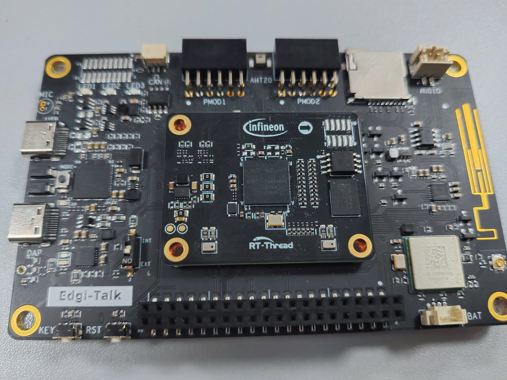
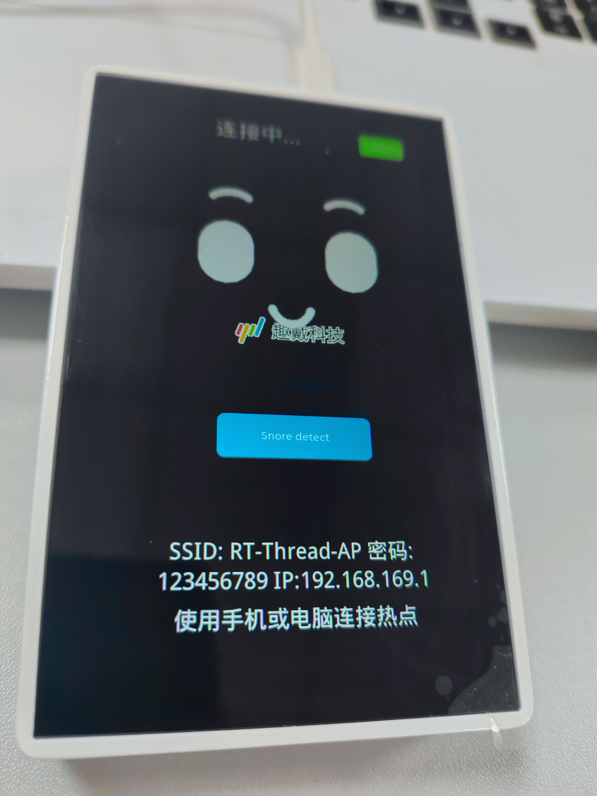

# 毫米波雷达睡眠看护与呼噜扰动监测系统

> 面向卧室、养老看护、夜间值守场景的**非接触生命体征监测 + 呼噜扰动识别 + 看护预警**一体化系统。


本项目由毫米波雷达板、Edgi-Talk 呼噜/温湿度板、一个 FastAPI 后端和一个 Vue3 前端 Web App 构成，**默认支持无硬件模拟联调**（不需要真实开发板也能完整演示）。系统实时采集心率 / 呼吸率 / 目标距离 / 呼噜强度 / 音频片段 / 温湿度，通过统一的秒级时间轴送入后端，前端将其转化为睡眠评分、扰动地图、环境舒适度事件流和 AI 健康报告。

---

## 目录

1. [项目特色](#1-项目特色)
2. [硬件层：雷达 + Edgi-Talk](#2-硬件层雷达--edgi-talk)
   - [2.1 毫米波雷达开发板 (`radar_wifi`)](#21-毫米波雷达开发板-radar_wifi)
   - [2.2 呼噜检测开发板 (`Edgi_Talk_M55_XiaoZhi`)](#22-呼噜检测开发板-edgi_talk_m55_xiaozhi)
3. [后端层：FastAPI 数据融合 (`backend/`)](#3-后端层fastapi-数据融合-backend)
4. [前端层：Vue 3 看护大屏 (`frontend/`)](#4-前端层vue-3-看护大屏-frontend)
5. [核心机制：呼噜-雷达时间戳对齐](#5-核心机制呼噜-雷达时间戳对齐)
6. [快速开始](#6-快速开始)
7. [项目结构](#7-项目结构)

---

## 1. 项目特色

| 能力 | 描述 |
|---|---|
| **非接触生命体征采集** | 毫米波雷达 60GHz 通过胸腔微动提取心率 / 呼吸率 / 目标距离，无需佩戴任何设备 |
| **呼噜扰动识别** | 床旁声学板持续监听，输出呼噜分数 / dBFS / 呼噜事件 / 10 秒音频片段 |
| **卧室环境监测** | AHT20 温湿度数据接入同一时间轴，生成舒适、过热、过冷、过干、过湿状态 |
| **统一时间轴融合** | 后端将雷达、呼噜、温湿度数据按秒合并到同一 `timeline`，前端多图同时间轴展示 |
| **睡眠质量评分** | 0-100 分综合评分 + 扣分原因（心率 / 呼吸 / 呼噜 / 离床 / 设备） |
| **夜间守护事件流** | 自动归因：呼噜事件、疑似离床、心率 / 呼吸异常、设备离线 / 恢复 |
| **看护动作队列** | 阈值策略驱动，把异常翻译成可执行动作（"检查雷达距离"、"确认呼噜板在线"） |
| **历史 + AI 洞察** | SQLite 存储 + DeepSeek API（可降级到本地规则），跨路由保留分析过程 |
| **离线优雅降级** | 雷达板 / 呼噜板任一离线时，对应曲线断线并显示 `--`，不会用 0 假装真实生理数据 |
| **无硬件可演示** | 提供 `mock_device_sender.py`，无开发板即可演示完整流程 |

---

## 2. 硬件层：雷达 + Edgi-Talk

### 2.1 毫米波雷达开发板 (`radar_wifi/`)



| 项目 | 说明 |
|---|---|
| **平台** | Infineon PSoC™ 6 + AIROC™ CYW43xxx Wi-Fi 模组（ModusToolbox） |
| **实时系统** | FreeRTOS + lwIP + mbedTLS |
| **雷达前端** | 英飞凌 XENSIV™ BGT60TRXX 60GHz 雷达收发器（SPI 接口） |
| **关键源文件** | [`radar_wifi/source/radar_task.c`](radar_wifi/source/radar_task.c)、[`radar_wifi/source/udp_server.c`](radar_wifi/source/udp_server.c)、[`radar_wifi/source/main.c`](radar_wifi/source/main.c) |
| **通信方式** | Wi-Fi UDP Server，端口 `9988`，向 PC 端 `realtime_radar_processing.py` 推送雷达帧 |
| **核心功能** | 通过 SPI 读取 BGT60TRXX 一帧原始采样（含多 RX 天线阵列），按帧封装后通过 UDP 推送；后端在 PC 端做 Range-FFT / 相位提取 / 心率呼吸率解算 |
| **协议说明** | 每帧包含帧序号 + 一组雷达 IQ 样本；后端会基于相位波形解调出心率与呼吸率 |
| **上电效果** | 串口打印 `UDP Server with Radar data` 横幅并启动 RTOS 调度器（见 [`radar_wifi/README.md`](radar_wifi/README.md)） |

**前端展示对应：** 实时监测页 → 心率趋势、呼吸趋势、呼噜强度趋势、设备状态胶囊中的"雷达开发板在线/离线"。

---

### 2.2 呼噜检测开发板 (`Edgi_Talk_M55_XiaoZhi/`)



| 项目 | 说明 |
|---|---|
| **平台** | Infineon PSoC™ Edge E84（多核：Secure M33 / M33 / M55） |
| **实时系统** | RT-Thread（多核 + LVGL UI） |
| **关键源文件** | [`Edgi_Talk_M55_XiaoZhi/applications/main.c`](Edgi_Talk_M55_XiaoZhi/applications/main.c)、[`Edgi_Talk_M55_XiaoZhi/applications/xiaozhi/xiaozhi.cpp`](Edgi_Talk_M55_XiaoZhi/applications/xiaozhi/xiaozhi.cpp)、[`.../wake_word/snore_detect.cpp`](Edgi_Talk_M55_XiaoZhi/applications/xiaozhi/wake_word/snore_detect.cpp) |
| **核心子系统** | LVGL UI 表情动画 + Wi-Fi 配网（AP 模式 `192.168.169.1`）+ WebSocket 语音交互（基于小智云） + Edge Impulse 唤醒词检测 + 音频上行 |
| **音频能力** | mic0 PCM 采集 + Opus 编码 + 16kHz 单声道 + 60ms 帧长；唤醒阈值 80% 置信度 |
| **本项目用途** | 改造为**床旁呼噜检测 + 温湿度上报**：拾取夜间环境音，通过 HTTP POST 上传 10 秒音频到 PC 后端（`http://电脑IP:8081/audio`）；M33 读取 AHT20，M55 通过共享内存读取温湿度并上报 |
| **双模式** | 上电默认守护模式：呼噜推理 + 云端 STT 求助词匹配；对话模式：暂停守护并立即进入小智多轮对话 |
| **状态机** | Unknown → Starting → WifiConfiguring → Idle → Connecting → Listening → Speaking → Sleep |

**前端展示对应：** 实时监测页 → 呼噜声浪条（条形跳动）、呼噜强度趋势图、温湿度趋势图、呼噜事件状态、设备状态胶囊中的"呼噜开发板在线/离线"和"温湿度板在线/离线"。

> 详细启动流程与多核烧写顺序参见 [`Edgi_Talk_M55_XiaoZhi/README_zh.md`](Edgi_Talk_M55_XiaoZhi/README_zh.md)。

---

## 3. 后端层：FastAPI 数据融合 (`backend/`)

后端是系统的"中枢神经"，负责**接收雷达、呼噜和温湿度数据、维护共享时间轴、计算睡眠指标、生成 AI 报告**。

| 入口文件 | 用途 | 推荐场景 |
|---|---|---|
| **`mock_hardware_api.py`** ⭐ | 完整模拟后端（提供 sleep overview / 历史 / 告警） | **联调 sleep overview、预警中心、历史数据页的入口** |
| `realtime_radar_processing.py` | 真实 UDP 接收 + 心率/呼吸率解算 | 接真实雷达开发板时使用 |
| `mock_device_sender.py` | 模拟开发板发送器 | 无硬件联调 |
| `mock_server.py` | 早期版本 | 已不推荐 |

### 3.1 关键 REST 接口

| 方法 | 路径 | 作用 |
|---|---|---|
| GET | `/status` | 设备在线状态、当前心率/呼吸/呼噜分数、音频上传次数、温湿度与舒适度 |
| GET | `/timeline?seconds=180` | **共享秒级时间轴**（三图对齐的根源） |
| GET | `/sleep/overview?mode=live&seconds=1800` | 睡眠质量评分、扰动热力、事件流 |
| GET | `/heartdata/selectPage` | 分页查询历史生命体征 |
| POST | `/login` / `/register` | 用户认证（SQLite 存储） |
| POST | `/save-vitals-with-user` | 保存心率/呼吸到历史 |
| POST | `/audio` | 接收呼噜板上传的 10 秒音频片段 |
| POST | `/mock/radar-frame` | 接收模拟雷达板帧 |
| POST | `/mock/snore-heartbeat` | 接收模拟呼噜板每秒特征 |
| POST | `/mock/environment-heartbeat` | 接收温湿度板心跳 |
| POST | `/ai/analyze-vitals` | 代理 DeepSeek 分析；未配置 key 时降级本地规则 |

### 3.2 关键特性

- **共享时间轴**：见第 5 节，时间戳对齐是本系统的核心。
- **离线优雅降级**：`heart_rate` / `breath_rate` / `snore_level` 在对应板离线时变为 `null`，前端断线不伪装数据。
- **环境舒适度**：温度 `18-28 C`、湿度 `40-70 %RH` 为默认舒适区，过热/过冷/过干/过湿会进入睡眠评分和告警中心。
- **DeepSeek 代理**：`backend/.env` 配置 `DEEPSEEK_API_KEY`，未配置时自动本地规则兜底，**不向浏览器暴露 key**。
- **SQLite 持久化**：用户、历史生命体征、睡眠事件全部落库。
- **音频入库**：收到的 10 秒音频保存到 `backend/mock_audio_uploads/`，可追溯。
- **场景注入**：`POST /mock/scenario` 可模拟"无人 / 异常 / 离床"等场景。

---

## 4. 前端层：Vue 3 看护大屏 (`frontend/`)

> **技术栈**：Vue 3 + Vite 7 + Pinia（持久化）+ Element Plus + ECharts + Plotly.js + Axios

前端由 6 个核心页面 + 1 个登录页组成，结构清晰、风格统一（医疗科技 + 玻璃卡片 + 深蓝绿高对比），所有页面支持深浅主题切换。

### 4.1 登录页 `/login`


- **功能**：账号密码登录 / 邮箱注册，调用 `POST /login`、`POST /register`。
- **特点**：右上角深浅色切换、本地登录状态保留。

---

### 4.2 项目首页 `/manage/project_intro`


**作用**：整个 Web App 的入口与"项目展示门面"，向评委、老师、第一次打开系统的人介绍"这是什么项目、用了什么硬件、能解决什么问题"。

**核心模块**：

| 模块 | 说明 |
|---|---|
| 顶部项目介绍 | 项目名 "毫米波雷达睡眠看护与呼噜扰动监测系统"、项目目标、两个 CTA 按钮（进入实时监测 / 查看睡眠驾驶舱） |
| 多设备数据流示意 | 左侧 Radar Board、右侧 Edgi-Talk，中间 Edge + Web App 融合核（玻璃卡片） |
| 4 张价值卡片 | 01 非接触生命体征 / 02 呼噜扰动识别 / 03 睡眠看护闭环 / 04 展示级 Web App |
| 4 步工作流 | 多设备采集 → 边缘侧上报 → 融合分析 → 看护决策 |
| 开发板实拍图 | 毫米波雷达开发板（`hardware-radar-board.jpg`） + 呼噜检测开发板（`snore-detect-board.jpg`），带深色渐变说明标签 |
| 页面入口 | LIVE / SLEEP / ALERT / DATA 四个跳转按钮 |

**实现位置**：[`frontend/src/views/project_intro.vue`](frontend/src/views/project_intro.vue)

---

### 4.3 生命体征监测（实时） `/manage/heart_pic`


**作用**：系统最直观的**实时监测主页面**，向使用者、调试者、演示者展示雷达、呼噜、温湿度在同一时间轴上的同步效果。

**核心组件**：

| 组件 | 数据来源 | 关键能力 |
|---|---|---|
| 开始/停止实时监测按钮 | — | 控制前端轮询，红色 = 监测中 |
| **双板在线状态胶囊** | `/status` | 雷达 / 呼噜 / 呼噜事件三色徽标 |
| **设备卡片 × 3** | `/status` | 雷达板：帧号、最近接收时间；呼噜板：分数、音频次数、最近音量；温湿度板：温度、湿度、舒适度 |
| **呼噜声浪监测** | `/status.snore_level` | 条形声浪，每秒跳动；事件时高亮红色 |
| **睡眠分期卡** | `/timeline` 启发式规则 | 清醒 / 浅睡 / 深睡 / 疑似呼噜扰动 |
| **呼噜-生命体征关联** | 最近呼噜事件 + 心率/呼吸 | 显示事件前后生命体征变化 |
| **实时健康摘要** | 本地规则 | 当下状态文字解释 |
| **三张共享时间轴趋势图** | `/timeline` | **心率趋势**、**呼吸趋势**、**呼噜强度趋势** — 三图使用同一批 `timestamp`，横坐标完全对齐 |

**数据来源标注**：页面明确说明
- 心率 / 呼吸率 / 距离 / 相位波形 ← 毫米波雷达开发板
- 呼噜强度 / 音频 / 呼噜事件 ← 呼噜检测开发板

**离线行为**：
- 关闭雷达板 → 心率/呼吸变 `--`，曲线断线，**不显示假 0**
- 关闭呼噜板 → 声浪条暂停、呼噜图断线，**但心率/呼吸继续**（因为呼吸率来自雷达）

**实现位置**：[`frontend/src/views/heart_pic.vue`](frontend/src/views/heart_pic.vue)

---

### 4.4 睡眠看护驾驶舱 `/manage/sleep_dashboard`


**作用**：把实时数据**进一步整理成睡眠质量、扰动趋势和夜间事件流**，是面向看护人员 / 答辩 / 展示的"夜间大屏"。

**核心组件**：

| 组件 | 描述 |
|---|---|
| **实时 / 历史回放切换** | 实时选 10 分钟 / 30 分钟 / 1 小时；历史选日期查 SQLite |
| **设备状态胶囊 × 4** | 雷达板 / 呼噜板 / 音频片段次数 / 数据点数 |
| **Sleep Quality Score 圆环** | 0-100 分，中央发光圆环 + 状态标签（"稳定睡眠"/"轻度扰动"/"呼噜频繁"/"疑似离床"/"设备异常"） |
| **扣分原因标签** | "呼噜扰动 -12"、"呼吸波动 -8"、"设备离线 -5" 等可叠加原因 |
| **呼噜扰动地图** | 横向时间轴热力条，按分钟聚合，颜色由蓝→紫→橙红表示扰动强度；悬浮显示时间/分数/dBFS/心率变化 |
| **夜间守护事件流** | 右侧竖向时间线，事件类型：呼噜事件 / 疑似离床 / 心率异常 / 呼吸异常 / 设备离线 / 恢复正常；支持"全部/异常/呼噜/设备"过滤 |
| **稳定性卡片** | 心率稳定性 / 呼吸稳定性 / 呼噜安静度 三张小卡 |

**数据来源**：`GET /sleep/overview?mode=live&seconds=1800`

**实现位置**：[`frontend/src/views/sleep_dashboard.vue`](frontend/src/views/sleep_dashboard.vue)

---

### 4.5 看护预警中心 `/manage/alert_center`


**作用**：面向看护人员 / 值守人员，把异常翻译成"下一步该做什么"。

**核心组件**：

| 组件 | 描述 |
|---|---|
| 风险总览卡 | 立即关注 / 继续观察 / 稳定，三档分级 |
| 设备状态卡 × 3 | 雷达板 / 呼噜板 / 音频片段 |
| 异常归因矩阵 | 心率 / 呼吸 / 呼噜 / 离床-无人 / 设备链路 5 类风险 |
| **照护动作队列** | 风险触发的可执行建议："检查雷达距离"、"确认呼噜板在线"、"观察呼吸波动"等 |
| 阈值策略面板 | 心率高低阈值 / 呼吸高低阈值 / 呼噜阈值 / 设备离线秒数 |
| 趋势小窗 | ECharts 显示最近 30 分钟心率/呼吸/呼噜小趋势 |

**持久化**：阈值策略 + 已处理动作状态保存在 `alertPolicyStore` (Pinia + persistedstate)，刷新页面仍保留。

**数据来源**：`/sleep/overview` + `/timeline` + `/status`

**实现位置**：[`frontend/src/views/alert_center.vue`](frontend/src/views/alert_center.vue)

---

### 4.6 历史数据与 AI 洞察 `/manage/data`


**作用**：查询历史生命体征 + 基于当前页数据生成 AI 或本地规则健康报告。

**核心组件**：

| 组件 | 描述 |
|---|---|
| 日期筛选 + 查询 | 调用 `GET /heartdata/selectPage` 分页 |
| **数据质量 KPI** | 平均心率 / 平均呼吸率 / 异常计数 / 偏态标记 |
| 历史表格 | 编号 / 用户 / 日期 / 心率（偏低-正常-偏高标签） / 呼吸（同样带标签） |
| **AI 洞察卡** | 独立卡片：loading skeleton + provider badge (DeepSeek/Local) + fallback badge + 错误重试 + 报告正文 |
| 重置按钮 | 清除当前查询 |

**AI 分析状态修复**：AI 分析状态从页面局部 `reactive` 移入 `useHistoryAnalysisStore`，跨路由异步过程用 `inFlightAnalysisPromise` + `requestToken` 保留：
- 离开 `/manage/data` 后请求继续；
- 返回页面仍显示"分析中"或最终报告；
- 重置 / 新请求会忽略旧结果。

**数据来源**：`/heartdata/selectPage` + `/ai/analyze-vitals`（后端代理 DeepSeek，未配置 key 自动本地规则兜底）

**实现位置**：[`frontend/src/views/data.vue`](frontend/src/views/data.vue) + [`frontend/src/stores/historyAnalysisStore.js`](frontend/src/stores/historyAnalysisStore.js)

---

### 4.7 呼吸监测 `/manage/breath_pic`


**作用**：独立展示**呼吸相关波形**，用于观察雷达相位或呼吸趋势，辅助算法 / 硬件调试。

**核心组件**：

- 实时呼吸波形（相位）
- 实时呼吸率
- 远程波形 + 帧号

**适合场景**：算法调试、硬件联调、单独验证呼吸提取效果。

**实现位置**：[`frontend/src/views/breath_pic.vue`](frontend/src/views/breath_pic.vue) + [`HeartRateMonitor.vue`](frontend/src/views/HeartRateMonitor.vue) + [`BreathRateMonitor.vue`](frontend/src/views/BreathRateMonitor.vue)

---

## 5. 核心机制：呼噜-雷达时间戳对齐

> 这是本系统最关键的设计：**两个开发板、两套协议、不同步的采样频率，最终在前端呈现"同一时间轴"**。

### 5.1 为什么需要对齐？

心率、呼吸率、呼噜强度这三类数据描述的是**同一个人的同一段时间**。如果不在后端对齐，前端会出现：
- 心率图横坐标是 `01:23:45`
- 呼噜图横坐标是 `01:23:47`（偏移 2 秒）
- 看起来"呼噜发生时心率没反应"，但其实只是采样没对齐

### 5.2 后端如何对齐？ `/timeline` 接口

`backend/mock_hardware_api.py` 维护一个**秒级时间桶缓冲区**，每秒钟 1 个点：

```python
# mock_hardware_api.py - 核心数据结构
TIMELINE_RETENTION_SECONDS = 7200  # 保留 2 小时

state = {
    "timeline": deque(maxlen=7200),  # 最多 2 小时秒级数据
    # 每条 timeline 记录：
    # {
    #   "timestamp": "2026-06-02T18:30:15",
    #   "heart_rate": 75.7,        # ← 来自雷达板
    #   "breath_rate": 19.4,       # ← 来自雷达板
    #   "target_distance": 0.85,   # ← 来自雷达板
    #   "snore_score": 0.85,       # ← 来自呼噜板
    #   "snore_dbfs": -14.0,       # ← 来自呼噜板
    #   "snore_level": 0.949,      # ← 来自呼噜板
    #   "snore_detected": true,    # ← 来自呼噜板
    #   "radar_online": true,
    #   "snore_online": true,
    #   "sleep_stage": "疑似呼噜扰动"
    # }
}
```

**写入时机**：

| 触发 | 字段来源 | 写入函数 |
|---|---|---|
| `POST /mock/radar-frame` (每秒) | 心率 / 呼吸率 / 距离 / 相位 | `update_radar_frame()` |
| `POST /mock/snore-heartbeat` (每秒) | 呼噜分数 / dBFS / 事件 | `update_snore_heartbeat()` |
| `POST /audio` (每 10 秒) | 音频路径 / 音量 / snore_level | `record_audio_upload()` |

**读出时机**：

```text
GET /timeline?seconds=180
        ↓
返回最近 180 秒的数据，按 timestamp 升序
        ↓
前端心率图 / 呼吸图 / 呼噜图 全部使用同一批 timestamp
```

### 5.3 前端如何渲染？ `heart_pic.vue`

```javascript
// heart_pic.vue 中的核心渲染逻辑（简化）
async function refreshTimeline() {
  const res = await request.get('/timeline', { params: { seconds: 180 } });
  // res.data 是 [{ timestamp, heart_rate, breath_rate, snore_level, ... }, ...]

  // 关键：多张趋势图共用同一份 xAxis (timestamp)
  heartRateChart.setOption({
    xAxis: { data: res.data.map(d => d.timestamp) },
    series: [{ data: res.data.map(d => d.heart_rate) }]
  });

  breathChart.setOption({
    xAxis: { data: res.data.map(d => d.timestamp) },  // ← 同一份 timestamp
    series: [{ data: res.data.map(d => d.breath_rate) }]
  });

  snoreChart.setOption({
    xAxis: { data: res.data.map(d => d.timestamp) },  // ← 同一份 timestamp
    series: [{ data: res.data.map(d => d.snore_level) }]
  });
}
```

### 5.4 离线时的对齐行为

当某一块开发板离线时，对应字段变为 `null`，**前端曲线断线**：

```text
时间轴:  18:30:10  18:30:11  18:30:12  18:30:13  18:30:14  18:30:15
心率:    75.2      75.6      75.1      null      null      null   ← 雷达板掉线
呼吸率:  19.2      19.5      19.3      null      null      null   ← 雷达板掉线
呼噜:    0.85      0.88      0.91      0.85      0.80      0.78  ← 呼噜板仍在线
```

**展示效果**：心率图和呼吸图在 18:30:13 处出现**断线**（不是显示 0），而呼噜图**继续显示**，用户能清晰看到"雷达板掉线了，但呼噜监测还在工作"。

### 5.5 为什么心率和呼吸率不"一模一样"？

它们来自同一块雷达板，描述同一个人，本应**强相关**（大事件同步发生），但**不应该完全相同**。模拟器故意做了差异化：

| 维度 | 心率 | 呼吸率 |
|---|---|---|
| 频率 | 较高（60-100 BPM） | 较低（12-25 BPM） |
| 相位 | 独立随机 | 独立随机 |
| 恢复速度 | 较慢 | 较快 |
| 呼噜扰动时的反应 | 明显抬升 | 轻微抬升 + 频率波动 |

这样用户一眼能看出"这两条曲线在同一个事件上同步变化，但不是同一条线"。

---

## 6. 快速开始

> 完整步骤见 [`README.md`](README.md)。这里给最简 4 终端流程。

### 6.1 启动后端（无硬件模拟）

```powershell
conda activate radar
python backend\mock_hardware_api.py
# 监听 http://localhost:8081
```

### 6.2 启动前端

```powershell
cd frontend
npm install
npm run dev
# 访问 http://localhost:5173/
```

### 6.3 启动模拟雷达板

```powershell
conda activate radar
python backend\mock_device_sender.py --radar-board
```

### 6.4 启动模拟呼噜板

```powershell
conda activate radar
python backend\mock_device_sender.py --snore-board
```

> 关闭任一模拟板终端约 5 秒后，前端对应模块显示离线。

### 6.5 注册并登录

- 用户名：`demo`
- 密码：`demo123`

> 详细 DeepSeek AI 配置、真实硬件接入、常见问题排查，见 [`README.md`](README.md) 与 [`MOCK_SIMULATION_HANDOFF.md`](MOCK_SIMULATION_HANDOFF.md)。

---

## 7. 项目结构

```text
hrrr-radar-monitor-system/
├── README.md                              # 详细启动教程（4 终端）
├── PROJECT_README.md                      # 本文件：项目功能介绍
├── PLAN.md                                # 实施计划 / 设计文档
├── MOCK_SIMULATION_HANDOFF.md             # 模拟联调交接说明
├── 看护预警中心页面及功能.md              # 预警中心设计计划
├── 睡眠看护驾驶舱页面及功能.md            # 驾驶舱设计计划
├── 项目页面与功能说明.md                  # 页面口径说明
├── 项目框架图.png                         # 整体框架图
│
├── image/                                 # 硬件实拍图
│   ├── 毫米波雷达开发板.jpg
│   └── 呼噜检测E84-Edgi-TaIk开发板.jpg
│
├── radar_wifi/                            # 毫米波雷达开发板（FreeRTOS + ModusToolbox）
│   ├── README.md
│   ├── source/
│   │   ├── main.c                        # RTOS 入口
│   │   ├── radar_task.c                  # 雷达采样任务
│   │   ├── radar_config_task.c           # 雷达配置
│   │   └── udp_server.c                  # Wi-Fi UDP 推送
│   ├── images/                           # 串口 / UDP 输出示意图
│   └── ...
│
├── Edgi_Talk_M55_XiaoZhi/                # 呼噜检测开发板（RT-Thread + 多核）
│   ├── README_zh.md
│   ├── applications/
│   │   ├── main.c                        # M55 应用核入口
│   │   └── xiaozhi/
│   │       ├── xiaozhi.cpp               # 状态机 / WebSocket 语音
│   │       ├── xiaozhi_audio.cpp         # 音频上行
│   │       └── wake_word/
│   │           ├── xiaozhi_wakeword.cpp  # Edge Impulse 唤醒词
│   │           └── meow_detect_once.cpp  # 单次检测（可改造为呼噜）
│   ├── board/                            # BSP
│   └── ...
│
├── backend/                               # FastAPI 后端
│   ├── mock_hardware_api.py              # ⭐ 完整模拟后端（推荐入口）
│   ├── realtime_radar_processing.py      # 真实 UDP 接收 + 心率/呼吸率解算
│   ├── mock_device_sender.py             # 模拟雷达板 / 呼噜板发送器
│   ├── mock_server.py                    # 早期版本
│   ├── presence_detection.py
│   ├── radar_func.py
│   ├── radar_settings.py
│   ├── radar_dl_models.py
│   ├── signal_decomposition.py
│   ├── traditional_methods.py
│   ├── audio_udp_receive.py
│   ├── db.py
│   ├── .env.example                      # DeepSeek key 配置示例
│   └── requirements.txt
│
├── frontend/                              # Vue 3 前端
│   ├── package.json
│   ├── vite.config.js
│   ├── public/
│   │   └── pic/
│   │       ├── hardware/
│   │       │   ├── hardware-radar-board.jpg    # 项目首页用雷达板图
│   │       │   └── snore-detect-board.jpg      # 项目首页用呼噜板图
│   │       ├── breath_data.jpg
│   │       ├── heart_data.jpg
│   │       ├── doppler.png
│   │       ├── range_fft.png
│   │       └── range_fft_single.png
│   └── src/
│       ├── main.js
│       ├── App.vue
│       ├── router/index.js
│       ├── stores/
│       │   ├── userStore.js
│       │   ├── themeStore.js              # 深浅主题
│       │   ├── historyAnalysisStore.js    # AI 分析状态（跨路由）
│       │   └── alertPolicyStore.js        # 阈值策略 + 已处理动作
│       ├── utils/request.js               # 统一 axios 封装
│       ├── assets/
│       │   ├── global.css                 # 语义 token：颜色、阴影、圆角
│       │   ├── logo.svg
│       │   └── leftmenu/                  # 侧栏图标
│       └── views/
│           ├── login.vue
│           ├── manage.vue                 # 侧栏 + 路由出口
│           ├── project_intro.vue          # 项目首页
│           ├── heart_pic.vue              # 生命体征监测
│           ├── sleep_dashboard.vue        # 睡眠看护驾驶舱
│           ├── alert_center.vue           # 看护预警中心
│           ├── data.vue                   # 历史数据
│           ├── breath_pic.vue             # 呼吸监测
│           ├── HeartRateMonitor.vue
│           └── BreathRateMonitor.vue
│
├── tests/                                 # 单元测试
│   └── test_realtime_snore_api.py
│
└── docs/                                  # 文档与截图
    ├── take_screenshots.mjs               # Playwright 截图脚本
    └── screenshots/                       # 自动生成的前端页面截图
        ├── 01-login.png
        ├── 02-project-intro.png
        ├── 03-heart-pic.png
        ├── 03-heart-pic-full.png
        ├── 04-sleep-dashboard.png
        ├── 05-alert-center.png
        ├── 06-data.png
        └── 07-breath-pic.png
```

---

## 8. 演示推荐顺序

| 顺序 | 页面 | 演示目的 | 推荐讲解时间 |
|---:|---|---|---:|
| 1 | 项目首页 | 先讲清楚项目背景、硬件组成和系统闭环 | 1 分钟 |
| 2 | 生命体征监测 | 展示实时心率、呼吸率、呼噜强度和双板在线状态、**三图同时间轴** | 2 分钟 |
| 3 | 睡眠看护驾驶舱 | 展示系统如何从实时数据生成睡眠质量评分、扰动热力、事件流 | 2 分钟 |
| 4 | 看护预警中心 | 展示系统如何给出异常归因和照护动作队列 | 1.5 分钟 |
| 5 | 历史数据 | 展示历史记录、异常标签和 AI / 本地健康报告 | 1.5 分钟 |
| 6 | 呼吸监测 | 如需讲算法或雷达信号，再展示该页面 | 0.5 分钟 |

> 关闭某个模拟板终端约 5 秒后，前端对应模块会显示离线 / 断线 / `--`，可作为离线演示的"硬核彩蛋"。

---

## 9. 相关文档

| 文档 | 内容 |
|---|---|
| [`README.md`](README.md) | 4 终端启动教程、conda 配置、DeepSeek 配置、常见问题 |
| [`MOCK_SIMULATION_HANDOFF.md`](MOCK_SIMULATION_HANDOFF.md) | 无硬件模拟联调与前端分析增强交接说明 |
| [`PLAN.md`](PLAN.md) | 实施计划（实施步骤 / 测试方案 / 设计决策） |
| [`项目页面与功能说明.md`](项目页面与功能说明.md) | 页面定位 / 讲解口径 / 演示推荐顺序 |
| [`睡眠看护驾驶舱页面及功能.md`](睡眠看护驾驶舱页面及功能.md) | 睡眠看护驾驶舱设计计划 |
| [`看护预警中心页面及功能.md`](看护预警中心页面及功能.md) | 看护预警中心设计计划 |
| [`radar_wifi/README.md`](radar_wifi/README.md) | 毫米波雷达开发板说明 |
| [`Edgi_Talk_M55_XiaoZhi/README_zh.md`](Edgi_Talk_M55_XiaoZhi/README_zh.md) | 呼噜检测开发板（小智）说明 |

---

> ⚠️ **重要提示**：本项目为课程设计 / 答辩 / 演示用，**不构成医学诊断**。所有生理指标（心率 / 呼吸率 / 睡眠评分）仅用于演示系统的数据流与可视化能力。
