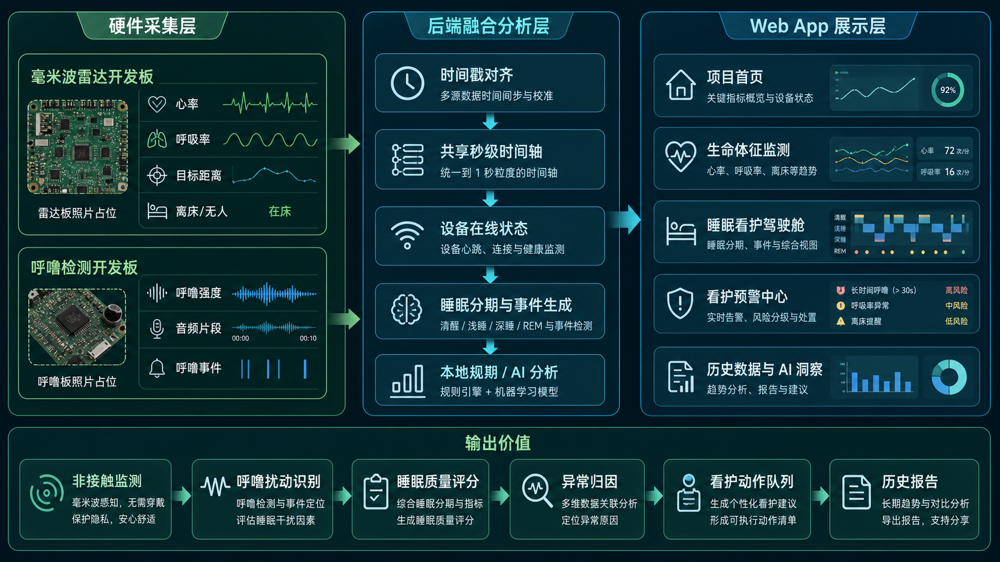

# 雷达生命体征监测系统：无开发板持续模拟联调版



这个项目现在可以在**没有毫米波雷达开发板、没有呼噜检测开发板、没有温湿度板**的情况下跑通完整演示。

模拟模式包含三类“虚拟/手动注入开发板数据”：

1. **毫米波雷达模拟板**：持续发送心率、呼吸率、目标距离、相位波形。
2. **呼噜检测模拟板**：每秒发送呼噜特征，并每 10 秒上传一个 10 秒音频片段。
3. **温湿度板数据**：通过 `POST /mock/environment-heartbeat` 注入温度、湿度、传感器状态。

关闭某个模拟板终端，就等于把对应开发板关掉；前端大约 5 秒后会显示离线。

> ⚠️ **后端启动方式务必看清**：本项目提供 3 个后端入口文件，现在 `backend/mock_hardware_api.py` 和 `backend/realtime_radar_processing.py` 都支持 sleep overview、温湿度、告警中心接口。
> - ❌ `backend/mock_server.py`（端口 8000）—— 早期简化示例，不作为主入口。
> - ✅ `backend/mock_hardware_api.py`（端口 8081）—— 无硬件演示、前端联调的推荐入口。
> - ✅ `backend/realtime_radar_processing.py`（默认 API 端口 8081）—— 接真实毫米波雷达时使用，也支持温湿度和睡眠概览。
>
> 如果看到 404，请先确认没有启动旧的 `mock_server.py`，且 8081 端口没有被另一个后端占用。

---

## 1. 预期效果

启动成功后，前端页面会显示：

- 雷达开发板在线/离线状态。
- 呼噜开发板在线/离线状态。
- 温湿度板在线/离线状态、温度、湿度、舒适度。
- 心率、呼吸率、呼噜强度三张曲线，使用同一条真实时间横坐标。
- 温度、湿度趋势图，支持舒适、过热、过冷、过干、过湿告警。
- 呼噜声浪条：会随着呼噜分数和音量 dBFS 实时变高变低。
- 雷达离线或无人时，曲线断开并显示 `--`，不会再用 `0` 假装真实数据。
- 睡眠分期：清醒/浅睡/深睡/疑似呼噜扰动。
- 呼噜-生命体征关联：观察呼噜事件前后心率、呼吸率变化。
- 实时健康摘要。
- 新增“睡眠看护驾驶舱”：深色夜间大屏，展示睡眠质量评分、呼噜扰动地图、夜间守护事件流。
- 历史数据页可点击“AI分析”；如果没有 DeepSeek key，会自动显示本地规则分析。

数据来源说明：

- **心率、呼吸率、距离**来自毫米波雷达模拟板。
- **呼噜分数、音量 dBFS、声浪条、呼噜事件、音频次数**来自呼噜检测模拟板。
- **温度、湿度、环境舒适度**来自温湿度板；真实硬件上由 M33 读取 AHT20，M55 通过共享内存读取并上报。
- 所以只关闭呼噜模拟板时，呼吸监测继续运行是正常的。

---

## 2. 环境准备

先克隆并进入项目根目录。下面只使用相对路径，实际目录取决于你把仓库克隆到哪里：

```powershell
git clone https://github.com/Kirito14IT/hrrr-radar-monitor-system.git
cd hrrr-radar-monitor-system
```

如果你已经在 VS Code / PowerShell 中打开了本项目根目录，可以跳过上面的 `cd`，后续命令默认都在项目根目录执行。

激活你的 Conda 环境：

```powershell
conda activate radar
```

看到提示符前面出现 `(radar)` 就说明成功，路径可能因电脑不同而不同：

```text
(radar) PS ...\hrrr-radar-monitor-system>
```

如果 PowerShell 提示找不到 `conda`，先执行 `conda init powershell`，关闭并重新打开 PowerShell 后再运行 `conda activate radar`。不要在 README 或脚本里写死某台电脑上的 Anaconda 安装路径。

如果后端缺依赖：

```powershell
pip install -r backend\requirements.txt
```

如果前端缺依赖：

```powershell
cd frontend
npm install
cd ..
```

---

## 3. 真实毫米波雷达开发板启动方式

真实硬件主线固定使用：

- 毫米波雷达开发板 UDP 数据端口：`9988`
- 呼噜检测开发板 HTTP 音频上传接口：`http://电脑IP:8081/audio`
- 后端 HTTP API：`8081`
- 前端 Vite：`5173`

### 终端 1：启动实时雷达处理后端

```powershell
# 在项目根目录执行
conda activate radar
python backend\realtime_radar_processing.py --port 9988 --api-port 8081 --no-presence
```

调试阶段建议先加 `--no-presence`，用于确认 UDP 接收、目标距离、时间轴和前端在线状态是否跑通。正式验证存在检测时再去掉该参数：

```powershell
python backend\realtime_radar_processing.py --port 9988 --api-port 8081
```

### 终端 2：启动前端

```powershell
cd frontend
npm run dev
```

浏览器打开：

```text
http://localhost:5173/
```

后端接口自检：

```powershell
curl http://localhost:8081/status
curl http://localhost:8081/target
curl http://localhost:8081/timeline?seconds=180
curl http://localhost:8081/heartrate
curl -Method POST http://localhost:8081/mock/environment-heartbeat -ContentType "application/json" -Body '{"temperature_c":24.5,"humidity_pct":52.0,"sensor_ok":true,"source":"manual_check"}'
```

如果开发板正在向 `9988` 发送 UDP 数据，`/status` 中的 `radar_board_online` 应为 `true`，`/timeline` 应返回 `200`。

呼噜检测开发板接入时，把开发板上传地址配置为：

```text
http://你的电脑IP:8081/audio
```

如果开发板发送的是每秒 JSON 特征心跳，可用：

```text
http://你的电脑IP:8081/mock/snore-heartbeat
```

收到呼噜板数据后，`/status` 中的 `snore_board_online` 应为 `true`，并会更新 `audio_upload_count`、`snore_score`、`snore_dbfs`、`snore_detected`。

收到温湿度数据后，`/status` 中的 `environment_board_online` 应为 `true`，并会更新 `temperature_c`、`humidity_pct`、`comfort_status`。默认舒适范围是温度 `18-28 C`、湿度 `40-70 %RH`；温度 `<15` 或 `>32 C`、湿度 `<30` 或 `>80 %RH` 会进入更严重的环境告警。

---

## 4. 无硬件模拟启动方式：4 个终端

> 📌 **提醒**：本章节的「模拟后端」特指 `mock_hardware_api.py`。如果你的目的是联调 sleep overview / 历史数据 / 告警中心页面，请使用这个文件，不要用 `mock_server.py` 或 `realtime_radar_processing.py`。

### 终端 1：启动模拟后端

```powershell
# 在项目根目录执行
conda activate radar
python backend\mock_hardware_api.py
```

正常输出类似：

```text
无硬件模拟后端已启动
本机访问: http://localhost:8081
局域网访问: http://你的当前IP:8081
```

这个窗口不要关。它负责：

- 给前端提供 API。
- 保存历史生命体征。
- 接收雷达模拟数据。
- 接收呼噜音频。
- 接收温湿度板心跳。
- 代理 DeepSeek AI 分析。

### 终端 2：启动前端

```powershell
# 从项目根目录进入前端目录
cd frontend
npm run dev
```

正常输出类似：

```text
Local:   http://localhost:5173/
```

浏览器打开：

```text
http://localhost:5173/
```

### 终端 3：启动毫米波雷达模拟板

```powershell
# 在项目根目录执行
conda activate radar
python backend\mock_device_sender.py --radar-board
```

它会每秒向后端发送一帧模拟生命体征：

```text
[radar-board] frame=12 status=ok hr=71.8 br=19.7 dist=0.85m
```

关闭这个终端后，前端会显示：

- 雷达开发板离线。
- 心率和呼吸率变为 `--`。
- 心率/呼吸图表出现断线。

如果你还想同时发送原始 UDP 包：

```powershell
python backend\mock_device_sender.py --radar-board --send-udp
```

### 终端 4：启动呼噜检测模拟板

```powershell
# 在项目根目录执行
conda activate radar
python backend\mock_device_sender.py --snore-board
```

默认行为：

- 每 1 秒发送一次呼噜特征：呼噜分数、音量、是否检测到呼噜。
- 每 10 秒上传一个 10 秒音频片段。

终端输出类似：

```text
[snore-board] heartbeat score=0.23 snore=False dbfs=-33.6
[audio] POST http://127.0.0.1:8081/audio bytes=640000 seconds=10.0
```

关闭这个终端后，前端会显示：

- 呼噜开发板离线。
- 音频上传次数不再增加。
- 心率和呼吸率仍然继续运行，因为它们来自雷达模拟板。

### 手动注入温湿度板数据

另开一个 PowerShell，在项目根目录执行：

```powershell
curl -Method POST http://localhost:8081/mock/environment-heartbeat -ContentType "application/json" -Body '{"temperature_c":24.5,"humidity_pct":52.0,"sensor_ok":true,"source":"manual_check"}'
curl http://localhost:8081/status
curl "http://localhost:8081/timeline?seconds=60"
curl "http://localhost:8081/sleep/overview?mode=live&seconds=300"
```

预期效果：

- `/status` 里 `environment_board_online` 为 `true`。
- `/timeline` 最近点包含 `temperature_c`、`humidity_pct`、`comfort_status`。
- 前端实时页出现 “AHT20 温湿度板” 设备卡和温湿度趋势图。
- 睡眠驾驶舱会把环境不舒适计入评分，告警中心会出现温湿度策略。

---

## 5. 注册、登录和查看页面

1. 打开 `http://localhost:5173/`。
2. 注册一个账号。
3. 登录。
4. 进入“生命体征监测”。

页面会自动开始刷新。按钮显示“停止监测”时，说明正在实时监测。

正常情况下你会看到：

- `雷达开发板：在线`
- `呼噜开发板：在线`
- `温湿度板：舒适`
- 心率和呼吸率每秒/每两秒刷新。
- 横坐标显示真实时间，例如 `01:23:45`。
- “呼噜声浪监测”的条状声浪会随着呼噜强度跳动。
- 心率、呼吸率、呼噜强度三张图的横坐标时间完全一致。
- 睡眠分期和实时健康摘要会随数据变化。

### 睡眠看护驾驶舱

左侧菜单点击“睡眠看护驾驶舱”，可以看到一个独立的深色夜间大屏：

- `Sleep Quality Score`：0-100 分睡眠质量评分。
- 呼噜扰动地图：按分钟显示呼噜强度热力条，颜色越偏橙红表示扰动越强。
- 夜间守护事件流：记录呼噜事件、疑似离床、心率/呼吸异常、设备离线和恢复正常。
- 底部稳定性卡片：心率稳定性、呼吸稳定性、呼噜安静度。
- 环境舒适度卡片：温湿度板离线、过热、过冷、过干、过湿都会扣分并生成事件。
- 页面支持“实时看护 / 历史回放”切换；历史事件会保存到后端 SQLite 的 `sleep_events` 表。

---

## 6. Edgi-Talk 固件编译、烧录和检查

### 功能说明

本项目的 Edgi-Talk 温湿度链路是：

```text
AHT20 -> M33(i2c1/SCL75/SDA74) -> shared/env_shared_memory -> M55 -> 屏幕 + 后端
```

M33 每 2 秒读取 AHT20 并写入共享内存；M55 每 2 秒读取共享内存，在待机主屏显示温湿度，WiFi 连接后每 5 秒向后端 `POST /mock/environment-heartbeat`。通信不使用 IPC。

WiFi 配置保存在 M55 工程的 `/flash/wifi_config.json`。保存前会确认 `/flash` 可写、可读回；保存时先写临时文件并校验，再替换正式文件。普通应用烧录不应清除该文件；如果使用整片擦除或外部 Flash 全擦除，WiFi 配置会被清掉，需要重新配一次。

### 编译

在项目根目录分别执行：

```powershell
cd Edgi_Talk_M33_AHT20
scons -j8
cd ..
cd Edgi_Talk_M55_XiaoZhi
scons -j8
cd ..
```

如果电脑没有配置 ARM 工具链，`scons` 会报找不到编译器，需要先按 Edgi-Talk/RT-Thread 工程文档配置工具链。

### 烧录顺序

按这个顺序烧录：

1. Secure M33 固件。
2. M33 NS 固件，也就是 `Edgi_Talk_M33_AHT20`，保持启用 CM55 Core。
3. M55 固件，也就是 `Edgi_Talk_M55_XiaoZhi`。

### 首次联网

第一次上电仍然使用 AP 配网：

1. 手机或电脑连接热点 `RT-Thread-AP`，密码 `123456789`。
2. 浏览器打开 `http://192.168.169.1`。
3. 选择路由器 WiFi，输入密码。
4. 配网成功后开发板会保存 `/flash/wifi_config.json`，然后自动切到 STA。

### 重启检查

按 reset 或重新上电后，预期不需要再打开 `192.168.169.1` 配网：

- M55 串口出现 `Config loaded: SSID=...`、`Connected to ... successfully`。
- M55 串口可运行 `wifi_cfg_status`，应看到 `storage_ready=1` 和已保存 SSID。
- M55 串口可运行 `env_status`，查看共享内存温湿度。
- M33 串口出现 `AHT20 initialized` 和 `AHT20 sample: ... C, ... %RH`。
- 屏幕待机时显示类似 `Env 24.5C  52.0%RH  OK`。

如果要手动清掉保存的 WiFi，在 M55 串口执行：

```text
wifi_cfg_clear
```

### 后端地址

M33 不需要配置电脑 IP。M33 只负责 AHT20 采样和共享内存写入。

M55 负责把呼噜和温湿度数据上传到电脑后端。为了适配电脑 IP 经常变化的情况，M55 支持把后端地址保存到 `/flash/backend_config.json`，以后换 WiFi 只需要在 M55 串口改一次，不需要改代码重新烧录。

在 M55 串口执行：

```text
backend_cfg_set 你的电脑IP 8081
backend_cfg_status
```

示例：

```text
backend_cfg_set 192.168.0.104 8081
backend_cfg_status
```

预期看到：

```text
backend_cfg_set: saved 192.168.0.104:8081
backend_cfg_status: saved target 192.168.0.104:8081 (/flash/backend_config.json)
```

如果想恢复代码里的默认地址，执行：

```text
backend_cfg_clear
```

---

## 7. DeepSeek AI 分析配置

历史数据页的“AI分析”现在不再把 API key 写在前端，而是由后端代理调用 DeepSeek。

复制示例配置：

```powershell
copy backend\.env.example backend\.env
```

打开：

```text
backend\.env
```

填写你的 key：

```env
DEEPSEEK_BASE_URL=https://api.deepseek.com
DEEPSEEK_MODEL=deepseek-v4-flash
DEEPSEEK_API_KEY=你的DeepSeek_API_Key
```

然后重启终端 1 的模拟后端。

说明：

- `backend\.env` 已经加入 `.gitignore`，不会提交。
- 如果不填 key，点击“AI分析”也不会报 403，会显示本地规则分析。
- 如果 DeepSeek 网络不可达，也会自动退回本地规则分析。
- 点击“AI分析”不会让两个模拟开发板终端退出；如果后端暂时忙，模拟板会打印重试提示并继续运行。

---

## 8. 可选命令

只上传一次 10 秒呼噜音频：

```powershell
python backend\mock_device_sender.py --audio
```

只发送一段雷达 UDP 原始包：

```powershell
python backend\mock_device_sender.py --radar-udp
```

一键演示 30 秒：

```powershell
python backend\mock_device_sender.py --demo
```

---

## 9. 手动验证清单

### 验证雷达模拟板

1. 启动终端 1、2、3。
2. 前端应显示雷达在线。
3. 心率和呼吸曲线应出现真实时间横坐标。
4. 关闭终端 3。
5. 等待约 5 秒，前端应显示雷达离线，心率/呼吸变 `--`。

### 验证呼噜模拟板

1. 启动终端 4。
2. 前端应显示呼噜板在线。
3. “呼噜声浪监测”的条状声浪应每秒跳动。
4. “呼噜强度趋势”应和心率/呼吸图显示相同的时间横坐标。
5. 等待约 10 秒，音频次数增加。
6. 关闭终端 4。
7. 等待约 5 秒，呼噜板离线，呼噜强度图断线，但心率/呼吸继续运行。

### 验证温湿度板

1. 启动终端 1 和 2。
2. 执行 `POST /mock/environment-heartbeat` 手动注入温湿度。
3. 前端实时页应显示温湿度板在线、温度、湿度、舒适度。
4. 修改 POST 为 `{"temperature_c":34,"humidity_pct":85,"sensor_ok":true,"source":"manual_check"}`。
5. 告警中心应显示环境风险，睡眠驾驶舱评分应出现环境扣分。
6. 停止发送温湿度心跳约 15 秒后，温湿度板应显示离线。

### 验证历史页和 AI

1. 登录后保持雷达板运行 30 秒以上。
2. 点击左侧“历史数据”。
3. 点击“查询”。
4. 表格应出现数据。
5. 点击“AI分析”。
6. 未配置 key 时显示本地规则报告；配置 key 并重启后端后，显示 DeepSeek 报告。
7. 点击 AI 分析期间，终端 3 和终端 4 不应退出；最多只会短暂打印网络重试提示。

---

## 10. 常见问题

### 前端显示离线

确认终端 1、3、4 都还在运行。

### 心率/呼吸是 `--`

说明雷达模拟板没运行、离线，或当前模拟场景是无人状态。

### 关闭呼噜终端后呼吸还在跑，是不是 bug？

不是。呼吸率来自毫米波雷达模拟板，呼噜板只负责呼噜特征和音频。

### 为什么要三张图共享时间轴？

因为这三类数据都描述同一个人的同一段时间。心率和呼吸率来自雷达，呼噜强度来自呼噜检测板，但后端会把它们按秒放进同一个时间轴，前端用同一批 timestamp 画三张图。这样你可以看出某个呼噜事件发生时，心率和呼吸率是否同步变化。

### 为什么心率和呼吸率不是完全一样的形状？

它们应该强相关，但不应该是复制粘贴。模拟器会让异常、无人、呼噜扰动这些大事件在同一时间发生，但心率和呼吸率使用不同频率、相位和恢复速度，所以视觉形状会有差异。

### AI 分析显示本地规则

通常是因为没有填写 `backend\.env`，或 DeepSeek key/网络不可用。先按第 7 节配置并重启后端。

### 本机 IP 变了怎么办？

本机浏览器访问仍然用：

```text
http://localhost:5173/
```

如果另一台电脑访问你的后端，需要把前端环境变量改成新 IP，例如：

```powershell
$env:VITE_API_BASE_URL="http://你的新IP:8081"
npm run dev
```
