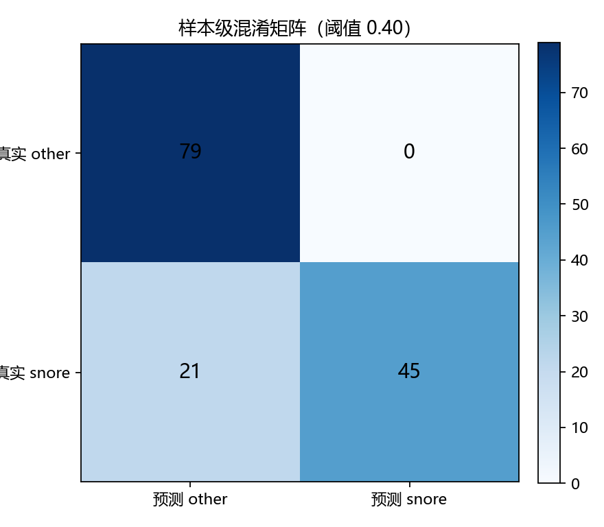
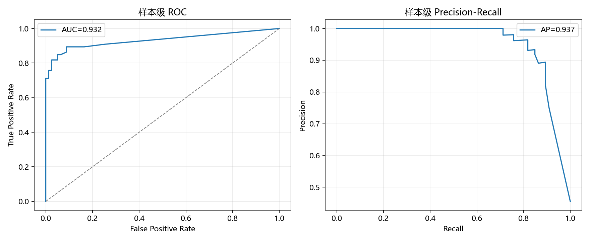
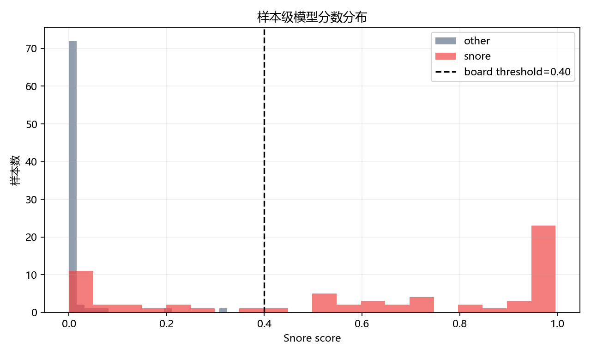
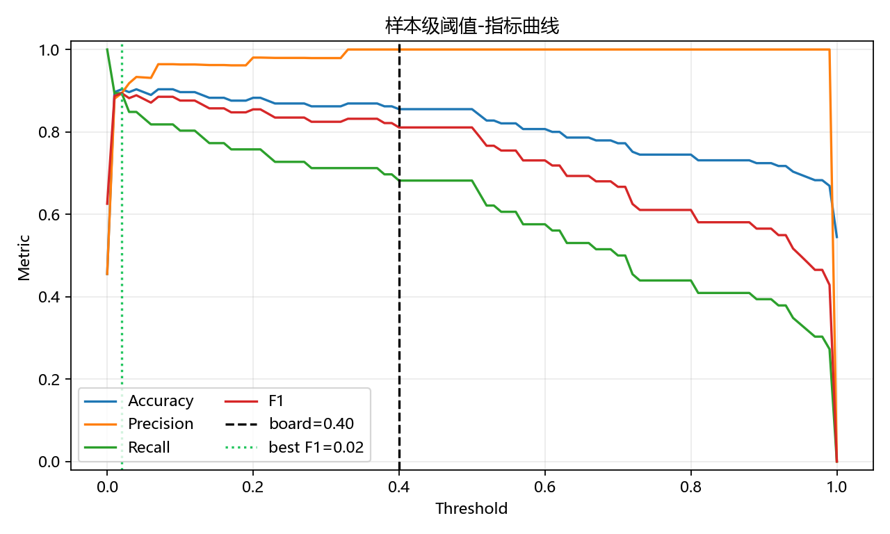
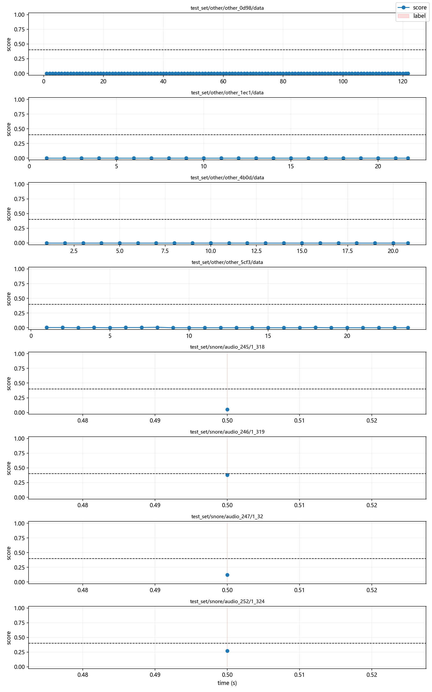

# 小智开发板呼噜模型离线评估报告

数据集：`D:\STUDY\Snore_detection_first\Data`

评估方式：离线复现小智 M55 开发板当前呼噜检测链路。脚本从开发板工程中的 `snore_model_data.h` 导出 int8 TFLite 模型，并按 `snore_detect.cpp` 中一致的特征流程进行推理：

- 16 kHz 单声道音频；
- 2 秒推理窗口；
- 取窗口末尾 9952 个样本；
- 512 点 Hann FFT；
- 160 点 hop；
- 60 帧 × 20 Mel bins；
- log-Mel 特征；
- int8 TFLite 推理；
- 开发板当前阈值：`snore_score >= 0.40` 判定为呼噜。

> 注：本报告是“开发板算法/模型的离线复现评估”，不是通过串口把每条音频实时灌入硬件后的端到端延迟测试。

## 1. 总体结果（样本级）

样本级统计使用每个音频样本内所有开发板窗口的最高 `snore_score` 作为该样本分数。

| 指标 | 数值 |
|---|---:|
| 样本数 | 145 |
| 正样本 snore | 66 |
| 负样本 other | 79 |
| Accuracy | 0.855 |
| Precision | 1.000 |
| Recall | 0.682 |
| F1 | 0.811 |
| Specificity | 1.000 |
| ROC-AUC | 0.932 |
| Average Precision | 0.937 |
| TP / FP / FN / TN | 45 / 0 / 21 / 79 |

结论：开发板阈值已从 `0.60` 下调到 `0.40`。在当前数据集上仍保持 0 误报，同时召回率从约 57.6% 提升到约 68.2%，F1 从约 0.731 提升到约 0.811。

## 2. 各数据划分结果（样本级）

| Split | 样本数 | 正样本 | Accuracy | Precision | Recall | F1 | ROC-AUC |
|---|---:|---:|---:|---:|---:|---:|---:|
| train_set | 84 | 20 | 0.929 | 1.000 | 0.700 | 0.824 | 0.891 |
| validation_set | 31 | 20 | 0.806 | 1.000 | 0.700 | 0.824 | 0.968 |
| test_set | 30 | 26 | 0.700 | 1.000 | 0.654 | 0.791 | 0.952 |

## 3. 窗口级结果

窗口级统计按开发板 2 秒窗口、1 秒步长评估。

| 指标 | 数值 |
|---|---:|
| 窗口数 | 4813 |
| 正窗口 | 66 |
| 负窗口 | 4747 |
| Accuracy | 0.996 |
| Precision | 1.000 |
| Recall | 0.682 |
| F1 | 0.811 |
| Specificity | 1.000 |
| ROC-AUC | 0.953 |
| Average Precision | 0.882 |

窗口级 Accuracy 很高主要因为负窗口数量远多于正窗口，因此比赛展示时建议重点展示 Precision、Recall、F1、ROC-AUC 和混淆矩阵。

## 4. 阈值分析

当前板端阈值：

| 阈值 | Accuracy | Precision | Recall | F1 |
|---:|---:|---:|---:|---:|
| 0.40 | 0.855 | 1.000 | 0.682 | 0.811 |

离线调参参考：

| 阈值 | Accuracy | Precision | Recall | F1 | 预测正样本数 |
|---:|---:|---:|---:|---:|---:|
| 0.30 | 0.862 | 0.979 | 0.712 | 0.825 | 48 |
| 0.40 | 0.855 | 1.000 | 0.682 | 0.811 | 45 |
| 0.50 | 0.855 | 1.000 | 0.682 | 0.811 | 45 |
| 0.60 | 0.807 | 1.000 | 0.576 | 0.731 | 38 |
| 0.70 | 0.772 | 1.000 | 0.500 | 0.667 | 33 |

在这批数据上，样本级 F1 最优阈值约为 `0.02`，对应 F1 约 `0.894`。这说明模型本身有较好的排序能力。当前实际采用 `0.40`，比原 `0.60` 更敏感，同时在本数据集上仍保持 0 误报；若比赛现场更重视召回率，可继续评估 `0.30`，但它在本数据集上已出现少量误报风险。

## 5. 可视化图表

### 样本级混淆矩阵



### ROC / PR 曲线



### 分数分布



### 阈值-指标曲线



### 多窗口样本时间线



## 6. 生成文件

- `metrics.json`：完整指标。
- `sample_predictions.csv`：样本级预测结果。
- `window_predictions.csv`：窗口级预测结果。
- `snore_board_model.tflite`：从开发板 C 头文件导出的 TFLite 模型。
- `*.png`：可视化图表。

## 7. 复现实验命令

```powershell
python tools/evaluate_snore_board_model.py --data D:\STUDY\Snore_detection_first\Data --out snore_eval_results
```
