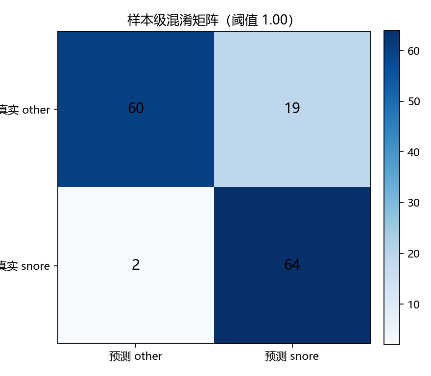
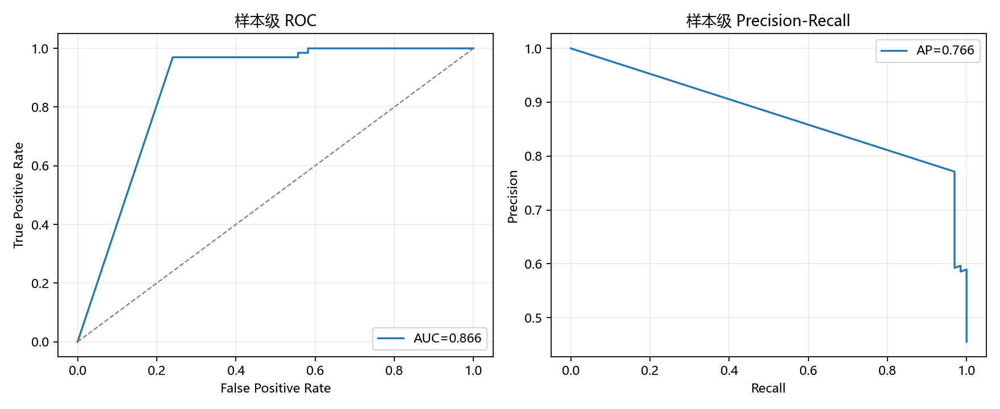
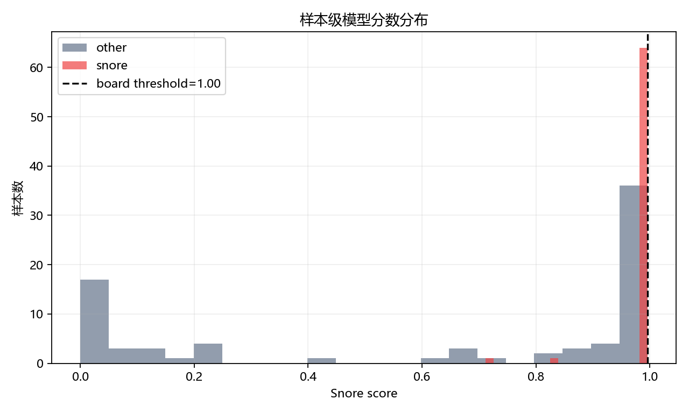
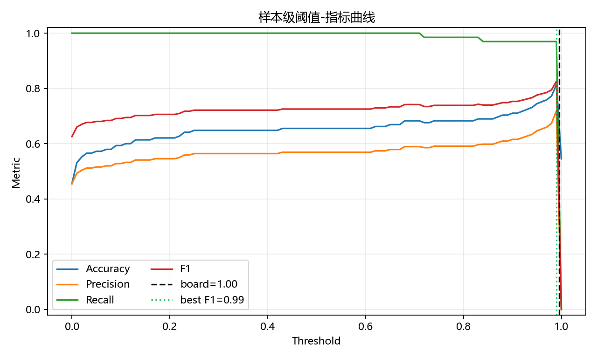
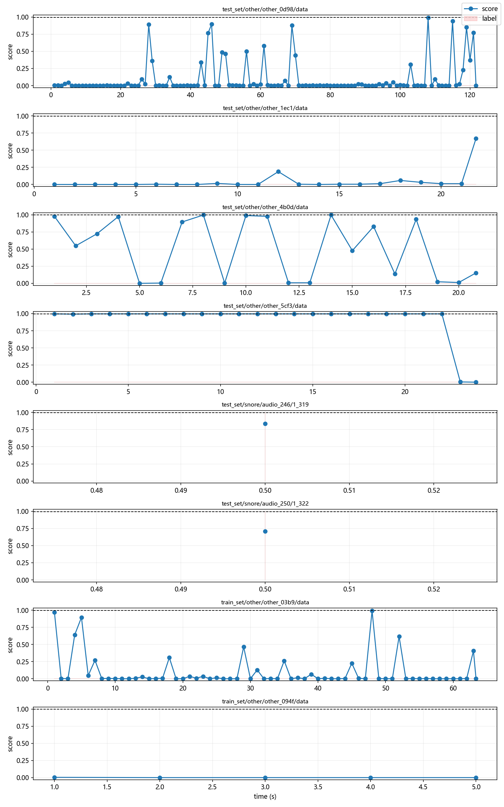

# conv2d-medium-balanced-2 量化模型离线评估报告

## 1. 本次替换内容

- 源模型：`D:\STUDY\hrrr-radar-monitor-system\models\conv2d-medium-balanced-2.h5`
- 量化模型：`D:\STUDY\hrrr-radar-monitor-system\models\conv2d-medium-balanced-2-int8.tflite`
- 量化报告：`D:\STUDY\hrrr-radar-monitor-system\models\conv2d-medium-balanced-2-int8.json`
- 开发板头文件：`D:\STUDY\hrrr-radar-monitor-system\Edgi_Talk_M55_XiaoZhi\edge-impulse\tflite-model\snore_model_data.h`
- 开发板阈值：`0.99609375`

说明：新模型量化后的输出较饱和，旧阈值 `0.40` 会带来较多误报。因此本次按样本级 F1 最优点，把板端阈值同步调到 `0.99609375`。

## 2. 量化信息

| 项目 | 数值 |
|---|---:|
| TFLite 大小 | 68,032 bytes |
| 输入形状 | `[1, 60, 20]` |
| 输入量化 | scale = 0.03960784524679184, zero_point = 77 |
| 输出形状 | `[1, 2]` |
| 输出量化 | scale = 0.00390625, zero_point = -128 |
| Keras / int8 平均绝对误差 | 0.006686 |
| Keras / int8 最大绝对误差 | 0.044749 |
| 随机验证集类别一致率 | 0.988281 |
| 源模型 SHA-256 | `12d95b4f8bdeb879d0d3b6623d3f1784d5415f6b850977d40768089bfc00ad55` |

## 3. 数据集与评估方式

数据集：`D:\STUDY\Snore_detection_first\Data`

评估方式复现小智 M55 板端流程：

- 16 kHz 单声道音频；
- 2 秒推理窗口；
- 使用窗口末尾 9952 个样本；
- 512 点 Hann FFT；
- 160 点 hop；
- 60 帧 × 20 Mel bins；
- log-Mel 特征；
- int8 TFLite 推理；
- 类别 1 为 `snore`。

## 4. 总体指标

### 样本级

| 指标 | 数值 |
|---|---:|
| 样本数 | 145 |
| 正样本 snore | 66 |
| 负样本 other | 79 |
| Accuracy | 0.855 |
| Precision | 0.771 |
| Recall | 0.970 |
| F1 | 0.859 |
| Specificity | 0.759 |
| ROC-AUC | 0.866 |
| Average Precision | 0.766 |
| TP / FP / FN / TN | 64 / 19 / 2 / 60 |

### 窗口级

| 指标 | 数值 |
|---|---:|
| 窗口数 | 4813 |
| 正窗口 | 66 |
| 负窗口 | 4747 |
| Accuracy | 0.979 |
| Precision | 0.395 |
| Recall | 0.970 |
| F1 | 0.561 |
| Specificity | 0.979 |
| ROC-AUC | 0.987 |
| Average Precision | 0.387 |
| TP / FP / FN / TN | 64 / 98 / 2 / 4649 |

## 5. 各数据划分指标（样本级）

| Split | 样本数 | 正样本 | Accuracy | Precision | Recall | F1 | Specificity | ROC-AUC |
|---|---:|---:|---:|---:|---:|---:|---:|---:|
| train_set | 84 | 20 | 0.810 | 0.556 | 1.000 | 0.714 | 0.750 | 0.875 |
| validation_set | 31 | 20 | 0.968 | 0.952 | 1.000 | 0.976 | 0.909 | 0.955 |
| test_set | 30 | 26 | 0.867 | 0.923 | 0.923 | 0.923 | 0.500 | 0.712 |

## 6. 可视化图像

### 样本级混淆矩阵



### ROC / PR 曲线



### 分数分布



### 阈值-指标曲线



### 多窗口样本时间线



## 7. 生成文件

- `metrics.json`：完整评价指标。
- `sample_predictions.csv`：样本级预测结果。
- `window_predictions.csv`：窗口级预测结果。
- `snore_board_model.tflite`：从开发板头文件导出的量化模型。
- `*.png`：可视化图表。

## 8. 复现命令

```powershell
conda run -n radar python models\convert_snore_model.py
python code\evaluate_snore_board_model.py --data D:\STUDY\Snore_detection_first\Data --out snore_eval_results_balanced_2
```
